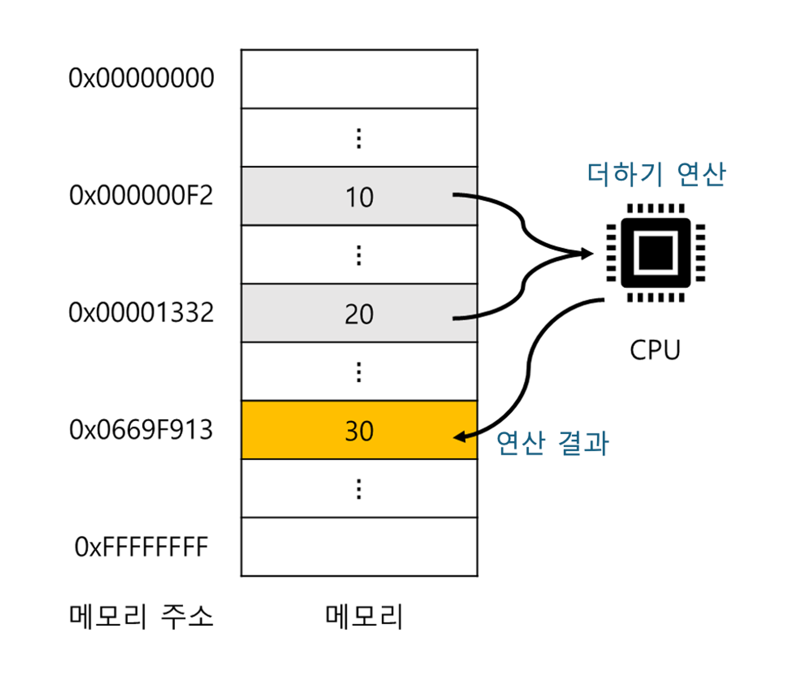
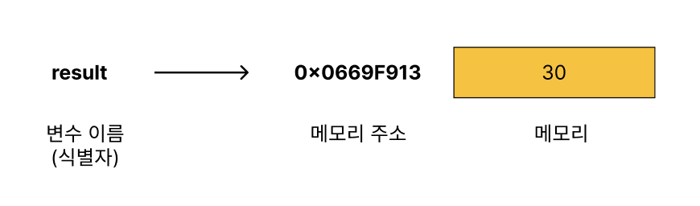
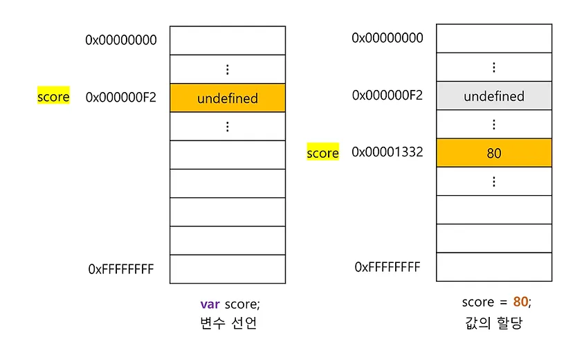
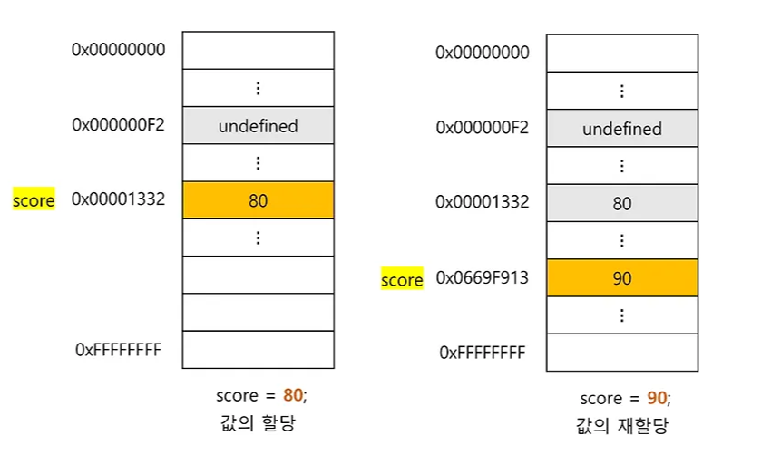

# 04장 : 변수

### **변수**

하나의 값을 저장하기 위해 확보한 메모리 공간 자체 또는 그 메모리 공간을 식별하기 위해 붙인 이름

프로그래밍 언어에서 값을 저장하고 참조하는 메커니즘

값의 위치를 가리키는 상징적인 이름

> 💡 변수는 값이 저장된 메모리 공간의 주소로 치환되어 실행됨.

따라서, 개발자가 직접 메모리 주소를 통해 값을 저장하고 참조할 필요 없이 **변수로 값에 접근**할 수 있다.



```jsx
var result = 10 + 20;
```

연산을 통해 생성된 30을 메모리 공간에 저장하고, 30을 다시 재사용할 수 있도록 값이 저장된 메모리 공간에 상징적인 이름(result)를 붙인 것이 변수!

### 식별자

식별자는 어떤 값을 구별해서 식별할 수 있는 고유한 이름을 말한다.

식별자는 메모리 공간에 저장되어 있는 값을 식별해야 하므로 메모리 주소를 기억해야 한다.

따라서 식별자는 값이 저장되어 있는 메모리 주소와 매핑 관계를 맺으며, 매핑 정보도 메모리에 저장되어야 한다.

> 💡 식별자는 값이 아니라 메모리 주소를 기억하고 있다!!



### **변수 선언**

변수를 생성하는 것 ➡️ 값을 저장하기 위한 메모리 공간을 확보하고, 메모리 공간의 주소와 연결하는 것

변수를 선언할 때는 **var, let, const 키워드를 사용한다.**

변수 선언 단계

1. 선언 단계 : 변수 이름을 등록해 자바스크립트 엔진에 변수의 존재를 알린다.
2. 초기화 단계 : 값을 저장하기 위한 메모리 공간을 확보하고 암묵적으로 `undefined` 를 할당해 초기화 한다.

초기화 단계를 거치지 않는다면 이전에 사용했던 값이 남아 있을 수 있다. 그 값을 쓰레기 값(garbage value) 이라고 한다.

선언하지 않은 식별자에 접근하면 **참조 에러**(Reference Error)가 발생한다.

### 변수의 실행 시점과 변수 호이스팅

**변수 호이스팅이란?**

변수 선언문이 코드의 선두로 끌어 올려진 것처럼 동작하는 것

```jsx
console.log(scored); // undefiend 순서(2)

var scored; // 변수 선언문 순서(1)
```

**변수 선언은 소스코드가 한 줄이 순차적으로 실행되는 런타임이 아닌 그 이전 단계에서 먼저 실행된다.**

자바스크립트 엔진은 소스 코드의 평가 과정을 거치면서 벤수 선언을 포함한 모든 선언문(변수 선언문, 함수 선언문)을 먼저 수행한다.

변수 선언 뿐만 아니라 var, let, const, function, function\*, class 키워드를 사용해서 선언하는 모든 식별자는 호이스팅 된다.

### 값의 할당

값을 할당할 때는 할당 연산자 `=` 를 사용한다.

```jsx
var score; // 변수 선언
score = 80; // 값의 할당

/* 축약형 */
var score = 80; // 변수 선언과 값의 할당
```

변수 선언은 런타임 이전에 실행되지만, 할당은 런타임 시점에 실행된다.

하지만, **값의 할당**은 소스 코드가 순차적으로 실행되는 시점인 **런타임에 실행**된다.

```jsx
console.log(score); // 결과 : undefined

var score;
scroe = 80;

console.log(score); // 결과 : 80
```

할당할 때는 이전 값 `undefined` 가 저장되어 있던 메모리 공간이 아닌 **새로운 메모리 공간을 확보하고 할당 값을 저장**한다.



### 값의 재할당

이미 값이 할당외어 있는 변수에 새로운 값을 또다시 할당하는 것

변수에 저장된 값을 다른 값으로 변경하는 것

값을 재할당할 수 없어서 값을 변경할 수 없는 건 상수 라고 한다!!

```jsx
var score = 80; // 변수 선언과 값의 할당

score = 90; // 값의 재할당
```

재할당도 마찬가지로, 새로운 메모리 공간을 확보하고 메모리 공간에 변경할 값을 저장한다



`score` 변수의 이전 값인 `undefined` 와 80은 어떤 변수(식별자)와도 연결되어 있지 않다.

아무도 사용하고 있으므로 불필요한 값이 되고 이 값들은 가비지 콜렉터에 의해 메모리에서 자동 해제 된다.

### 식별자 네이밍 규칙

1. 식별자는 특수 문자를 제외한 문자, 숫자, 언더스코어(\_), 달러 기호($)를 포함할 수 있다.
2. 단, 식별자는 특수 문자를 제외한 문자, 언더스코어(\_), 달러 기호($)로 시작해야한다.
3. 숫자로 시작하는 것은 허용하지 않는다.
4. 예약어는 식별자로 사용할 수 없다.

```jsx
break       do          instanceof   typeof
case        else        new          var
catch       finally     return       void
class       for         super        while
const       function    switch       with
continue    if          this         yield
debugger    import      throw
default     in          try
delete      let         static
```

일반적으로 변수나 함수의 이름에는 카멜케이스를 사용하고, 생성자 함수, 클래스 이름에는 파스칼 케이스를 사용한다.

```jsx
var first_name; // 스네이크 케이스

var FirstName; // 파스칼 케이스
```
