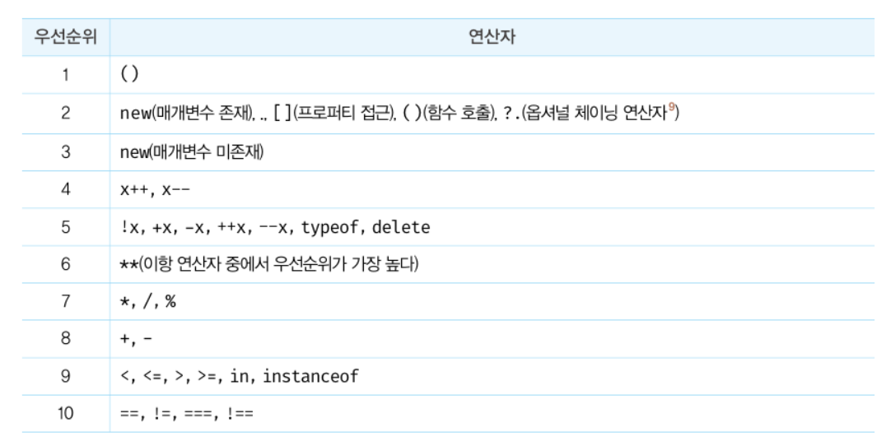
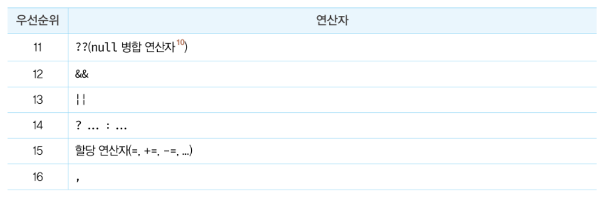
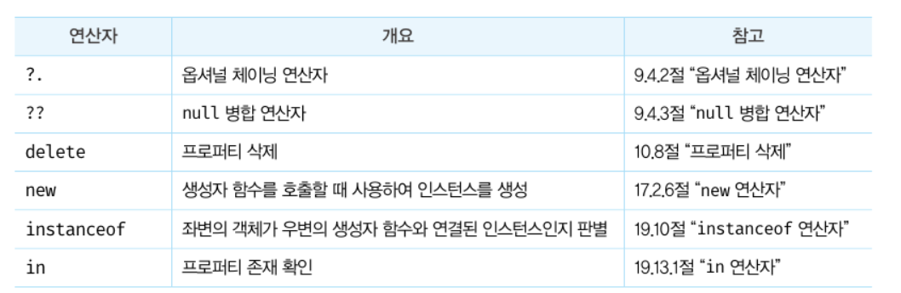

# 07장 : 연산자

### 단항 산술 연산자

**숫자 타입이 아닌 피연산자에 `+ 단항 연산자` 를 사용하면 피연산자를 숫자 타입으로 변환하여 반환**

- 피연산자를 변경하는 것 X
- 숫자 타입으로 변환한 값을 생성해서 반환 ⇒ 부수 효과 X

```jsx
var x = "1";

//문자열을 숫자 타입으로 변환
console.log(+x); //1
console.log(x); //'1'

//불리언 값
x = true;
var y = false;
console.log(+x); //1
console.log(+y); //0

//문자열
x = "Hello";
console.log(+x); //NaN
//문자열을 숫자로 타입 변환 할 수 없으므로 NaN을 반환
```

`-단항 연산자` 는 피연산자의 부호를 반전한 값을 반환하며 숫자 타입이 아닌 피연산자에 사용하면 피연산자를 숫자 타입으로 변환하여 반환

```jsx
-"10"; // -10
-true; //-1
-"Hello"; // NaN
```

### 문자열 연결 연산자

`+ 연산자` 는 피연산자 중 하나 이상이 문자열인 경우 **문자열 연결 연산자**로 동작

```jsx
//문자열 연결 연산자
"1" + 2; // '12'
1 + "2"; // '12'

// 타입 변환
1 + true; //2
1 + false; //1
1 + null; //0

// undefined는 숫자로 타입 변환 되지 않는다.
+undefined; // NaN
1 + undefined; //NaN
```

### 비교 연산자

| 비교 연산자 | 의미        | 설명               |
| ----------- | ----------- | ------------------ |
| ==          | 동등 비교   | 값이 같다          |
| ===         | 일치 비교   | 값과 타입이 같다   |
| ! =         | 부동등 비교 | 값이 다르다        |
| ! ==        | 불일치 비교 | 값과 타입이 다르다 |

**동등비교(==) 연산자**는 비교할 때 암묵적 타입 변환을 통해 **타입을 일치시킨 후 같은 값인지 비교**

```jsx
// 동등 비교
5 == 5; //true

5 == "5"; //true
// 타입은 다르지만 암묵적 타입 변환을 통해 타입을 일치시키면 값이 동일하므로 true
```

**일치비교(===) 연산자**는 타입과 값이 같은 경우에만 true를 반환

```jsx
// 일치 비교
5 === 5; //true
5 === '5'; //false

// ※ 주의할 점!!
**// NaN은 자신과 일치하지 않는 유일한 값**
NaN === NaN; // false
```

NaN은 자신과 일치하지 않는 유일한 값으로 숫자가 NaN인지 확인하려면 `Number.isNaN` 을 사용!

```jsx
Number.isNaN(NaN); // true
Number.isNaN(10); // false
Number.isNaN(1 + undefined); // true
```

```jsx
// 양의 0과 음의 0 비교
0 == -0; // true
0 === -0; // true
```

※ Object.is 메서드

예측 가능한 정확한 비교 결과를 반환

그 외에는 일치 비교 연산자와 동일하게 동작한다.

```jsx
-0 === +0; //true
Object.is(-0, +0); // false

NaN === NaN; //false
Object.is(NaN, NaN); // true
```

### 삼항 조건 연산자

조건식의 평가 결과에 따라 반환할 값 결정

**조건식 ? 조건식이 true일 때 반환할 값 : 조건식이 false일 때 반환할 값**

조건식의 평가 결과가 불리언 값이 아니면 불리언 값으로 암묵적 타입 변환된다.

```jsx
var x = 2;

var result = x % 2 ? "홀수" : "짝수";

// 2 % 2 = 0이고, 0을 불리언 값으로 암묵적 타입 변환하면 false이므로 result는 짝수
console.log(result); // 짝수
```

삼항 연산자의 첫 번째 피연산자는 조건식이므로 삼항 조건 연산자 표현식은 조건문

따라서, `if-else` 문을 사용하여 삼항 조건 연산자 표현식과 유사하게 처리 가능

| 삼항 조건 연산자 표현식 | if-else 문    |
| ----------------------- | ------------- |
| 값처럼 사용 가능        | 값처럼 사용 X |
| 표현식                  | 표현식 X      |

```jsx
var result = if (x % 2) { result = '홀수';} esle { result = '짝수' ;}; // SyntaxError
```

```jsx
var result = x % 2 ? "홀수" : "짝수";
console.log(result); // 짝수
```

조건에 따라 어떤 값을 결정해야 한다면 **삼항 조건 연산자 표현식**!

조건에 따라 수행해야 할 문이 여러 개라면 **if-else문!**

### 논리 연산자

논리 부정(!) 연산자는 항상 **불리언 값** 반환

단, 피연산자가 반드시 불리언 값일 필요는 없다. → 불리언 값이 아니면 암묵적 타입 변환!

```jsx
// 암묵적 타입 변환
!0; //true
!"Hello"; // false
```

`논리합(||)` 또는 `논리곱(&&)` 연산자 표현식의 결과는 불리언 값이 아닐 수도 있다.

→ 언제나 2개의 피연산자 중 어느 한 쪽으로 평가됨!

```jsx
// 단축 평가
"Cat" && "Dog"; // 'Dog'
```

### typeof 연산자

피연산자의 데이터 타입을 문자열로 반환

`string` , `number` , `bollean`, `undefined`, `symbol`, `object`, `function` 중 1개를 반환

`null` 반환 X ⇒ 값이 null인지 확인할 떄는 **일치 연산자(===)** 사용

```jsx
**typeof NaN // number**
typeof undefined // undefined
typeof Symbol() // symbol
**typeof null // object**
typeof function () {} // function

var foo = null;
typeof foo === null; // -> false
foo === null; // -> true
```

선언하지 않은 식별자를 `typeof 연산자` 로 연산하면 **ReferenceError가 발생하지 않고 undefined를 반환**

```jsx
typeof undeclared; // -> undefined
```

### 지수 연산자

좌항의 피연산자를 밑, 우항의 피연산자를 지수로 거듭 제곱

```jsx
2 ** 2 = 4
2 ** 0 = 1
2 ** -2 = 0.25
```

Math.pow 메서드와 동일

```jsx
Math.pow(2, 2);
Math.pow(2, 0);
Math.pow(2, -2);
```

이항 연산자 중에서 우선 순위가 가장 높다

**※ 그 외의 연산**


**※ 연산자 우선순위**


