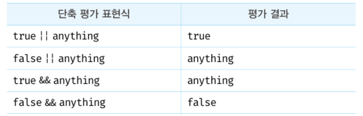

# 09장 : 타입 변환과 단축 평가

### 타입 변환이란?

개발자가 의도적으로 값의 타입을 변환하는 것을 **명시적 타입 변환** 또는 **타입 캐스팅**이라고 한다.

```jsx
var x = 10;

//명시적 타입 변환
var str = x.toString();
console.log(typeof str, str); // string 10

// x 변수의 값이 변경되는 것은 아님!
console.log(typeof x, x); // number 10
```

자바스크립트 엔진에 의해 자동 변환되는 것을 **암묵적 타입 변환** 또는 **타입 강제 변환**이라 한다.

```jsx
var x = 10;

// 암묵적 타입 변환
var str = x + "";
console.log(typeof str, str); // string 10

// x 변수의 값이 변경되는 것은 아님!
console.log(typeof x, x); // number 10
```

### 암묵적 타입 변환

자바스크립트 엔진은 표현식을 평가할 때 개발자의 의도와 상관없이 코드의 문맥을 고려해 암묵적이로 데이터 타입을 강제 변환할 때가 있다.

```jsx
// 피연산자가 모두 문자열 타입이어야 하는 문맥
"10" + 2; // '102'

// 피연산자가 모두 숫자 타입이어야 하는 문맥
5 * "10"; // 50

// 피연산자 또는 표현식이 불리언 타입이어야 하는 문맥
!0; // true
if (1) {
}
```

1. **문자열 타입으로 변환**

   문자열 연결 연산자는 문자열 타입이 아닌 피연산자를 문자열 타입으로 암묵적 타입 변환한다.

   ```jsx
   // 숫자 타입
   0 + ' ' // "0"

   // 불리언 타입
   true + ' '  // 'true'
   false + ' ' // 'false'

   // null 타입
   null + ' ' // 'null'

   ...
   ```

2. **숫자 타입으로 변환**

   산술 연산자의 모든 피연산자는 모두 숫자 타입이어야 한다.

   산술 연산자는 숫자 타입이 아닌 피연산자를 숫자 타입으로 암묵적 타입 변환한다.

   피연산자를 숫자 타입으로 변환할 수 없는 경우는 `NaN`이 된다.

   - 빈 문자열, 빈 배열, null, false ⇒ 0 으로 변환
   - true ⇒ 1으로 변환
   - 객체, 빈 배열이 아닌 배열, undefined ⇒ NaN

   ```jsx
   // 문자열 타입
   +' ' // -> 0
   +'0' // -> 0
   +'string' // -> NaN

   // 불리언 타입
   +true // -> 1
   +false // -> 0

   ...

   // 객체 타입
   +{} // -> NaN
   +[] // -> 0
   +[10,20] // -> NaN
   +(function(){}) // -> NaN
   ```

3. **불리언 타입으로 변환**

   자바스크립트 엔진은 조건식의 평가 결과를 불리언 타입으로 암묵적 타입 변환한다.

   이때 자바스크립트 엔진은 **불리언 타입이 아닌 `Truthy` 값 또는 `Falsy` 값으로 구분한다.**

   | Falsy 값        | Truthy 값               |
   | --------------- | ----------------------- |
   | false           | Falsy 값 이외의 모든 것 |
   | undefined       |                         |
   | null            |                         |
   | 0,-0            |                         |
   | NaN             |                         |
   | ' ' (빈 문자열) |                         |

   ```jsx
   // Truthy, Falsy 값 판별 함수

   function isFalsy(v) {
     return !v; // Falsy 값이면 true 반환
   }

   function isTruthy(v) {
     return !v; // Truthy 값이면 true 반환
   }
   ```

### 명시적 타입 변환

표준 빌트인 생성자 함수를 `new` 연산자 없이 호출하는 방법, 빌트인 메서드를 사용하는 방법, 암묵적 타입 변환을 이용하여 명시적으로 타입을 변경할 수 있다.

1. **문자열 타입으로 변환**

   String 생성자 함수를 new 연산자 없이 호출

   ```jsx
   String(1);
   String(NaN);
   String(Infinity);
   ```

   toString 메서드 사용

   ```jsx
   (1).toString();
   NaN.toString();
   Infinity.toString();
   ```

   문자열 연결 연산자 사용

   ```jsx
   1 + " ";
   NaN + " ";
   Infinity + " ";
   ```

2. **숫자 타입으로 변환**

   Number 생성자 함수를 new 연산자 없이 호출

   ```jsx
   Number("0");
   Number(true); // -> 1
   ```

   `parseInt`, `parseFloat` 함수 사용(문자열만 가능)

   ```jsx
   parseInt("0");
   ```

   `+` 단항 산술 연산자 이용

   ```jsx
   +"0"; // -> 0
   +true; // -> 1
   ```

   `*` 산술 연산자 이용

   ```jsx
   "0" * 1; // 0
   true * 1; // 1
   false * 1; // 0
   ```

3. **불리언 타입으로 변환**

   Boolean 생성자 함수를 new 연산자 없이 호출

   ```jsx
   Boolean("x"); // true
   Boolean(""); // false
   Boolean(null); // false
   Boolean(undefined); // false
   ```

   `!` 부정 논리 연산자 두 번 사용

   ```jsx
   !!"x"; // true
   !!" "; // false
   ```

### 단축 평가

논리 연산의 결과를 결정하는 피연산자를 타입 변환핮히 않고 그대로 반환하는 것

표현식을 평가하는 도중에 평가 결과가 확정된 경우 나머지 평가 과정을 생략

**논리 연산자를 사용한 단축 평가**

- 논리곱(&&)

  두 개의 피연산자가 모두 true로 평가될 때 true를 반환

  좌항에서 우항으로 평가가 진행 ⇒ 두 번째 피연산자가 논리곱 연산자 표현식의 평가 결과 결정

  _논리 연산의 결과를 결정하는 두 번째 피연산자를 그대로 반환!_

  좌항 피연산자가 false로 평가되는 Fasly 값이면 좌항 피연산자를 그대로 반

  ```jsx
  "Cat" && "Dog"; // -> 'Dog'
  ```

- 논리합(||)
  두 개의 피연산자 중 하나만 true여도 true 반환
  첫 번째 피연산자가 논리합 연산자 표현식의 평가 결과 결정
  _논리 연산의 결과를 결정하는 첫 번째 피연산자를 그대로 반환!_
  ```jsx
  "Cat" || "Dog"; // -> 'Cat'
  ```



단축 평가를 사용하면 if문 대체 가능

- Truthy 값(참으로 평가되는 값)일때 논리곱(&&) 연산자로 대체 가능
- Falsy 값(거짓으로 평가되는 값)일때 논리합(||) 연산자로 대체 가능

```jsx
// done이 true일 때 message에 '완료' 할당
var done = true;
var message = "";

message = done && "완료";
console.log(message); // -> '완료'

// done이 false일 때 message에 '미완료' 할당
var done = false;

message = done || "미완성";
console.log(message); // -> '미완성'
```

**옵셔널 체이닝 연산자 : `?.`**

좌항의 피연산자가 null 또는 undefined인 경우 undefined 반환, 아니면 우항의 프로퍼티 참조를 이어감

객체를 가리키기를 기대하는 변수가 null 또는 undefined가 아닌지 확인하고 프로퍼티를 참조할때 유용

```jsx
var elem = null;

var value = elem?.value;
console.log(value); // undefined

//동일한 동작을 논리 연산자 &&를 통해서도 가능
var value = elem && elem.value;
console.log(value); // null
```

좌항 피연산자가 false로 평가되는 Fasly 값이라도 null 또는 undefined가 아니면 우항의 프로퍼티 참조를 이어간다.

```jsx
var str = "";

var length = str && str.length();
console.log(length); // ''

var length = str?.length();
console.log(length); // 0
```

**null 병합 연산자 : `??`**

좌항의 피연산자가 null 또는 undefined인 경우 우항의 피연산자 반환, 아니면 좌항 반환

변수에 기본값을 설정할 떄 유용

```jsx
var foo = null ?? "default string";
console.log(foo); // 'defulat string'
```

좌항 피연산자가 false로 평가되는 Fasly 값이라도 null 또는 undefined가 아니면 좌항의 피연산자 그대로 반환

```jsx
var foo = "" ?? "default string";
console.log(foo); // 'default string'

// 논리합(||)의 경우
var foo = "" || "default string";
console.log(foo); // 'default string'
```

빈 문자열(’ ‘)은 Falsy 값이지만 null 또는 undefined가 아니므로 좌항 값 빈문자열 그대로 반환
