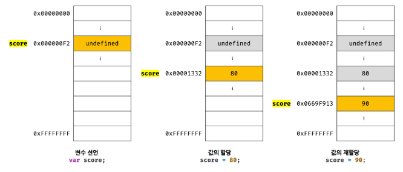

# 11장 : 원시 값과 객체의 비교

자바스크립트 타입은 크게 원시 타입과 객체 타입으로 구분할 수 있다.

| 원시 타입                                       | 객체 타입                                        |
| ----------------------------------------------- | ------------------------------------------------ |
| 변경 불가능한 값                                | 변경 가능한 값                                   |
| 변수에 실제 값 저장                             | 변수에 참조 값 저장                              |
| 원시 값이 복사되어 전달 <br/> ➡️ 값에 의한 전달 | 참조 값이 복사되어 전달 <br> ➡️ 참조에 의한 전달 |

## 원시 값

```markdown
원시 값은 read only 값으로, 변경 불가능(immutable value)한 값이다.
```

위 뜻은 **원시 값 자체를 변경할 수 없다**는 의미이지 변수 값을 변경할 수 없다는 것은 아니다.

상수는 재할당이 금지된 변수일 뿐이지 상수와 변경 불가능한 값이 동일한 것은 아님!

```jsx
// const 키워드를 사용해 선언한 변수는 재할당이 금지
const o = {};

// const 키워드를 사용해 선언한 변수에 할당한 원시 값은 변경할 수 없음.
// 하지만 const 키워드를 사용해 선언한 변수에 할당한 객체는 변경 가능
o.a = 1;
console.log(o); // {a:1}
```

> **✅ 불변성(immutability)**
>
> 원시 값은 변경 불가능하므로 변수 값을 변경하기 위해서는
>
> 1.  **새로운 메모리 공간을 확보**하고
> 2.  재할당한 원시값을 저장한 후
> 3.  변수가 참조하던 **메모리 공간의 주소를 변경**해야 한다.



불변성을 갖는 원시 값을 할당한 변수는 재할당 이외에 변수 값을 변경할 수 있는 방법이 없다.

### 문자열과 불변성

1. 문자열은 **원시 타입**이며, **변경 불가능**하다.

   - 문자열이 생성된 이후에는 **변경** ❌
   - 문자열을 저장 하려면 먼저 확보해야하는 메모리 공간의 크기를 결정해야 한다.

  <br>

2. 문자열은 **유사 배열 객체**이면서 **이터러블**이므로 배열과 유사하게 각 문자에 접근할 수 있다.

   - `length` 프로퍼티를 갖고, `for문`으로 순회할 수도 있다.

   ```jsx
   var str = "string";

   // 문자열은 유사 배열이므로 배열과 유사하게 인덱스를 사용해 각 문자에 접근할 수 있다.
   // 하지만 문자열은 원시 값이므로 변경할 수 없다. 이때 에러가 발생하지 않는다.

   str[0] = "S";

   console.log(str); // string

   // 변수에 새로운 문자열을 재할당하는 것은 가능
   str = "Hello";
   console.log(str); // Hello
   ```

### 값에 의한 전달

변수에 원시 값을 갖는 변수를 할당하면 할당받는 변수에는 **할당되는** 변수의 **원시값이 복사**되어 전달된다.

```jsx
var score = 80;

// copy 변수에 score 변수의 값 80이 복사되어 할당됨.
var copy = score;

console.log(score); // 80
console.log(copy); // 80
console.log(score === copy); // true
```

`copy` 변수에 원시 값을 갖는 `score` 변수를 할당하면 `copy` 에는 할당되는 변수 `score` 의 원시 값 80이 복사되어 전달된다.


두 변수는 같은 값을 갖는 점에서는 동일하지만 `score` 변수와 `copy` 변수의 값 80은 **다른 메모리 공간에 저장된 별개의 값이다.**

```jsx
score = 100;

console.log(score, copy); // 100, 80
console.log(score === copy); // false
```

따라서, `score` 변수의 값을 변경해도 `copy` 변수의 값에는 **어떠한 영향도 주지 않는다.**

```markdown
🔥 값에 의한 전달 은 자바스크립트를 위한 용어가 아니다!
```

변수에는 **값이 전달되는 것이 아니라,** **메모리 주소가 전달**된다.

변수와 같은 **식별자는 값이 아닌 메모리 주소를 기억**하고 있기 때문이다.

<br>
<br>

> 그렇다면 `값에 의한 전달` 이란?
>
> 값을 전달하는 것이 아니라 **메모리 주소를 전달하는 것**이다.
>
> 단, 전달된 **메모리 주소를 통해 메모리 공간에 접근**하면 **값을 참조**할 수 있다.

<br>
<br>

**🔥 중요한 점은!**

두 변수의 원시 값은 **서로 다른 메모리 공간에 저장된 별개의 값**이다.

따라서, 어느 한쪽에서 재할당을 통해 값을 변경하더라도 **서로 간섭할 수 없다**는 것이다.

## 객체(Object)

**특징**

- 프로퍼티 **개수가 정해져 있지 않으며** 동적으로 **추가 및 삭제** 가능
- **프로퍼티 값에도 제약이 없다.**
- 따라서 원시 값과 달리 **미리 메모리 공간의 크기를 결정 ❌**
- 객체는 경우에 따라 **크기가 매우 클** 수도 있다.
- 생성 및 접근 비용도 원시 값보다 더 많이 든다.

### 변경 가능한 값

```markdown
객체 타입의 값, 즉 객체는 변경가능한 값(mutable value)이다.
```

**원시 값 vs 객체 값**

<table>
    <thead>
        <tr>
            <th>원시 값</th>
            <th>객체 값</th>
        </tr>
    </thead>
    <tbody>
        <tr>
            <td><strong>원시 값을 할당한 변수는, 원시 값 자체를 가지고 있음</strong></td>
            <td><strong>객체를 할당한 변수는, <em>메모리 주소(참조 값)</em>을 기억하고 있음</strong></td>
        </tr>
        <tr>
            <td>
                <strong>변경할 수 없는 값</strong><br>
                ➡️ 값을 바꾸려면 <strong>재할당 필요</strong>
            </td>
            <td>
                <strong>재할당 없이도 객체 내부 변경 가능</strong>
                <ul>
                    <li>프로퍼티 <strong>동적 추가</strong> 가능</li>
                    <li>프로퍼티 <strong>값 갱신</strong> 가능</li>
                    <li>프로퍼티 자체 <strong>삭제</strong> 가능</li>
                </ul>
            </td>
        </tr>
        <tr>
            <td></td>
            <td>
                <strong>프로퍼티 값이 객체일 수도 있음</strong><br>
                ➡️ 복사해서 생성하는 비용이 많이 듦<br>
                ➡️ <strong>메모리의 효율적 소비가 어렵고 성능이 나빠짐</strong>
            </td>
        </tr>
        <tr>
            <td></td>
            <td><strong>여러 개의 식별자가 하나의 객체를 공유할 수 있음</strong></td>
        </tr>
    </tbody>
</table>

<details>
<summary>참조 값(reference value) </summary>
<div markdown="1">
<br>
생성된 객체가 저장된 메모리 공간의 주소 그 자체
객체를 할당한 변수가 기억하는 메모리 주소를 통해 메모리 공간에 접근하면 <b>참조 값(reference value)</b>에 접근할 수 있다.
<br>
</div>
</details>


> 객체를 수정할때, 객체를 할당한 변수에 재할당을 하지 않았으므로 **객체를 할당한 변수의 참조 값은 변경되지 않는다.**

- 🤔 얕은 복사와 깊은 복사
  객체 프로퍼티 값으로 갖는 객체의 경우
  | 얕은 복사 | 깊은 복사 |
  | ------------------ | ---------------------------------------------------------------------------------- |
  | 한 단계까지만 복사 | 객체에 중첩되어 있는 객체까지 모두 복사하여 원시값처럼 완전한 복사본을 만드는 복사 |
  | 참조 값을 복사 | 원시 값을 할당한 변수를 다른 변수에 할당하는 것 |
  ✅ `얕은 복사` 와 `깊은 복사` 로 생성된 객체는 **원본과는 다른 객체**임!

  ```jsx
  const o = { x: { y: 1 } };

  // 얕은 복사
  const c1 = { ...o };
  console.log(c1 === o); // false
  console.log(c1.x === o.x); // true

  // lodash와 cloneDeep을 사용한 깊은 복사
  const _ = require("lodash");

  //깊은 복사
  const c2 = _.cloneDeep(o);
  console.log(c2 == o); // false
  console.log(c2.x === o.x); // false
  ```

  ```jsx
  const v = 1;

  // "깊은 복사"라고 부르기도 함
  const c1 = v;
  console.log(c1 === v); //true

  const o = { x: 1 };

  // "얕은 복사" 라고 부르기도 함
  const c2 = o;
  console.log(c2 === o); // true
  ```

### 참조에 의한 전달

```jsx
var person = {
  name: "Lee",
};

// 참조 값을 복사(얕은 복사)
var copy = person;
```

객체를 가리키는 변수 (원본, `person` )를 다른 변수 (사본, `copy` )에 할당하면 **원본의 참조 값이 복사되어 전달** 되는 것


`person` 과 `copy` 는 저장된 메모리 주소는 다르지만 동일한 참조 값으르 갖는다.

➡️ **두 개의 식별자가 하나의 객체를 공유**한다는 것!

> 따라서, 원본 또는 사본 중 어느 **한 쪽에서 객체를 변경**하면 **서로 영향을 주고 받는다!**

```jsx
var person = {
  name: "Lee",
};

// 참조 값을 복사(얕은 복사)
var copy = person;

// copy를 통해 객체를 변경한다.
copy.name = "Kim";

// person을 통해 객체를 변경한다.
person.address = "Seoul";

// copy와 person은 동일한 객체를 가리킨다.
// 따라서 한 쪽에서 객체를 변경하면 서로 영향을 받는다.
console.log(person); // {name : "Kim", address : "Seoul"}
console.log(copy); // {name : "Kim", address : "Seoul"}
```

## 값에 의한 전달 vs 참조에 의한 전달

**✅ 공통점**

값에 의한 전달과 참조에 의한 전달은

➡️ **식별자가 기억하는 메모리 공간에 저장된 값을 복사해서 전달한다는 점**에서 동일하다.

**❎ 차이점은?**

👉 **식별자가 기억하는 값의 종류 차이!**

- 원시 값이면 ➡️ **실제 값 자체를 복사**
- 참조 값이면 ➡️ **메모리 주소(참조)를 복사**

> 결국, 원시 값 vs 참조 값의 차이일 뿐!

자바스크립트에서는 **"참조에 의한 전달"은 존재하지 않는다.**

오직 **"값에 의한 전달"만 존재**한다!

> 즉, 참조 값조차도 값으로 복사되는 것일 뿐, **참조 자체가 공유되는 건 아니다.**

🧾 **결론**

자바스크립트에서 모든 전달은 **값 복사에 기반한 전달**이다!
