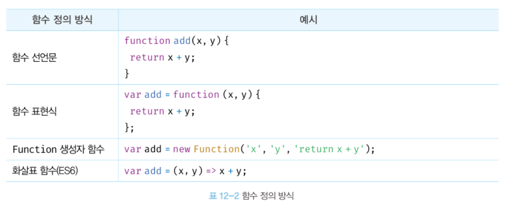

# 12장 : 함수

## 함수란?

일련의 과정을 문으로 구현하고 코드 블록으로 감싸서 하나의 실행 단위로 정의한 것

```jsx
// 함수 정의
function 함수명(매개변수){
  return 반환 값;
}
```

<br/>

- 매개변수(Parameter) : 함수 내부로 입력을 전달받는 변수
- 인수(argument) : 입력
- 반환값 (return value) : 출력

<br/>

함수는 값이며, 여러 개 존재할 수 있으므로 특정 함수를 구별하기 위해 식별자인 **함수 이름**을 사용할 수 있다.

<br/>

함수는 **함수 정의**를 통해 생성하고, **함수 호출**로 함수를 실행한다!

```jsx
// 함수 정의
function add(x, y) {
  return x + y;
}

// 함수 호출
var result = add(2, 5);

// 함수 add에 인수 2,5를 전달하면서 호출하면 반환값 7 반환
console.log(result); // 7
```

## 함수를 사용하는 이유

함수는 몇 번이든 호출할 수 있으므로 **코드의 재사용** 측면에서 매우 유용하다.

```jsx
함수는 유지보수의 편의성을 높이고 실수를 줄여 코드의 신뢰성을 높인다.
```

## 함수 리터럴

함수도 함수 리터럴로 생성할 수 있다.

함수 리터럴은 function 키워드, 함수 이름, 매개 변수 목록, 함수 몸체로 구성된다.

```jsx
// 변수에 함수 리터럴 할당
var f = function add(x, y) {
  return x + y;
};
```

**함수 리터럴의 구성요소**

- 함수 이름
  - 함수 이름은 식별자다.
  - 함수 이름은 함수 몸체 내에서만 참조할 수 있는 식별자다.
  - 함수 이름은 생략 할 수 있다.(기명함수, 익명/무명함수)
    <br>
    <br>
- 매개변수 목록
  - 0개 이상의 매개변수를 소괄호로 감싸고 쉼표로 구분한다.
  - 각 매개변수에는 함수를 호출할 때 지정한 인수가 순서대로 할당된다.
    ✅ 매개변수 목록은 **순서에 의미**가 있다.
  - 매개변수는 함수 몸체 내에서 변수와 동일하게 취급된다.
    <br>
    <br>
- 함수 몸체
  - 함수가 호출되었을 때 일괄적으로 실행된 문들을 하나의 실행 단위로 정의한 코드 블록이다.
  - 함수 몸체는 함수 호출에 의해 실행된다.

<br/>

함수는 객체다!

**일반 객체는 호출할 수 없지만 함수는 호출할 수 있다.**

함수는 객체에는 없는 함수 객체만의 고유한 프로퍼티를 갖는다.

## 함수 정의

함수를 정의하는 방법에는 4가지가 있다.

모든 함수 정의 방식은 함수를 정의한다는 면에서는 동일하다.



### 함수 선언문

함수 선언문은 **함수 이름을 생략할 수 없다.**

```jsx
// 함수 선언문
function add(x, y) {
  return x + y;
}

// 함수 참조
console.dir(add); // f add(x,y)

// 함수 호출
console.log(add(2, 5));
```

<br>

함수 선언문은 **표현식이 아닌 문**이다.

➡️ 콘솔에서 함수 선언문을 실행하면 완료 값 `undefined` 가 출력된다.

➡️ 따라서, **변수에 할당할 수 없**지만 변수에 할당되는 것**처럼 보인다**.

```jsx
// 함수 선언문은 표현식이 아닌 문이므로 변수에 할당할 수 없다.
// 하지만, 함수 선언문이 변수에 할당 되는 것처럼 보인다.

var add = function add(x, y) {
  return x + y;
};

// 함수 호출
console.log(add(2, 5)); // 7
```

<br>

**🤔 변수에 할당할 수 없다면서 왜일까?**

자바스크립트 엔진은 똑같아 보이는 함수 리터럴도 **문맥에 따라** 다르게 해석한다.

- **함수 선언문**
- **함수 리터럴 표현식**

함수 이름을 생략할 수 없다는 점을 제외하면 함수 리터럴과 형태가 동일하다.

둘 다 함수가 생성되는 것은 동일하나 함수를 생성하는 내부 동작에 차이가 있다.

<br/>

**✅ 언제 함수 선언문으로 보고, 언제 함수 표현식으로 볼까?**

- **함수 선언문**으로 해석하는 경우

  - 함수 리터럴이 **단독**으로 사용됐을 때
  - 반드시 **이름이 있어야 함**
  - 암묵적으로 **같은 이름의 식별자**가 자동 생성됨

  ```jsx
  // 기명 함수 리터럴을 단독으로 사용하면 함수 선언문으로 해석된다.
  // 함수 선언문에서는 함수 이름을 생략할 수 없다.
  function foo() {
    console.log("foo");
  }

  foo(); // foo
  ```

<br/>

- **함수 표현식**으로 해석하는 경우

  - 함수 리터럴이 **값으로 평가되어 사용될 때**

    - 변수에 할당하거나
    - 괄호로 감싼 그룹연산자 안에 있거나
    - 피연산자로 사용될 때
      <br/>

    - **함수 이름 생략 가능**
      이름을 붙이면 기명 함수 표현식, 이름이 없으면 무명 함수 표현식

    ```jsx
    // 함수 리터럴을 피연산자로 사용하면 함수 선언문이 아니라 함수 리터럴 표현식으로 해석된다.
    // 함수 리터럴에서는 함수 이름을 생략할 수 있다.

    (function bar() {
      console.log("bar");
    });

    bar(); // ReferenceError : bar is not defined
    ```

    - 표현식에서 붙인 이름(`bar`)은 외부에서는 사용할 수 없다. **함수 몸체 내부에서만 사용 가능하다.**

<br/>

**❌ 왜 표현식에선 이름으로 호출 불가능할까?**

표현식에서의 함수 이름(`bar`)은 오직 **함수 내부에서만 참조 가능**한 식별자다.

외부에서 호출하려면 함수 객체를 가리키는 별도의 식별자가 필요하다.

하지만 위 예제에서는 함수 객체를 가리키는 식별자가 존재하지 않는다.

<br/>

**⭕️ 반면, 선언문에선 왜 호출 가능 할까?**

함수 선언문은 자바스크립트 엔진이 함수를 생성하면서 **함수 이름과 동일한 식별자를 암묵적으로 생성하고, 그 식별자에 함수 객체를 할당**한다.

즉, 함수 선언문의 이름으로 호출하는 건 사실 함수 이름이 아니라, 엔진이 암묵적으로 만든 **식별자**로 호출하는 것이다.

<br/>

| 구분           | 함수 선언문                        | 함수 표현식            |
| -------------- | ---------------------------------- | ---------------------- |
| 형태           | 단독으로 사용                      | 값으로 평가되는 문맥   |
| 함수 이름 생략 | 불가능                             | 가능                   |
| 외부 호출 여부 | 가능                               | 불가능                 |
| 호이스팅       | 함수 이름과 동일한 식별자 호이스팅 | 변수 선언부만 호이스팅 |

### **함수 표현식**

함수는 값의 성질을 갖는 일급 객체이다.

함수 리터럴로 생성한 함수 객체를 변수에 할당할 수 있다.

```jsx
var add = function (x, y) {
  return x + y;
};

console.log(add(2, 5)); // 7
```

함수 리터럴의 함수 이름은 생략할 수 있다. ➡️ **익명 함수**

함수를 호출할 때 함수 이름이 아닌 함수 객체를 가리키는 식별자를 사용해야 한다.

```jsx
//기명 함수 표현식
var add = function foo(x, y) {
  return x + y;
};

// 식별자로 호출
console.log(add(2, 5)); // 7

// 함수 이름으로 호출하면 ReferenceError가 발생한다.
// 함수 이름은 함수 몸체 내부에서만 유효한 식별자다.
console.log(foo(2, 5)); // ReferenceError : 함수 이름으로 호출 X
```

### 함수 생성 시점과 함수 호이스팅

자바스크립트에서 함수는 **정의 방식**에 따라 **언제 생성되고, 호출 가능한 시점**이 달라진다

- **함수 선언문**으로 정의한 함수는 함수 선언문 이전에 호출 ⭕️
- **함수 표현식**으로 정의한 함수는 함수 표현식 이전에 호출 ❌

<br/>

**✅ 함수 선언문**

```jsx
console.log(add(2, 3)); // ✅ 5

// 함수 선언문
function add(x, y) {
  return x + y;
}
```

- 함수 선언문은 **코드 실행 이전**에 자바스크립트 엔진이
  **함수 객체를 먼저 생성**하고, **식별자에 할당**해둔다.
- 따라서 **선언 이전에도 참조와 호출이 모두 가능하다.**
- 이런 동작을 함수 **호이스팅(Function Hoisting)** 이라고 부른다.

<br/>

**✅ 함수 표현식**

```jsx
console.log(sub(5, 2)); // ❌ TypeError: sub is not a function

// 함수 표현식
var sub = function (x, y) {
  return x - y;
};
```

- 함수 표현식은 **변수에 함수 리터럴을 할당**하는 방식이다.
- 변수 `sub`의 **선언 자체는 호이스팅**되지만,
  할당(`function (x, y) { ... }`)은 **런타임에 실행된다.**
- 따라서 **초기 상태에서는 `sub`이 `undefined`**이다.
- 이 시점에 호출하면 결국 `undefined()`가 되므로 **TypeError**가 발생한다.
- 따라서 함수 표현식으로 정의한 함수는 함수 표현식 이후에 참조 또는 호출해야 한다.

### `Function` 생성자 함수

자바스크립트에서는 내장된 `Function` 생성자를 사용해 **문자열로 된 코드**를 전달해서 **함수 객체를 생성**할 수 있다.

```jsx
var add = new Function("x", "y", "return x + y");

console.log(add(2, 5)); // 7
```

`Function` 생성자는 **함수 선언문/표현식과는 다르게 동작**하며, **클로저를 생성하지 않고 보안·성능에도 좋지 않기 때문에 일반적으로 사용하지 않는 것이 바람직하다.**

### **화살표 함수**

`function` 키워드 대신 화살표 `⇒` 를 사용해 더 간략하게 함수를 선언할 수 있다.

화살표 함수는 **항상 익명 함수로 정의**한다.

```jsx
//화살표 함수
const add = (x, y) => x + y;
console.log(add(2, 5)); // 7
```

- 생성자 함수로 사용 X
- 기존 함수와 `this` 바인딩 방식이 다름
- `prototype` 프로퍼티 X
- `arguments` 객체 생성 X

## 함수 호출

함수를 호출하면 현재의 실행 흐름을 중단하고 호출된 함수로 실행흐름을 옮긴다.

이때, 매개변수에 인수가 순서대로 할당되고 함수 몸체의 문들이 실행된다.

### **매개변수와 인수**

매개변수를 통해 인수를 전달함.

**매개변수와 인수의 관계**

- **매개변수(Parameter)**: 함수를 선언할 때 정의하는 변수
- **인수(Argument)**: 함수를 호출할 때 전달하는 값

```jsx
//함수 선언문
function add(x, y) {
  return x + y;
}

//함수 호출
// 인수 1과 2가 매개변수 x와 y에 순서대로 할당되고 함수 몸체의 문들이 실행된다.
var result = add(1, 2);
```

- 인수는 **값으로 평가될 수 있는 표현식**이면 무엇이든 전달 가능
- 개수나 타입에 **제한 없음**

<br/>

함수가 호출되면:

1. 함수 몸체 안에서 매개변수가 **암묵적으로 생성**
2. `undefined`로 먼저 초기화
3. 인수가 순서대로 매개변수에 **할당**

```jsx
function add(x, y) {
  return x + y;
}

add(2, 5);
add(3); // x = 3 , y = undefined

// add 함수의 매개변수 x,y는 함수 몸체 내부에서만 참조할 수 있다.
console.log(x, y); // ❌ ReferenceError : x is not defined
```

<br/>

매개변수는 **함수 내부에서만 유효하다.** 함수 바깥에서는 **참조 불가!!!**

✅ **매개변수의 스코프**는 **함수 내부**다!

```jsx
function add(x, y) {
  return x + y;
}

console.log(add(2, 5)); // ✅ 7
console.log(x, y); // ❌ ReferenceError
```

<br/>

**매개 변수와 인수의 개수가 일치하지 않아도 오류 발생 X**

```jsx
function add(x, y) {
  return x + y;
}

console.log(add(2)); // NaN (y가 undefined니까 2 + undefined)
console.log(add(2, 5, 10)); // 7 (초과 인수는 무시됨)
```

- **인수가 부족하면**: 할당되지 않은 매개변수는 `undefined`
- **인수가 많으면**: 초과 인수는 **무시**, 하지만 `arguments`로 접근 가능

<br/>

모든 인수는 암묵적으로 `arguments` 객체의 프로퍼티로 보관된다.

`arguments`는 함수 표현식, 선언문에서만 사용 가능

화살표 함수에서는 ❌ 사용 불가!

### 인수 확인

자바스크립트 함수의 특징

1. 자바스크립트 함수는 **매개변수와 인수의 개수가 일치하는지 확인 하지 않는다.**
2. 자바스크립트는 **동적 타입 언어**로 **매개 변수의 타입을 사전에 지정할 수 없다.**

➡️ 함수를 정의할 때 적절한 인수가 전달되었는지 확인해야 한다.

```jsx
// 확인 ❌
function add(x,y){
  return x+y;
}

console.log(add(2)); // NaN
console.log(add('a','b')); // 'ab'

// 확인 ✅
function add2(x,y){
  if (typeof x !== 'number' || typeof y !== 'number'){
    // 매개변수를 통해 전달된 인수의 타입이 부적절한 경우 에러를 발생시킨다.
    threw new TypeError('인수는 모두 숫자값이어야 합니다.');
  }
  return x + y;
}

console.log(add(2)); // TypeError : 인수는 모두 숫자 값이어야 합니다.
console.log(add('a', 'b')); // TypeError : 인수는 모두 숫자 값이어야 합니다.
```

<br/>

**매개변수 기본값 사용(Default Parameters)**

```jsx
function add3(x = 0, y = 0) {
  return x + y;
}

console.log(add3(2)); // ✅ 2 (y = 0 기본값 사용)
console.log(add3(undefined, 5)); // ✅ 5 (x = 0 기본값 사용)
console.log(add3(null, 5)); // ✅ 5 (null은 유효한 값, 기본값 안 씀)
```

- **인수를 생략하거나**
- **`undefined`를 명시적으로 전달한 경우에만** 기본값 적용!

### **매개변수의 최대 개수**

ECMAScript 사양에서는 매개변수의 최대 개수에 대해 명시적으로 제한하고 있지 않다.

→ 하지만 **매개변수가 많아지면 유지보수성이 나빠진다.**

→ **최적의 매개변수 개수는 0개** (가급적 적게 사용)

```markdown
📌 매개변수의 순서에는 의미가 있다.
```

- 매개변수 개수가 많으면 **순서를 고려해야 하므로 코드가 복잡해짐**
- 매개변수 개수나 순서가 변경되면 **호출 방식도 바뀌어 코드 전체가 영향을 받음**
- 즉, **유지보수성이 떨어진다.**

<br/>

**이상적인 함수 설계**

1. 함수는 한 가지 일만 해야 한다.
2. 가급적 작게 만들어야 한다.
3. 최대 3개 이상을 넘지 않는 것을 권장 한다.

➡️ 객체를 인수로 전달하는 것이 유리하다!

<br/>

**객체를 인수로 사용하는 경우**

1. 매개변수 순서를 신경쓰지 않아도 된다.
2. 인수의 의미를 설명하는 프로퍼티 키를 사용하므로 가독성이 높아진다.
3. 필요한 값만 전달할 수 있다.

```jsx
$.ajax({
  method: "POST",
  url: "/user",
  data: { id: 1, name: "Lee" },
  cache: false,
});
```

<br/>

**⚠️ 객체를 인수로 사용할 때 주의할 점**

함수 외부에서 함수 내부로 전달한 객체를 함수 내부에서 변경하면 함수 외부의 객체가 변경되는 부수 효과 `side effect` 가 발생한다.

### **반환문**

return 키워드와 표현식(반환값)으로 실행 결과를 함수 외부로 반환 가능

```jsx
function multiply(x, y) {
  return x * y;
}

// 함수 호출은 반환값으로 평가된다.
var result = multiply(3, 5);
console.log(result); // 15
```

함수는 `return` 키워드를 사용해 모든 값을 반환할 수 있다.

➡️ 함수 호출 표현식은 반환값으로 평가된다.

<br/>

**반환문의 역할**

1. 함수의 실행을 중단하고 함수 몸체를 빠져나간다.
2. `return` 키워드 뒤에 오는 표현식을 평가해 반환한다.
3. 반환문을 생략하면 암묵적으로 `undefined`를 반환한다.

```jsx
function multiply(x, y) {
  return x * y; // 반환문

  // ✅ 반환문 이후에 다른 문이 존재하면 그 문은 실행되지 않고 무시된다.
  console.log("실행되지 않는다");
}

console.log(multiply(3, 5)); // 15
```

```jsx
// ✅ 반환문은 생락할 수 있다.
function foo() {}

// 암묵적으로 undefined 반환
console.log(foo()); // undefined
```

```html
<!-- ✅ 반환문은 함수 몸체 내부에서만 사용할 수 있다. -->

<body>
  <script>
    return; <!--❌ SyntaxError : Illegal return statement -->
  </script>
</body>
```

### **참조에 의한 전달과 외부 상태의 변경**

매개변수 또한 타입에 따라 값에 의한 전달, 참조에 의한 전달 방식을 그대로 따른다.

→ 전달하는 데이터 타입에 따라 동작 방식이 달라진다!

함수를 호출하면서 매개변수에 값을 전달하는 방식을 `값에 의한 호출(call by value)` , `참조에 의한 호출(call by reference)` 로 구별해 부르기도 한다.

<br/>

- 값에 의한 전달(Call by value)

```jsx
// ✅ 값에 의한 전달(Call by value)
function changeValue(primitive) {
  primitive += 100;
}

let num = 100;
changeValue(num);

console.log(num); // 👉 100 (원본 변경 없음)
```

- 원시값은 **값 자체가 복사되어 전달**됨.
- 함수 외부에서 변경해도 **원본 값에 영향을 주지 않음.**

<br/>

- 참조에 의한 전달(Call by Reference)

```jsx
// ✅ 참조에 의한 전달 (Call by Reference)

function changeObject(obj) {
  obj.name = "Kim";
}

let person = { name: "Lee" };
changeObject(person);

console.log(person); // 👉 { name: 'Kim' } (원본 객체 변경됨!)
```

- 객체는 **참조 값이 복사되어 전달**됨.
- 원본 객체와 같은 메모리 주소를 가르키므로 **함수 외부에서 변경하면 원본도 변경**됨.
- `부수 효과(Side Effect)` 발생 가능

<br/>

**외부 상태 변경의 문제점**

함수가 외부 상태를 변경하면 상태 변화를 추적하기 어려워진다.

참조에 의한 전달 방식을 통해 참조 값을 공유하고 있다면 변수들은 언제든지 참조하고 있는 객체를 직접 변경할 수 있다.

```jsx
function changeObject(obj) {
  obj.name = "Kim"; // ❌ 원본 변경 발생!
}

let person = { name: "Lee" };
changeObject(person);

console.log(person.name); // ❗ 'Kim' (원본이 변경됨)
```

✔️ 객체의 변경을 추적하려면

- `옵저버(Observer) 패턴` 활용
- 객체를 `불변 객체 immutable object` 로 만들어 사용

<br/>

**불변 객체 (Immutable Object)**

객체를 마치 변경 불가능한 값으로 동작하게 만드는 것

이를 통해 객체의 상태 변경을 막고, 객체의 상태 변경이 필요한 경우에는 객체의 방어적 복사를 통해 원본 객체를 완전히 복제한다.

즉, 원본 객체를 깊은 복사를 통해 새로운 객체를 생성하고 재할당을 통해 교체한다.

이를 통해 외부 상태가 변경되는 부수 효과를 없앨 수 잆다.

## 다양한 함수의 형태

### **즉시 실행 함수**

함수 정의와 동시에 즉시 호출되는 함수

단 한 번만 호출되며 다시 호출할 수 없다.

```jsx
// 익명 즉시 실행 함수
(function () {
  var a = 3;
  var b = 5;
  return a * b;
})();

// 기명 즉시 실행 함수
(function foo() {
  var a = 3;
  var b = 5;
  return a * b;
})();

foo(); // ❌ ReferenceError : foo is not defined
```

- **익명 함수를 사용**하는 것이 일반적
- **기명 함수**도 사용할 수 있으나 **함수 리터럴로 평가**되며 함수 몸체에서만 참조할 수 있는 식별자이므로 **즉시 실행 함수를 다시 호출할 수는 없다.**

<br/>

즉시 실행 함수는 반드시 그룹 연산자 `()` 로 감싸야 한다.

➡️ 자바스크립트 엔진이 함수 리터럴을 평가하여 함수 객체를 먼저 생성하도록 하기 위해서!

```jsx
// ✔️ 그룹 연산자로 감싸지 않음
function () { // ❌ SyntaxError : Function statements require a function name
  // ...
}();

// ✔️ 기명 함수로 정의해 그룹 연산자 없이 즉시 호출
function foo() {
  ...
}(); // ❌ SyntaxError : Unexpected token ')'
```

- 함수 정의가 함수 선언문의 형식에 맞지 않아 에러가 발생함!

<br/>

그룹 연산자로 함수를 묶은 이유는 먼저 함수 리터럴을 평가해서 함수 객체를 생성하기 위해서다.

```jsx
// 즉시 실행 함수도 일반 함수처럼 값을 반환할 수 있다.
var res = (function () {
  var a = 3;
  var b = 5;
  return a * b;
})();

console.log(res); // 15

// 즉시 실행 함수에도 일반 함수처럼 인수를 전달할 수 있다.
res = (function (a, b) {
  return a * b;
})(3, 5);

console.log(res); // 15
```

즉시 실행 함수도 일반 함수처럼 값을 반환하고 인수를 전달할 수 있다.

### **재귀 함수**

- 함수가 자기 자신을 호출하는 함수

**반복문 없이 반복적인 처리를 구현할 수 있음**

\*재귀 호출(Recursive Call) : 함수가 자기 자신을 호출하는 행위

```jsx
// 10부터 0까지 출력하는 함수
function countdown(n) {
  if (n < 0) return; // 탈출 조건
  console.log(n);
  countdown(n - 1); // 👈 재귀 호출
}

countdown(10);
```

<br/>

**함수 표현식으로 정의한 재귀 함수**

```jsx
// 함수 표현식
var factorial = function foo(n) {
  // 탈출 조건 : n이 1 이하일때 재귀 호출을 멈춘다.
  if (n <= 1) return 1;
  // 함수를 가리키는 식별자로 자기 자신을 재귀 호출
  return n * factorial(n - 1);

  // 함수 이름으로 자기 자신을 재귀호출 할 수도 있다.
  // console.log(factorial === foo); // true
  // return n * foo(n-1);
};

console.log(factorial(5)); // 5 !
```

- **함수 표현식**에서는 **식별자**로도, **함수 이름으로도 자기 자신 호출 가능**
- 함수 **외부**에서는 **반드시 식별자로 호출** 해야 함!
- `foo()` 는 함수 내부에서만 사용 가능
- `factorial()` 은 함수 내부 & 외부에서 모두 사용 가능

<br/>

**스택 오버플로 (Stack Overflow)**

재귀 함수는 자신을 무한 재귀 호출한다.

탈출 조건이 없으면 함수가 무한 호출되어 `스택 오버플로` 에러가 발생한다.

✅ 재귀 함수 내에는 재귀 호출을 멈출 수 있는 **탈출 조건**을 반드시 만들어야 한다.

```jsx
function infiniteLoop(n) {
  console.log(n);
  infiniteLoop(n + 1); // ❌ 탈출 조건 없음 → 무한 재귀 호출!
}

infiniteLoop(1); // 💥 RangeError: Maximum call stack size exceeded
```

### **콜백 함수**

- 함수의 매개변수를 통해 다른 함수의 내부로 전달되는 함수

✔ **콜백 함수(Callback Function)** → 다른 함수에 **전달** 되어 실행되는 함수

✔ **고차 함수(Higher-order Function)** → **콜백 함수를 매개변수로 받는 함수**

```jsx
// 외부에서 전달받은 f를 n만큼 반복 호출한다.
function repeat(n, f) {
  for (var i = 0; i < n; i++) {
    f(i); // i를 전달하면서 f 호출
  }
}

// 익명 함수 리터럴을 콜백 함수로 고차 함수에 전달
// 익명 함수 리터럴은 repeat 함수를 호출할 때마다 평가되어 함수 객체를 생성한다.
repeat(5, function (i) {
  if (i % 2) console.log(i);
});
```

- `repeat()`가 `f(i)`를 호출하는 시점을 결정
- 콜백 함수는 `repeat()` 내부에서만 실행됨

<br/>

**콜백 함수의 호출과 전달 방식**

콜백 함수는 고차 함수에 의해 호출되며, 필요에 따라 인수를 전달받을 . 수 있다.

고차 함수에 콜백 함수를 전달할 때는 반드시 함수 자체를 전달해야 한다.

```jsx
// ❌ 잘못된 방식 (콜백 함수를 직접 호출)
repeat(5, logOdds()); // 실행되지 않음 ❌

// ✅ 올바른 방식 (함수 자체를 참조로 전달)
repeat(5, logOdds); // 실행됨 ✅
```

→ 콜백 함수는 함수 참조(이름)만 넘겨야 하고, 실행 하면 안된다!

<br/>

**익명 함수 vs 함수 참조 전달**

콜백 함수가 고차 함수 내부에서만 사용된다면, 익명 함수로 전달하는 것이 일반적이다.

하지만, 고차 함수가 호출될 때마다 익명 함수가 새롭게 생성되므로 성능이 저하될 수 있다.

**✅ 반복 호출이 필요한 경우, 콜백 함수를 정의한 후 참조 전달하는 것이 효율적!**

<br/>

**익명 함수 사용**

```jsx
// ❌ 비효율적인 방식
repeat(5, function (i) {
  if (i % 2) console.log(i);
});
```

- 고차 함수 `repeat()`가 호출될 때마다 **새로운 함수 객체가 생성됨**
- 불필요한 메모리 사용 증가 → 성능 저하 가능

<br/>

**함수 참조 전달**

```jsx
// ✅ 효율적인 방식
var logOdds = function (i) {
  if (i % 2) console.log(i);
};
repeat(5, logOdds); // ✅ logOdds 함수는 한 번만 생성됨!
```

- `logOdds` 함수는 **한 번만 생성되고, 재사용 가능**
- **반복 호출할 때 메모리 낭비 방지 & 성능 최적화**

콜백 함수는 고차 함수에 의해 호출되며 이때 고차 함수는 필요에 따라 콜백 함수에 인수를 전달할 수 있다.

<br/>

**콜백 함수 활용**

배열 고차 함수에서의 활용

```jsx
// map

var res = [1, 2, 3].map(function (item) {
  return item * 2;
});

console.log(res); // [2,4,6]
```

```jsx
// filter
// 어떤 데이터 집합에서 특정 조건을 만족하는 값만 반환받기를 원할 때

res = [1, 2, 3].filter(function (item) {
  return item % 2;
});

console.log(res); // [1,3]
```

```jsx
// reduce
// 배열의 각 요소를 순회하며 callback함수의 실행 값을 누적하여 하나의 결과값을 반환

res = [1, 2, 3].reduce(function (acc, cur) {
  return acc + cur;
}, 0);

console.log(res); // 6
```

<br/>

**비동기 처리에서의 활용**

이벤트 핸들러, Ajax, 타이머…

```jsx
// 이벤트 핸들러
document.getElementById("btn").addEventListener("click", function () {
  console.log("버튼 클릭됨!");
});

// 타이머 함수
setTimeout(function () {
  console.log("1초 후 실행됨!");
}, 1000);
```
