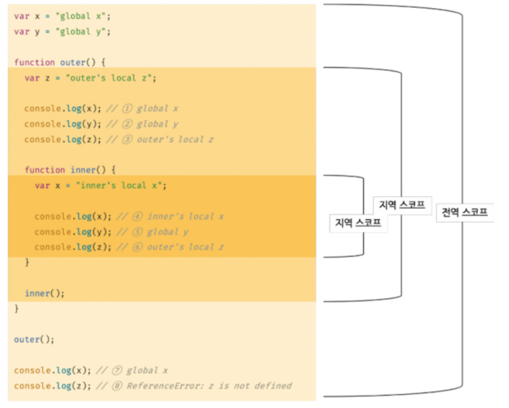

# 13장 : 스코프

## 스코프란?

모든 식별자가 자신이 선언된 위치에 의해 다른 코드가 식별자 자신을 참조할 수 있는 유효 범위

- **식별자가 유효하게 참조될 수 있는 범위(공간)
  변수나 함수가 “어디에서 접근 가능한가”를 결정하는 규칙**

```jsx
function add(x, y) {
  // 매개변수는 함수 몸체 내부에서만 참조할 수 있다.
  // 즉, 매개변수의 스코프(유효범위)는 함수 몸체 내부이다.
  console.log(x, y); // 2, 5
  return x + y;
}

add(2, 5);

// 매개변수는 함수 몸체 내부에서만 참조할 수 있다.
console.log(x, y);
```

- `x`, `y`는 함수 내부에서만 **유효(scope 내)**
- 함수 밖에서는 **접근할 수 없음**

<br/>

함수는 **코드** **블록**(`{}`) 이나 **함수 몸체 내**에서도 선언할 수 있다.

이때, 코드 블록이나 함수는 중첩될 수 있다.

```jsx
var var1 = 1; // 코드의 가장 바깥 영역에서 선언한 함수

if (true) {
  var var2 = 2; // 코드 블록 내에서 선언한 변수
  if (true) {
    var var3 = 3; // 중첩된 코드 블록 내에서 선언한 변수
  }
}

function foo() {
  var var4 = 4; // 함수 내에서 선언한 변수

  function bar() {
    var var5 = 5; // 중첩된 함수 내에서 선언한 변수
  }
}

console.log(var1); // ✅ 1
console.log(var2); // ✅ 2
console.log(var3); // ✅ 3
console.log(var4); // ❌ ReferenceError : var4 is not defined
console.log(var5); // ❌ ReferenceError : var5 is not defined
```

- `var` 키워드는 함수 레벨 스코프이므로 **if 블록 안에서 선언해도 외부에서 참조 가능**
- 반면 **함수 내부에서 선언한 변수는 함수 외부에서 참조 불가**

<br/>

<br/>

```jsx
var x = "global";

function foo() {
  var x = "local";
  console.log(x); // 1️⃣ 'local' → 내부 스코프의 x 참조
}

foo();

console.log(x); // 2️⃣ 'global' → 외부 스코프의 x 참조
```

- 함수 안에 있는 `x`와 전역의 `x`는 **이름은 같지만 완전히 별개**
- **서로 다른 스코프에 존재하므로 서로 영향을 주지 않음**

<br/>

**식별자 결정**

> 스코프는 자바스크립트 엔진이 어떤 변수를 참조할지 결정하는 기준

- 변수 이름이 같더라도 **어디서 선언되었는지**에 따라 **다른 변수로 취급**
- 이를 **식별자 결정**(Identifier Resolution)이라고 부름

```jsx
var x = "global";

function foo() {
  var x = "local"; // 지역 스코프
  console.log(x); // 이 x를 참조
}
```

자바스크립트는 엔진은 스코프를 통해 어떤 변수를 참조해야할 것인지 결정한다.

따라서 스코프란 자바스크립트 엔진이 식별자를 검색할 때 사용하는 규칙이라고도 할 수 있다.

자바스크립트 엔진은 코드를 실행할 때 코드의 문맥을 고려한다.

<br/>

코드의 가장 바깥 영역에 선언된 `변수 x` 는 어디서든지 참조할 수 있다.

하지만 `foo` 함수 내부에서 선언된 `변수 x` 는 `foo` 함수 내에서만 참조할 수 있다.

이때 두 개의 `x` 변수는 식별자 이름이 동일하지만 스코프가 다른 별개의 변수이다.

<br/>

따라서, 식별자는 값을 구별할 수 있는 이름으로

1. 식별자는 고유해야 함
2. **하나의 스코프 내에서는 동일 이름의 식별자를 중복 선언할 수 없음**
3. 하지만 **서로 다른 스코프에서는 같은 이름의 식별자 사용 가능**

<br/>

<br/>

## 스코프의 종류

코드는 전역(global)과 지역(local)으로 구분할 수 있다.

| 구분 | 설명                  | 스코프      | 변수      |
| ---- | --------------------- | ----------- | --------- |
| 전역 | 코드의 가장 바깥 영역 | 전역 스코프 | 전역 변수 |
| 지역 | 함수 몸체 내부        | 지역 스코프 | 지역 변수 |

변수는 자신이 선언된 위치에 의해 자신이 유효한 범위인 스코프가 결정됨.

- 전역에서 선언된 변수는 전역 스코프를 갖는 전역 변수
- 지역에서 선언된 변수는 지역 스코프를 갖는 지역 변수

### 전역과 전역 스코프 & 지역과 지역 스코프



**전역**
코드의 가장 바깥 영역!

전역에 변수를 선언하면 전역 스코프를 갖는 **전역 변수**가 된다.

- 전역 변수는 어디서든지 참조할 수 있다.

<br/>

**지역**

지역이란 **함수 몸체 내부**를 말한다.

지역에 변수를 선언하면 지역 스코프를 갖는 지역 변수가 된다.

- 지역변수는 자신의 지역 스코프와 하위 지역 스코프에서 유효하다.

<br/>

## 스코프 체인

스코프는 함수 중첩에 의해 계층적 구조를 갖는다.

중첩 함수의 지역 스코프는 중첩 함수를 포함하는 외부 함수의 지역 스코프와 계층적 구조를 갖는다.

이때 외부 함수의 지역 스코프를 중첩 함수의 **상위 스코프**라 한다.


위 그림에서 지역은 `outer` 함수와 `inner` 함수 지역이 있다.

- `inner` 함수는 `outer` 함수의 중첩 함수다.
- `outer` 함수가 만든 지역 스코프는 `inner` 함수가 만든 지역 스코프의 상위 스코프이다.
- `outer` 함수의 지역 스코프의 상위 스코프는 전역 스코프다.

<br/>

- 스코프가 계층적으로 연결된 것을 **스코프 체인**이라고 한다.

변수를 참조할 때 자바스크립트 엔진은 스코프 체인을 통해 변수를 참조하는 코드의 스코프에서 시작하여 **상위 스코프 방향으로 이동하며 선언된 변수를 검색**한다.

✅ 상위 스코프에서 선언한 변수를 하위 스코프에서도 참조할 수 있다.

<br/>

<br/>

### 스코프체인에 의한 변수 검색

자바스크립트 엔진은 변수를 참조하는 코드의 스코프에서 시작해서 **상위 스코프 방향**으로 이동하며 선언된 변수를 검색한다.

<br/>

**동작 방식**

- **현재 스코프**에 참조하려는 변수가 없으면
  ➡ **바로 바깥(상위) 스코프로 이동**
  ➡ 계속해서 **전역 스코프까지** 찾아 올라감
- **상위 스코프의 변수는 하위 스코프에서 참조 가능**
- **하위 스코프의 변수는 상위 스코프에서 참조 불가**

<br/>

### 스코프 체인에 의한 함수 검색

자바스크립트는 **함수도 변수처럼 스코프를 갖고**, **식별자를 통해 스코프 체인을 따라 검색**된다.

```jsx
// 전역 함수
function foo() {
  console.log("global function foo");
}

function bar() {
  // 중첩 함수
  function foo() {
    console.log("local function foo");
  }
  foo(); // 1️⃣
}

bar(); // 👉 'local function foo'
```

- `bar()` 함수 내부에서 `foo()`를 호출함
- 자바스크립트 엔진은 **현재 스코프(bar 함수 내부)**부터
  `foo`라는 식별자를 검색
- **지역에 `foo()` 함수가 있으므로 그 함수가 호출됨**
- **전역의 `foo()` 함수는 무시됨**

<br/>

**✅ 함수도 변수처럼 스코프를 갖는다.**

- 함수 선언문은 런타임 이전에 평가되어 **함수 객체가 생성됨**
- **함수 이름과 동일한 식별자가 암묵적으로 선언되고**,
  해당 식별자에 함수 객체가 할당됨

➡ 즉, 함수도 **변수처럼 스코프에 등록되고, 스코프 체인을 따라 검색됨**

<br/>

## 함수 레벨 스코프

코드 블록이 아닌 함수에 의해서만 지역 스코프가 생성된다는 것

- `var` 키워드로 선언된 변수는 오로지 함수의 코드 블록만을 지역 스코프로 인정한다.

```jsx
var x = 1;

if (true) {
  // var 키워드로 선언된 변수는 함수의 코드 블록만을 지역 스코프로 인정한다.
  // 함수 밖에서 var 키워드로 선언된 변수는 코드 블록 내에서 선언되었다 할지라도 모두 전역 변수다.
  // 따라서 x는 전역 변수다. 이미 선언된 전역 변수가 x가 있으므로 x 변수는 중복 선언된다.
  // 이는 의도치 않게 변수 값이 변경되는 부작용을 발생시킨다.
  var x = 10;
}

console.log(x); // 10
```

- 전역 변수 `x` 는 중복 선언되고, 그 결과 의도치 않은 전역 변수의 값이 재할당 된다.

<br/>

```jsx
var i = 10;

// for 문에서 선언한 i는 전역 변수다. 이미 선언된 전역 변수 i가 있으므로 중복 선언된다.
for (var i = 0; i < 5; i++) {
  console.log(i); // 0 1 2 3 4
}

// 의도치 않게 변수의 값이 변경되었다.
console.log(i); // 5
```

- `var` 키워드로 선언된 변수는 블록 레벨 스코프를 인정하지 않음
- `i` 변수는 전역 변수가 되어 중복 선언됨
- 의도치 않은 전역 변수의 값이 재할당됨

<br/>

## 렉시컬 스코프

프로그래밍 언어는 일반적으로 두 가지 방식 중 한 가지 방식으로 함수의 상위 스코프를 결정한다.

<br/>

1. **동적 스코프**

   함수를 정의하는 시점에 함수가 어디서 호출 될지 알 수 없다.

   **함수가 호출되는 시점**에 동적으로 상위 스코프를 결정

1. **렉시컬 스코프**

   **함수 정의가 평가되는 시점**에 상위 스코프가 정적으로 결정

<br/>

- 자바스크립트는 렉시컬 스코프를 따르므로 함수를 **어디서 호출했는지가 아니라 함수를 어디서 정의했는지**에 따라 **상위 스코프를 결정**한다.

함수가 호출된 위치는 상위 스코프 결정에 어떠한 영향도 주지 않는다.

즉, **함수의 상위 스코프**는 언제나 **자신이 정의된 스코프**다.

<br/>

함수의 상위 스코프는 함수 정의가 실행될 때 정적으로 결정된다.

함수 정의가 실행되어 생성된 함수 객체는 결정된 상위 스코프를 기억한다.

함수가 호출될 때마다 함수의 상위 스코프를 참조할 필요가 있기 때문이다.
