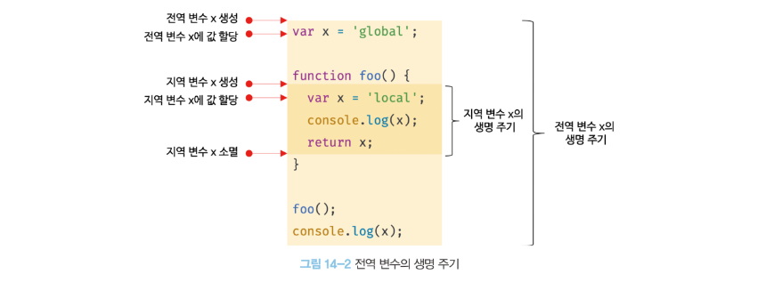

# 14장 : 전역 변수의 문제점

## 변수의 생명 주기

### 지역 변수의 생명주기

변수는 생성되고 소멸되는 생명 주기가 있다.

- 전역 변수의 생명 주기는 애플리케이션의 생명 주기와 같다.
- 지역 변수의 생명 주기는 함수의 생명 주기와 같다.

- 변수의 생명 주기
- 메모리 공간이 확보된 시점부터 메모리 공간이 해제되어 가용 메모리 풀에 반환되는 시점

```jsx
var x = "global";

function foo() {
  console.log(x); // foo 함수 내부에서 변수 x는 이미 선언되었지만 값이 console 출력 후 할당되었기때문에 초기값인 undefined가 출력된다.
  var x = "local";
}

foo();
console.log(x);

/* 출력값
undefined
global
*/
```

- **호이스팅은 스코프 단위로 동작**한다.
- 호이스팅 : 변수 선언이 스코프의 선두로 끌어 올려진 것처럼 동작하는 js 고유의 특징

### 전역 변수의 생명 주기

전역 변수의 생명 주기는 전역 객체의 생명 주기와 일치

전역 객체 `window` 는 웹페이지를 닫기 전까지 유효하므로

`var` 키워드로 선언한 전역 변수의 생명 주기는 전역 객체의 생명 주기와 일치



## **전역 변수의 문제점**

1. **암묵적 결합**

   모든 코드가 전역 변수를 참조할 수 있다.

   변수의 유효 범위가 클수록 가독성이 나빠지고, 상태 변경의 위험성이 높아진다.

2. **긴 생명 주기**

   전역 변수는 생명 주기가 길다.

   따라서, 메모리 리소스를 오래 소비한다.

   전역 변수의 상태를 변경할 수 있는 시간도 길어진다.

   `var 키워드` 는 중복 선언이 되므로 재할당이 이뤄진다.

3. **스코프 체인 상에서 종점에 존재**

   변수를 검색할 때 가장 마지막에 검색된다.

   ➡️ 전역 변수의 검색 속도가 가장 느리다.

4. **네임스페이스 오염**

   파일이 분리되어 있어도 하나의 전역 스코프를 공유 한다.

   다른 파일 내에서 같은 이름을 가진 전역 변수나 전역 함수가 같은 스코프 내에 존재한다면 의도치 않는 결과 발생 가능

## 전역 변수 사용을 억제하는 방법

전역 변수를 반드시 사용해야 할 이유를 찾지 못한다면 지역 변수를 사용해야 한다.

> 변수의 스코프는 좁을 수록 좋다.

<br/>

### **즉시 실행 함수**

즉시 실행 함수는 단 한 번만 호출된다.

모든 코드를 즉시 실행 함수로 감싸면 모든 변수는 즉시 실행 함수의 지역 변수가 된다.

```jsx
(function () {
  var foo = 10; // 즉시 실행 함수의 지역 변수
  //...
})();

console.log(foo); // ❌ 참조 에러
```

위 방법을 사용하면 전역 변수를 생성하지 않으므로 라이브러리 등에 자주 사용된다.

### **네임스페이스 객체**

전역에 네임스페이스 역할을 담당할 객체 생성 후 전역 변수처럼 사용하고 싶은 변수를 프로퍼티로 추가하는 방법

```jsx
var MYAPP = {}; // 전역 네임스페이스 객체

MYAPP.name = "Lee";

console.log(MYAPP.name); // Lee

// 네임 스페이스 객체에 또다른 네임 스페이스 객체를 프로퍼티로 추가해
// 네임 스페이스를 계층적으로 구성할 수 있음
MYAPP.person = {
  name: "Lee",
  address: "Seoul",
};

console.log(MYAPP.person.name); // Lee
```

✅ 네임스페이스 객체 자체가 전역 변수에 할당되므로 유용하진 않음

### **모듈 패턴**

클래스를 모방해서 관련이 있는 변수와 함수를 모아 즉시 실행 함수로 감싸 하나의 모듈 생성

클로저를 기반으로 동작

전역 변수의 억제와 \*캡슐화까지 구현 가능

<br/>

🧐 **캡슐화(encapsulation)란?**

객체의 상태를 나타내는 프로퍼티와 프로퍼티를 참조하고 조작할 수 있는 동작인 메서드를 하나로 묶는 것.

객체의 특정 프로퍼티나 메서드를 감출 목적으로 사용한다. 👉 정보 은닉

<br/>

자바스크립트는 `public` , `private` ,`protected` 등의 접근 제한자를 제공하지 않는다.

```jsx
var Counter = (function() {
  // private 변수
  var num = 0;

  //외부로 공개할 데이터, 메서드를 프로퍼티로 추가한 객체 반환
  return {
    increase() {
      return ++num;
    },
    decrease() {
      return --num;
    }
  };
}));

// private 변수는 외부 노출 X
console.log(Counter.num); // undefined

console.log(Counter.increase()); // 1
console.log(Counter.increase()); // 2
```

- 위 코드의 즉시 실행 함수는 **객체를 반환**한다.
- 이 객체는 외부에 노출하고 싶은 변수나 함수를 담아 반환
- 이때 반환되는 객체의 프로퍼티는 외부에 노출되는 **퍼블릭 멤버**
- 외부로 노출하고 싶지 않은 변수나 함수는 객체에 추가 ❌
- 객체에 추가되지 않은 프로퍼티는 외부에서 접근할 수 없는 **프라이빗 멤버**

### **ES6모듈**

> ES6 모듈을 사용하면 더는 전역변수를 사용할 수 없다.

<br/>

**ES6모듈은 파일 자체의 독자적인 모듈 스코프 제공한다.**

모듈 내에서 선언한 변수는 **전역 변수가 아님**

`var` 키워드로 선언해도 더 이상 `window` 객체의 프로퍼티가 되지 않음

```jsx
// app.mjs
var msg = "Hello";

// 브라우저 콘솔에서
console.log(window.msg); // ❌ undefined
```

<br/>

`<script type="module">` 을 사용하면 로드된 자바스크립트 파일은 모듈로서 동작

모듈의 파일 확장자는 `mjs` 권장

모듈끼리는 기본적으로 서로 격리되어 동작함.

```html
<script type="module" src="lib.mjs"></script>
<script type="module" src="app.mjs"></script>
```

<br/>

- **지원 브라우저**:
  ✅ Chrome 61+, Firefox 60+, Safari 10.1+, Edge 16+
- **미지원 브라우저**:
  ❌ IE 및 구형 브라우저에서는 동작하지 않음

<br/>

ES6 모듈 기능을 사용하더라도 트랜스파일리이나 번들링이 필요해 아직까지는 Webpack 등의 모듈 번들러를 사용하는 것이 일반적
