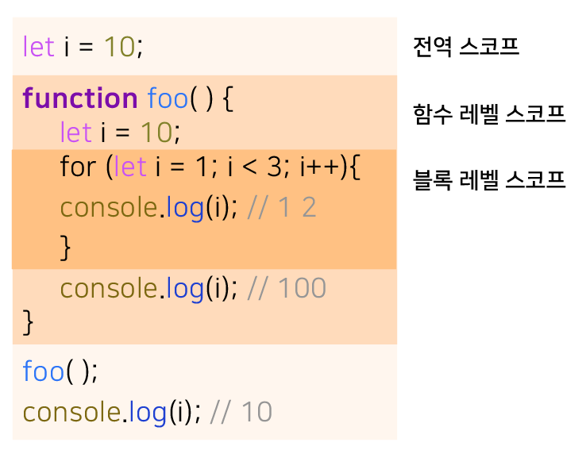

# 15장 : let, const 키워드와 블록 레벨 스코프

## **var 키워드로 선언한 변수의 문제점**

### 변수 중복 선언 허용

`var` 키워드로 선언한 변수를 중복 선언하면 초기화문 유무에 따라 다르게 동작

```jsx
var x = 1;
var y = 1;

// 초기화 ✅
// var 키워드로 선언된 변수는 같은 스코프 내에서 중복 선언을 허용
// 초기화 문이 있는 변수 선언문은 자바스크립트 엔진에 의해 var 키워드가 없는 것처럼 동작함
var x = 100;

// 초기화 ❌
// 초기화 문이 없는 변수 선언문은 무시
var y;

console.log(x); // 100
console.log(y); // 1
```

- 변수를 중복 선언하며 값까지 할당 했다면 의도치 않게 먼저 선언된 변수 값이 변경된다.

<br/>

### 함수 레벨 스코프

`var` 키워드로 선언한 변수는 오로지 **함수의 코드 블록만을 지역 스코프로 인정**

함수 외부에서 `var` 키워드로 선언한 변수는 코드 블록 내에서 선언해도 모두 전역 변수가 된다.

```jsx
var x = 1;

if (true) {
  // x는 전역변수로 이미 선언된 x가 있으므로 x 변수는 중복 선언됨.
  var x = 10;
}

console.log(x); // 10
```

```jsx
var i = 10;

// for에서 선언한 i는 이미 선언된 전역 변수 i가 있으므로 중복 선언 & 전역 변수
for (var i = 0; i < 5; i++) {
  console.log(i); // 0 1 2 3 4
}

// 의도치 않게 i 변수의 값이 변경됨
console.log(i); // 5
```

<br/>

### 변수 호이스팅

`var` 키워드로 변수를 선언하면 **변수 호이스팅에 의해 변수 선언문이 스코프의 선두로 끌여 올려진 것처럼 동작**

```jsx
// 이 시점에는 변수 호이스팅에 의해 이미 foo 변수가 선언되었다. (1. 선언 단계)
// 변수 foo는 undefined로 초기화 된다(2. 초기화 단계)
console.log(foo); // undefined

// 변수에 값을 할당(3. 할당 단계)
foo = 123;

console.log(foo); // 123

// 변수 선언은 런타임 이전에 자바스크립트 엔진에 의해 암묵적으로 실행된다.
var foo;
```

- 변수 호이스팅에 의해 `var` 키워드로 선언한 변수는 **번수 선언문 이전에 참조할 수 있다.**
- 선언문 이전에 변수를 참조하면 언제나 `undefined` 를 반환한다.

## let 키워드

### **변수 중복 선언 금지**

`let` 키워드로 이름이 같은 변수를 중복 선언 하면 `SyntaxError` 발생

```jsx
let bar = 123;

// let이나 const 키워드로 선언된 변수는 같은 스코프 내에서 중복 선언을 허용하지 않는다.
let bar = 456; // ❌ SyntaxError : Identifier 'bar' has already been declared
```

<br/>

### **블록 레벨 스코프**

**모든 코드 블록**을 지역 스코프로 인정하는 **블록 레벨 스코프를 따른다.**

✅ 함수, `if` 문, `for` 문, `while` 문, `try/catch` 문 …

```jsx
let foo = 1; // 전역 변수

{
  let foo = 2; // 지역 변수
  let bar = 3; // 지역 변수
}

console.log(foo); // 1
console.log(bar); // ❌ ReferenceError : bar is not defined
```

- 코드 블록 내에서 선언된 `foo` 변수와 `bar` 변수는 지역 변수다
- 전역에서 선언된 변수와 블록 내에서 선언된 변수는 다른 별개의 변수다.
- 전역에서는 지역에서 선언된 변수를 참조할 수 없다.

<br/>

함수도 코드 블록이므로 스코프를 만든다.

**함수 내의 코드 블록**은 **함수 레벨 스코프**에 **중첩**된다.



<br/>

### **변수 호이스팅**

`let` 키워드로 선언한 변수는 변수 호이스팅이 발생하지 않는 것처럼 동작한다.

```jsx
console.log(foo); // ❌ RefferenceError : foo is not defined
let foo;
```

<br/>

**✅ `let` 키워드로 선언한 변수는 선언 단계**와 **초기화 단계**가 분리되어 진행되기 때문에

`let 키워드` 로 선언한 변수를 변수 선언문 이전에 참조하면 **참조 에러** 발생한다.

스코프 시작 지점부터 초기화 시작 시점까지 변수를 참조할 수 없는 구간을 **일시적 사각지대(TDZ)**라고 부른다.

```jsx
// 런타임 이전에 선언 단계 실행
// 초기화 이전에 변수 참조 불가
console.log(foo); // ❌ ReferenceError : foo is not defined

let foo; //초기화 단계 실행
console.log(foo); // undefined

foo = 1; // 할당 단계 실행
console.log(foo); // 1
```

<br/>

하지만, 호이스팅이 발생하지 않는 것은 아님!!

```jsx
let foo = 1;
{
  console.log(foo); // ❌ Reference Error : Cannnot access 'foo' before initialization
  let foo = 2;
}
```

- 호이스팅이 발생하지 않으면 출력은 전역 변수 `foo`의 값인 1을 출력해야 한다.
- 하지만 `let` 키워드로 선언한 변수도 여전히 호이스팅이 발생하므로 참조 에러가 발생한다.
- 단, ES6에서 도입된 `let` , `const` ,`class` 을 사용한 선언문은 호이스팅이 발생하지 않는 것처럼 동작한다.

<br/>

### 전역 객체와 let

전역 객체의 프로퍼티를 참조할 때 `window` 를 생략할 수 있다.

```jsx
// 이 예제는 브라우저 환경에서 실행해야 한다.

// 전역 변수
var x = 1;
// 암묵적 전역
y = 2;
// 전역 함수
function foo() {}

// var 키워드로 선언한 전역 변수는 전역 객체 window의 프로퍼티다.
console.log(window.x); // 1

//전역 객체 window의 프로퍼티는 전역 변수처럼 사용할 수 있다.
console.log(x); // 1

// 암묵적 전역은 전역 객체 window의 프로퍼티다
console.log(window.y); // 2
console.log(y); // 2

// 함수 선언문으로 정의한 전역 함수는 전역 객체 window의 프로퍼티다.
console.log(window.foo);
console.log(foo);
```

<br/>

`let` 키워드로 선언한 전역 변수는 전역 객체의 프로퍼티가 아니다.

즉 `winodw` 로 접근할 수 없다.

`let` 전역 변수는 보이지 않는 개념적인 블록 내에 존재하게 된다.

```jsx
// 이 예제는 브라우저 환경에서 실행해야 한다.
let x = 1;

// let, const 키워드로 선언한 전역 변수는 전역 객체 window의 프로퍼티가 아니다.
console.log(window.x); // undefined
console.log(x); // 1
```

<br/>

## const 키워드

```jsx
conse 키워드는 상수를 선언하기 위해 사용된다.
```

### 선언과 초기화

`const 키워드` 로 선언한 변수는 반드시 **선언과 동시에 초기화**해야 한다.

그렇지 않으면 `SyntaxError` 가 발생한다.

<br/>

`let 키워드` 로 선언한 변수와 마찬가지로 **블록 레벨 스코프**를 가지며, **변수 호이스팅**이 발생하지 않는 것처럼 동작한다.

```jsx
{
  // 변수 호이스팅이 발생하지 않는 것처럼 동작
  console.log(foo); // ❌ ReferenceError : Cannot access 'foo' before initialization
  const foo = 1;
  console.log(foo); // 1
}

// 블록 레벨 스코프를 갖는다
console.log(foo); // ❌ ReferenceError : foo is not defined
```

<br/>

### 재할당 금지

다른 키워드와 달리 **재할당이 금지**된다.

```jsx
const foo = 1;
foo = 2; // ❌ TypeError : Assignment to constant variable.
```

<br/>

### 상수

- 상수는 재할당이 금지된 변수를 말한다.

상수는 상태 유지와 가독성, 유지보수의 편의를 위해 적극적으로 사용해야 한다.

```jsx
// 세전 가격
let preTaxPrice = 100;

// 세후 가격
// 0.1의 의미를 명확히 알기 어렵기 떄문에 가독성이 좋지 않다.
let afterTaxPrice = preTaxPrice + preTaxPrice * 0.1;

console.log(afterTaxPrice); // 110
```

<br/>

`const 키워드` 로 선언된 변수는 **재할당이 금지**된다.

`const 키워드` 로 선언된 변수에 원시 값을 할당한 경우 원시 값은 변경할 수 없는 값이고, 재할당이 금지되므로 할당된 값을 변경할 방법이 없다.

일반적으로 상수의 이름은 대문자로 선언해 상수임을 명확히 나타낸다.

여러 단어로 이뤄진 경우에는 스네이크 케이스로 표현!

```jsx
// 변수 이름을 대문자로 선언해 상수임을 명확히 나타낸다.
const TAX_RATE = 0.1;

// 세전 가격
let preTaxPrice = 100;

// 세후 가격
let afterTaxPrice = preTaxPrice + preTaxPrice * TAX_RATE;

console.log(afterTaxPrice); // 110
```

<br/>

### const 키워드와 객체

`const 키워드` 로 선언된 변수에 객체를 할당한 경우 값을 변경할 수 있다.

✅ 변경 가능한 값인 객체는 재할당 없이 직접 변경이 가능하기 때문이다!

```jsx
const person = {
  name: "Lee",
};

// 객체는 변경 가능한 값이다. 따라서 재할당 없이 변경이 가능하다.
person.name = "Kim";

console.log(person); // {name : "Kim"}
```

- `const 키워드`는 재할당을 금지할 뿐 불변을 의미하지는 않는다.
- 새로운 값을 재할당하는 것은 불가능
- 프로퍼티 동적 생성, 삭제, 픞로퍼티 값의 변경을 통해 객체를 변경하는 것은 가능
- 객체가 변경되더라도 변수에 할당된 참조 값은 변경되지 않는다.

## `var` vs `let` vs `const`

| `let`                              | `const`                     |
| ---------------------------------- | --------------------------- |
| 재할당이 필요한 경우에 한정해 사용 | 변수 선언에 기본적으로 사용 |

- ES6을 사용한다면 `var` 키워드는 사용하지 않는다
- 재할당이 필요한 경우에 한정해 `let` 키워드 사용
  - 이때 변수의 스코프는 최대한 좁게 만든다
- 변경이 발생하지 않고 읽기 전용으로 사용하는 원시 값과 객체에는 `const` 키워드 사용
- `const` 는 재할당을 금지하므로 다른 키워드보다 안전하다
