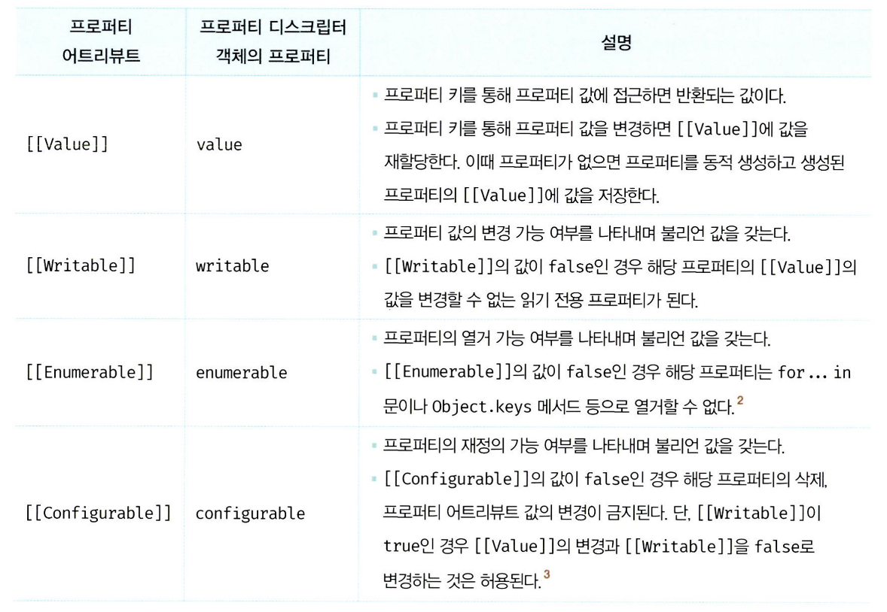

# 16장 : 프로퍼티 어트리뷰트

## 내부 슬롯과 내부 메서드

- 자바스크립트 **엔진의 내부 구현을 설명하기 위한 개념**
- ECMAScript 사양에서 사용하는 **"의사 프로퍼티"** &**"의사 메서드"**

ECMAScript 사양에 등장하는 이중 대괄호 `([[...]])`로 감싼 이름들이 내부 슬롯과 내부 메서드다.

내부 슬롯과 내부 메서드는 자바스크립트 엔진에서 실제로 동작하지만 개발자가 직접 접근할 수 있도록 외부에 공개된 객체 프로퍼티는 아니다.

자바스크립트 엔진의 내부 로직이므로 원칙적으로 직접적으로 접근하거나 호출할 수 있는 방법을 제공하지 않는다.

단, 일부 내부 슬롯과 내부 메서드에 한하여 간접적으로 접근할 수 있는 수단을 제공하기는 한다.

예를 들어, 모든 객체는 `[[Prototype]]` 이라는 내부 슬롯을 갖는다.

```jsx
const o = {};

// 내부 슬롯은 자바스크립트 엔진의 내부 로직이므로 직접 접근할 수 없다.
o.[[Prototype]] // ❌ Uncaught Syntax Error : Unexpected toekn '['

// 단 일부 내부 슬롯과 내부 메소드에 한하여 간접적으로 접근할 수 있는 수단을 제공하기는 한다.
o.__proto__ // Object.prototype
```

<br/>

## 프로퍼티 어트리뷰트와 프로퍼티 디스크립터 객체

자바스크립트 엔진은 프로퍼티를 생성할 때 프로퍼티의 상태를 나타내는 프로퍼티 어트리뷰트를 기본값으로 자동 정의한다.

<br/>

**🤔 프로퍼티 상태란?**

- 프로퍼티의 값
- 값의 갱신 가능 여부
- 열거 가능 여부
- 정의 가능 여부

<br/>

**프로퍼티 어트리뷰트**

자바스크립트 엔진이 관리하는 **내부 상태 값**인 내부 슬롯

`[[Value]]` , `[[Writable]]` , `[[Eumerable]]` , `[[Configurable]]` 이다.

프로퍼티 어트리뷰트에 **직접 접근 할 수 없다.**

하지만, `Object.getOwnPropertyDescriptor` 메소드를 사용하여 간접적으로 확인할 수 있다.

```jsx
const person = {
  name: "Lee",
};

// 프로퍼티 어트리뷰트 정보를 제공하는 프로퍼티 디스크립터 객체를 반환한다.
console.log(Object.getOwnPropertyDescriptor(person, "name"));
// {value : "Lee", writable : true, enumerable : true, configurable : tre}
```

- 첫번째 매개변수 : 객체의 참조를 전달
- 두번째 매개변수 : 프로퍼티 키를 문자열로 전달
- `Object.getOwnPropertyDescriptor` 메서드는 프로퍼티 어트리뷰트 정보를 제공하는 **프로퍼티 티스크립터 객체**를 반환
- 존재 하지 않는 프로퍼티나 상속받은 프로퍼티에 대한 프로퍼티 디스크립터를 요구하면 `undefined` 가 반환

<br/>

ES8에서 도입된 `Object.getOwnPropertyDescriptor` 메소드는 모든 프로퍼티의 프로퍼티 어트리뷰트 정보를 제공하는 프로퍼티 디스크립터 객체들을 반환한다.

```jsx
const person = {
  name: "Lee",
};

// 프로퍼티 동적 생성
person.age = 20;

// 모든 프로퍼티의 프로퍼티 어트리뷰트 정보를 제공하는 프로퍼티 디스크립터 객체들을 반환
console.log(Object.getOwnPropertyDescriptor(person, "name"));

/*
{
  name : {value : "Lee", writable : true, enumerable : true, configurable : true},
  age : {value : 20, writable : true, enumerable : true, configurable : true}
}
*/
```

## 데이터 프로퍼티와 접근자 프로퍼티

프로퍼티는 데이터 프로퍼티와 접근자 프로퍼티로 구분할 수 있다.

<br/>

- **데이터 프로퍼티**
  키와 값으로 구성된 일반적인 프로퍼티

<br/>

- **접근자 프로퍼티**
  자체적으로 값을 갖고 있지 않고 다른 데이터 프로퍼티의 값을 읽거나 저장할 때 호출되는 접근자 함수로 구성된 프로퍼티

<br/>

### 데이터 프로퍼티

자바스크립트 엔진이 프로퍼티를 생성할 때 **기본값으로 자동 정의**된다.

데이터 프로퍼티는 아래와 같은 프로퍼티 어트리뷰트를 갖는다.



```jsx
const person = {
  name: "Lee",
};

// 프로퍼티 어트리뷰트 정보를 제공하는 프로퍼티 디스크립터 객체를 취득한다.
console.log(Object.getOwnPropertyDescriptor(person, "name"));
// {value : 'Lee', writable : true, enumerable : true, configurable : true}
```

- 프로퍼티가 생성될때 `[[Value]]` 값은 프로퍼티 값으로 초기화
- `[[Writable]]` , `[[Enumerable]]` ,`[[Configurable]]` 의 값은 `true` 로 초기화
- 프로퍼티를 동적 추가해도 똑같음

<br/>

### 접근자 프로퍼티

자체적으로는 값을 갖지 않고 다른 데이터 프로퍼티의 값을 읽거나 저장할때 사용하는 접근자함수로 구성된 프로퍼티


<br/>

```jsx
접근자 함수는 getter/setter 함수라고도 부른다!
```

접근자 프로퍼티는 `getter` 와 `setter` 함수를 모두 정의할 수도 있고 하나만 정의할 수도 있다.

```jsx
const person = {
  // 데이터 프로퍼티
  firstName: "Ungmo",
  lastName: "Lee",

  // fullName은 접근자 함수로 구성된 접근자 프로퍼티다.
  // getter 함수
  get fullName() {
    // 배열 디스트럭처럼 할당
    [this.firstName, this.lastName] = name.split(" ");
  },
};

// 데이터 프로퍼티를 통한 프로퍼티 값의 참조
console.log(person.firstName + " " + person.lastName); // Ungmo Lee

// 접근자 프로퍼티를 통한 프로퍼티 값의 저장
// 접근자 프로퍼티 fullName에 값을 저장하면 setter 함수가 호출된다.
person.fullName = "Heegun Lee";
console.log(person); // {firstName : "Heegun", lastName : "Lee"}

// 접근자 프로퍼티를 통한 프로퍼티 값의 참조
// 접근자 프로퍼티 fullName에 접근하면 getter 함수가 호출된다.
console.log(person.fullName); // Heegun Lee

// firstName은 데이터 프로퍼티다.
let descriptor = Obejct.getOwnPropertyDescriptor(person, "firstName");
console.log(descriptor);
// {value : "Heegun", writable : true, enumerable : true, configurable : true}

// fullName은 접근자 프로퍼티다.
descriptor = Obejct.getOwnPropertyDescriptor(person, "fullName");
console.log(descriptor);
// {get : f, set : f, enumerable : true, configurable : true}
```

- `person` 객체의 `firstName`, `lastName`은 **일반적인 데이터 프로퍼티**다.
- 메서드 앞에 `get`, `set`이 붙은 함수는 각각 **getter**, **setter 함수**다.
- 이 getter/setter 함수의 이름인 `fullName`이 **접근자 프로퍼티**다.
- **접근자 프로퍼티는 자체적으로 값(`[[Value]]`)을 가지지 않는다.**
- 다만, **값을 읽거나 저장할 때에만 동작하는 함수 프로퍼티**이다.

<br/>

**✅ 내부 슬롯/내부 메서드 관점에서의 `[[Get]]` 동작 흐름**

접근자 프로퍼티에 접근하면, 자바스크립트 엔진은 내부적으로 `[[Get]]` 메서드를 호출함.

<br/>

1. **프로퍼티 키 유효성 확인**
   - 접근하려는 키가 **문자열 또는 심벌**인지 확인한다.
2. **프로토타입 체인에서 프로퍼티 검색**
   - 현재 객체부터 시작하여 상위 프로토타입 체인으로 올라가며 프로퍼티를 찾는다.
3. **검색된 프로퍼티가 데이터인지 접근자인지 판별**
   - 데이터 프로퍼티인지, 접근자 프로퍼티인지 구분한다.
4. **접근자 프로퍼티일 경우**
   - 해당 프로퍼티의 어트리뷰트 `[[Get]]`에 저장된 **getter 함수**를 호출한다.
   - 이 getter 함수의 실행 결과를 반환한다.

**💪** 참고: `[[Get]]` 내부 슬롯은

- `Object.getOwnPropertyDescriptor(obj, 'prop').get`의 반환값과 같다.
- 즉, **getter 함수는 프로퍼티 디스크립터의 `get` 속성에 저장되어 있음**

## 프로퍼티 정의

새로운 프로퍼티를 추가하면서 프로퍼티 어트리뷰트를 명시적으로 정의하거나, 기존 프로퍼티의 프로퍼티 어트리뷰트를 재정의하는 것

```jsx
Object.defineProperty(객체, 프로퍼티키, 프로퍼티디스크립터);
```

<br/>

`Object.defineProperty` 메서드를 사용하여 프로퍼티의 어트리뷰트를 정의할 수 있다.

인수로는 객체의 참조와 데이터 프로퍼티의 키인 문자열, 프로퍼티 디스크립터 객체를 전달한다.

```jsx
const person = {};

// 데이터 프로퍼티 정의
Object.defineProperty(person, "firstName", {
  value: "Ungmo",
  writable: true,
  enumerable: true,
  configurable: true,
});

Object.defineProperty(person, "lastName", {
  value: "Lee",
});
```

<br/>

### 디스크립터 프로퍼티 기본값

`Object.definedProperty` 메서드로 프로퍼티를 정의할 때 프로퍼티 디스크립터 객체의 프로퍼티를 일부 생략할 수 있다.

| 프로퍼티 디스크립터 | 내부 어트리뷰트    | 기본값      |
| ------------------- | ------------------ | ----------- |
| `value`             | `[[Value]]`        | `undefined` |
| `get`               | `[[Get]]`          | `undefined` |
| `set`               | `[[Set]]`          | `undefined` |
| `writable`          | `[[Writable]]`     | `false`     |
| `enumerable`        | `[[Enumerable]]`   | `false`     |
| `configurable`      | `[[Configurable]]` | `false`     |

<br/>

### 어트리뷰트 의미와 동작

- 디스크립터 객체의 프로퍼티를 누락시키면 `undefined` , `false` 가 기본값
- **`enumerable: false`**
  → `for...in`, `Object.keys()` 등에서 **열거되지 않음**
- **`writable: false`**
  → `[[Value]]` 값을 **변경할 수 없음** (변경 시 에러 없이 무시)
- **`configurable: false`**
  - 프로퍼티를 삭제할 수 없음(삭제 시 에러 없이 무시)
  - 해당 프로퍼티를 재정의할 수 없음
    ```jsx
    Obejct.defineProperty(person, "lastName", { enumerable: true });
    // ❌ Uncaught TypeError : Cannot redfine property : lastName
    ```

<br/>

`Object.definedProperty` 메서드 ➡️ 한번에 **하나의 프로퍼티만** 정의

`Object.definedProperties` 메서드 ➡️ 사용하면 **여러 개의 프로퍼티를 한번에 정의 가능**

```jsx
Object.defineProperties(person, {
  age: {
    value: 30,
    writable: true,
    enumerable: true,
    configurable: true,
  },
  gender: {
    value: "male",
    enumerable: true,
  },
});
```

<br/>

## 객체 변경 방지

객체 변경 방지 메서드들은 객체의 변경을 금지하는 강도가 다르다

| 구분           | 메서드                     | 프로퍼티 추가 | 프로퍼티 삭제 | 프로퍼티 값 읽기 | 프로퍼티 값 쓰기 | 프로퍼티 어트리뷰트 재정의 |
| -------------- | -------------------------- | ------------- | ------------- | ---------------- | ---------------- | -------------------------- |
| 객체 확장 금지 | `Object.preventExtensions` | ❌            | ✅            | ✅               | ✅               | ✅                         |
| 객체 밀봉      | `Object.seal`              | ❌            | ✅            | ✅               | ✅               | ❌                         |
| 객체 동결      | `Object.freezee`           | ❌            | ❌            | ✅               | ❌               | ❌                         |

### 객체 확장 금지

- `Object.preventExtensions` 메서드는 객체의 확장을 금지한다.

확장이 금지된 객체는 프로퍼티 추가가 금지된다.

- 객체에 **새로운 프로퍼티 추가 금지**
- 기존 프로퍼티 **수정/삭제는 가능**
- `Object.defineProperty()`로도 **추가 불가**

확장이 가능한 객체인지 확인 여부는 `Object.isExtensible` 메서드로 확인 가능!

```jsx
const person = {};
Object.preventExtensions(person);

person.age = 30; // ❌ 추가 안 됨
console.log(Object.isExtensible(person)); // false
```

### 객체 밀봉

- `Object.seal` 메서드는 객체를 밀봉한다.
- **프로퍼티 추가/삭제 금지**
- **어트리뷰트 재정의 금지 (`writable`, `enumerable` 등)**
- 프로퍼티 **값 변경은 가능**

밀봉된 객체인지 확인 여부는 `Object.isSealed` 메서드로 확인 가능

```jsx
const person = { name: "Lee" };
Object.seal(person);

person.name = "Kim"; // ✅ 값 변경 가능
delete person.name; // ❌ 삭제 안 됨
console.log(Object.isSealed(person)); // true
```

### 객체 동결

- `Object.freeze` 메서드는 객체를 동결한다.

객체 동결이란 프로퍼티 추가 및 삭제와 프로퍼티 어트리뷰트 재정의 금지, 프로퍼티 값 갱신 금지를 의미한다.

- **추가/삭제/재정의/값 변경 전부 금지**
- 오직 **읽기만 가능**

동결된 객체인지 확인 여부는 `Object.isFrozen` 메서드로 확인 가능

```jsx
const person = { name: "Lee" };
Object.freeze(person);

person.name = "Kim"; // ❌ 무시됨
delete person.name; // ❌ 무시됨
console.log(Object.isFrozen(person)); // true
```

### 불변 객체

지금까지 살펴본 변경 방지 메서드들은 **얕은 변경 방지**로 직속 프로퍼티만 변경이 방지되고 중첩 객체까지는 영향을 주지 못한다.

- `preventExtensions`, `seal`, `freeze` 모두 **직속 프로퍼티까지만 영향**
- **중첩 객체는 보호되지 않음**

```jsx
const person = {
  name: "Lee",
  address: { city: "Seoul" },
};

// 얕은 객체 동결
Object.freeze(person);

// 직속 프로퍼티만 동결
console.log(Object.isFrozen(person)); // ✅
// 중첩 객체까진 동결하지 못함
console.log(Object.isFrozen(person.address)); // ❌
```

중첩 객체까지 모두 동결하려면 객체를 값으로 갖는 모든 프로퍼티에 대해 **재귀적으로 `Object.frozen` 메서드를 호출**해야 한다.
