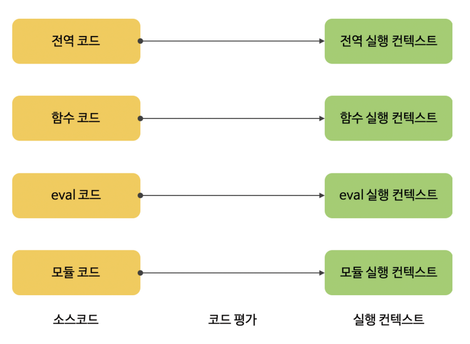
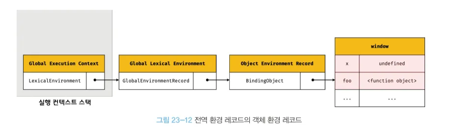

# 23장 : 실행 컨텍스트

**실행 컨텍스트(Execution Context)**

자바스크립트의 동작 원리를 담고 있는 핵심 개념

`scope` , `hoisting(호이스팅)` , `this` , `function` , `클로저(closure)` 등의 동작 방식을 이해할 수 있다.

➡️ 실행할 코드에 제공할 환경 정보를 모아 놓은 객체

## 소스 코드의 타입

4가지 타입의 소스코드는 실행 컨텍스트를 생성한다.

소스코드의 타입에 따라 실행 컨텍스트를 생성하는 과정과 관리 내용이 다르기 때문에 4가지 타입으로 구분한다.

\*소스 코드 : 실행 가능한 코드(executable code)

| 소스코드의 타입 | 설명                                                                                                             |
| --------------- | ---------------------------------------------------------------------------------------------------------------- |
| 전역 코드       | 전역에 존재하는 소스 코드를 말한다. <br/>전역에 정의된 함수, 클래스 등의 내부 코드는 포함되지 않는다.            |
| 함수 코드       | 함수 내부에 존재하는 소스 코드를 말한다. <br/> 함수 내부에 중첩된 함수, 클래스 등의 내부 코드는 포함되지 않는다. |
| eval 코드       | 빌트인 전역 함수의 eval 함수에 인수로 전달되어 실행되는 소스 코드를 말한다.                                      |
| 모듈 코드       | 모듈 내부에 존재하는 소스코드를 말한다. <br/> 모듈 내부의 함수, 클래스 등의 내부 코드는 포함되지 않는다.         |

1. **전역 코드**

   전역 변수를 관리하기 위해 최상위 스코프인 전역 스코프를 생성해야 함.

   전역 코드가 평가되면 전역 실행 컨텍스트가 생성 된다.

   ✅  `var` 키워드로 선언된 전역 변수와 함수 선언문 만든 함수는 전역 객체에 자동으로 붙는다.

   ```jsx
   var name = "이름";
   function sayHi() {
     console.log("안녕하세요!");
   }

   // 변수랑 함수는 window 객체에 자동으로 등록됨
   console.log(window.name); // 이름
   window.sayHi(); // "안녕하세요!"

   // let/const는 전역 객체 붙지 않는다.
   let age = 18;
   console.log(window.age); // undefined
   ```

   ✅ `var` 로 전역에서 선언하거나 함수 선언문 `function 함수명 () {}` 으로 만든 함수는 자동으로 `window` 에 붙어서 `window.변수명` , `window.함수명()` 으로 전역 객체를 통해 접근 가능하다!

<br/>

1. **함수 코드**

   함수 코드는 지역 스코프를 생성하고 지역 변수, 매개 변수, `arguments` 객체를 관리해야 한다.

   ✅ 함수는 실행되면 함수 내부만의 변수 공간(지역 스코프)가 생김

   ```jsx
   function hi(name) {
     let greeting = "안녕"; // 함수 안에서만 보임
   }
   ```

   생성한 지역 스코프를 전역 스코프에서 시작하는 스코프 체인의 일원으로 연결해야 한다.

   ✅ 함수에서 변수를 찾을때 지역 스코프 → 바깥 스코프 → 전역 스코프로 이어져 있어(스코프 체인) 필요한 걸 찾아 감

   ```jsx
   var a = 10;
   function foo() {
     console.log(a); // 함수 안엔 없지만, 바깥에서 찾음
   }

   // 출력 : undefined
   ```

   이를 위해 함수코드가 평가되면 함수 실행 컨텍스트가 생성된다.

   ✅ 이 함수만의 실행 환경을 만들어 이 컨텍스트가 지역 변수, 매개 변수, 스코프 체인을 관리해준다.

<br/>

1. **eval 코드**

   문자열로 된 자바스크립트 코드를 실행시켜 준다.

   ```jsx
   eval("console.log('안녕')");
   ```

   `eval` 코드는 `strict mode`(엄격 모드)에서 자신만의 독자적인 스코프를 생성한다.

   이를 위해 eval 코드가 평가되면 eval 실행 컨텍스트가 생성된다.

   ✅ `strict mode`에서는 `eval` 안에서 만든 변수들이 바깥에 영향을 주지 못한다.

   ```jsx
   // 기본 모드
   var x = 1;

   eval("var x = 100;");

   console.log(x); // 100

   // 엄격 모드
   ("use strict");

   var x = 1;

   eval("var x = 100;");

   console.log(x); // 1
   ```

<br/>

1. **모듈 코드**

   모듈 코드는 모듈별로 독립적인 모듈 스코프를 생성한다.

   이를 위해 모듈 코드가 평가되면 모듈 실행 컨텍스트가 생성된다.

   ✅ `import/export` 쓰는 파일이 바로 모듈 코드

   ```jsx
   // math.js
   export const add = (a, b) => a + b;

   // app.js
   import { add } from "./math.js";
   console.log(add(2, 3)); // 5
   ```



## 소스코드의 평가와 실행

자바스크립트 엔진은 소스코드를 `소스코드의 평가` 와 `소스코드의 실행` 과정으로 나누어서 처리한다.

**소스코드의 평가**

실행 컨텍스트를 생성하고 변수, 함수 등의 선언문만 먼저 실행하여 생성된 변수나 함수 식별자를 키로 실행 컨텍스트가 관리하는 스코프에 등록한다.

**소스코드의 실행**

선언문을 제외한 소스코드가 순차적으로 실행되기 시작한다. ➡️ 런타임이 시작!

이때, 소스코드 실행에 필요한 정보, 즉 변수나 함수의 참조를 실행 컨텍스트가 관리하는 스코프에서 검색해서 사용한다.

변수 값 변경 등의 소스코드 실행 결과는 다시 실행 컨텍스트가 관리하는 스코프에 등록된다.

| 순서 | 설명                                                                   |
| ---- | ---------------------------------------------------------------------- |
| 1️⃣   | **선언 먼저** 정리하고                                                 |
| 2️⃣   | **런타임이 시작**됨! (코드 순차 실행!)                                 |
| 3️⃣   | 실행할 때 필요한 값은 **실행 컨텍스트가 관리하는 스코프**에서 찾음     |
| 4️⃣   | 변수 값이 바뀌거나 새로 생기면, 그 내용도 **그 스코프에 다시 등록됨!** |


## 실행 컨텍스트의 역할

코드가 실행되기 위해서 여러 가지 관리가 필요하다.

<br/>

1. 선언에 의해 생성된 모든 식별자를 스코프를 구분하여 등록하고 상태 변화를 지속적으로 관리할 수 있어야 한다.
2. 스코프는 중척 관계에 의해 스코프 체인을 형성해야 한다. 즉, 스코프 체인을 통해 상위 스코프로 이동하며 식별자를 검색할 수 있어야 한다.
3. 현재 실행 중인 코드의 실행 순서를 변경할 수 있어야 하며 다시 되돌아갈 수 있어야 한다.

<br/>

이 모든 것을 관리하는 것이 바로 실행 컨텍스트다.

```markdown
실행 컨텍스트는 소스 코드를 실행하는 데 필요한 환경을 제공하고 코드의 실행 결과를 실제로 관리하는 영역이다!
```

실행 컨텍스트는 식별자를 등록하고 관리하는 스코프와 코드 실행 순서 관리를 구현한 내부 메커니즘으로, 모든 코드는 실행 컨텍스트를 통해 실행되고 관리된다.

## 실행 컨텍스트 스택

식별자와 스코프는 실행 컨텍스트의 **렉시컬 환경**으로 관리하고 코드 실행 순서는 **실행 컨텍스트 스택**으로 관리한다.

```html
실행 컨텍스트는 스택(stack) 자료구조로 관리된다.
```

코드가 실행되는 시간의 흐름에 따라 실행 컨텍스트 스택에는 실행 컨텍스트가 추가 `push` 되고, 제거 `pop` 된다.

```jsx
const x = 1;

function foo() {
  const y = 2;

  function bar() {
    const z = 3;
    console.log(x + y + z);
  }
  bar();
}

foo();
```


> **1️⃣ 전역 코드의 평가와 실행**

자바스크립트 엔진은 **먼저 전역 코드를 평가**하여 **전역 실행 컨텍스트를 생성**하고 **실행 컨텍스트 스택에 푸시** 한다.

>

- 전역 변수 `x`와 전역 함수 `foo`는 전역 실행 컨텍스트에 등록된다.
- 이후 전역 코드가 실행되기 시작하고,
  - 전역 변수 `x`에 값이 할당되고
  - 전역 함수 `foo`가 호출된다.

<br/>

> **2️⃣ `foo` 함수 코드의 평가와 실행**

- 전역 함수 `foo`가 호출되면 전역 코드 실행은 잠시 멈춘다.
- 코드의 제어권이 `foo` 함수 내부로 이동한다.
- 자바스크립트 엔진은 `foo` 함수 코드를 평가하여 **`foo` 함수 실행 컨텍스트**를 생성하고, 실행 컨텍스트 스택에 푸시 한다.
- 지역 변수 `y` 와 중첩 함수 `bar` 가 **`foo` 실행 컨텍스트**에 등록 된다.
- 이후 `foo` 함수 코드가 실행되며, 지역 변수 `y` 에 값이 할당되고, 중첩 함수 `bar` 가 호출 된다.

<br/>

> **3️⃣  `bar` 함수 코드의 평가와 실행**

- 중첩 함수 `bar` 가 호출되면 `foo` 함수 실행은 잠시 중단 된다.
- 코드의 제어권이 `bar` 함수 내부로 이동한다.
- 자바스크립트 엔진은 **`bar` 함수 실행 컨텍스트**를 생성하고, 실행 컨텍스트 스택에 푸시 한다.
- `bar` 함수의 지역 변수와 관련된 정보들이 `bar` 실행 컨텍스트에 등록 된다.
- `bar` 함수 코드가 실행 된다.
- `bar` 함수의 실행이 종료되면 `bar` **실행 컨텍스트는 스택에서 제거** `pop` 되고, 다시 `foo` 함수 실행으로 돌아간다.

<br/>

> **4️⃣ `foo` 함수 코드로 복귀**

- `bar` 함수가 종료되면 코드 제어권은 다시 `foo` 함수로 이동
- `bar` **함수 실행 컨텍스트**를 실행 컨텍스트 스택에서 팝하여 **제거**
- `foo` 함수는 더 이상 실행할 코드가 없으므로 종료

<br/>

> **5️⃣ 전역 코드로 복귀**

- `foo` 함수가 종료되면 코드 제어권은 전역 코드로 이동
- `foo` 함수 실행 컨텍스트를 실행 컨텍스트에서 팝하여 제거
- 더 이상 실행할 전역 코드가 남아 있지 않으므로 전역 실행 컨텍스트도 실행 컨텍스트에서 팝되어 제거됨

<br/>

```html
실행 컨텍스트 스택은 코드의 실행 순서를 관리 한다.
```

실행 컨텍스트 스택의 **최상위 실행 컨텍스트**는 언제나 **현재 실행 중인 코드의 실행 컨텍스트**이다.

## 렉시컬 환경

식별자와 식별자에 바인딩된 값, 그리고 상위 스코프에 대한 참조를 기록하는 자료구조로 실행 컨텍스트를 구성하는 컴포넌트

```html
렉시컬 환경은 스코프와 식별자를 관리 한다.
```


키와 값을 갖는 **객체 형태의 스코프를 생성**하여 **식별자를 키로 등록**하고 **식별자에 바인딩된 값을 관리**한다.

➡️ 스코프를 구분하여 식별자를 등록하고 관리하는 저장소 역할

실행 컨텍스트는 `LexicalEnvironment 컴포넌트` 와 `VariableEnvironment 컴포넌트` 로 구성된다.

| 개념                    | 설명                                                          |
| ----------------------- | ------------------------------------------------------------- |
| **LexicalEnvironment**  | 현재 스코프(변수, 함수 선언들)를 담고 있는 공간               |
| **VariableEnvironment** | 변수 선언만을 따로 관리하는 공간 (초기 상태에서 `var` 처리용) |


생성 초기 `LexicalEnvironment 컴포넌트` 와 `VariableEnvironment 컴포넌트` 는 하나의 동일한 렉시컬 환경을 참조한다.

이후에 `VariableEnvironment 컴포넌트` 를 위한 새로운 렉시컬 환경을 생성하게 되면 두 컴포넌트의 내용이 달라지는 경우도 있다.

**렉시컬 환경**은 두 개의 컴포넌트로 구성된다.

| 컴포넌트                       | 설명                                                                                                                                                     |
| ------------------------------ | -------------------------------------------------------------------------------------------------------------------------------------------------------- |
| 환경 레코드                    | 스코프에 포함된 식별자를 등록하고 등록된 식별자에 바인딩된 값을 관리하는 저장소 <br/> 환경 레코드는 소스 코드의 타입에 따라 관리하는 내용에 차이가 있다. |
| 외부 렉시커러 환경에 대한 참조 | 상위 스코프를 가리킴                                                                                                                                     |

<details>
<summary>상위 스코프란? </summary>
<div markdown="1">
<br>
해당 실행 컨텍스트를 생성한 소스 코드를 포함하는 상위 코드의 렉시컬 환경을 말한다.
<br/>
외부 렉시컬 환경에 대한 참졸르 통해 단방향 링크드 리스트인 스코프 체인을 구현 한다.
<br>
</div>
</details>

## 실행 컨텍스트의 생성과 식별자 탐색 과정

```jsx
var x = 1;
const y = 2;

function foo(a) {
  var x = 3;
  const y = 4;

  function bar(b) {
    const z = 5;
    console.log(a + b + x + y + z);
  }
  bar(10);
}

foo(20);
```

### 전역 객체 생성

전역 객체는 전역 코드가 평가되기 전에 생성된다.

전역 객체도 `Object.prototype` 을 상속받는다.

➡️ 전역 객체도 프로토타입 체인의 일원이다.

```jsx
// Object.prototype.toString
window.toString(); // -> "[object Window]"

window.__proto__.proto__.__proto__.__proto__ === Object.prototype; // true
```

### 전역 코드 평가

소스 코드가 로드되면 자바스크립트 엔진은 전역 코드를 평가한다.

1. 전역 실행 컨텍스트 생성
2. 전역 렉시컬 환경 생성

   2.1 전역 환경 레코드 생성

   2.1.1 객체 환경 레코드 생성

   2.1.2 선언적 환경 레코드 생성

   2.2 this 바인딩

   2.3 외부 렉시컬 환경에 대한 참조 생성


> 전역 실행 컨텍스트 생성

비어 있는 전역 실행 컨텍스트를 생성하여 실행 컨텍스트 스택에 푸시 한다.

이때 전역 실행 컨텍스트는 실행 컨텍스트의 최상위, 실행 중인 실행 컨텍스트가 된다.

<br/>

> 전역 렉시컬 환경 생성

전역 렉시컬 환경을 생성하고 전역 실행 컨텍스트에 바인딩 한다.


<br/>

> 전역 환경 레코드 생성

전역 환경 레코드는 자바스크립트가 **전역 코드**를 실행할 때 만들어지는**전역 실행 컨텍스트 내부의 환경**

이 전역 렉시컬 환경은 **전역 변수, 함수, 빌트인 객체 등을 관리하는 공간**이다.

```html
환경 레코드는 두 가지로 나뉜다.
```

✅ `var` 는 전역 객체에 자동으로 붙지만 `let`과 `const`는 전역 객체에 붙지 않음!

<br/>

1. **객체 환경 레코드 (Object Environment Record)**

   - 기존의 **전역 객체(window)**를 참조함
   - 관리 대상:
     - `var` 키워드로 선언된 전역 변수
     - `function` 선언문으로 만든 전역 함수
     - `window.alert`, `window.console` 같은 **빌트인 전역 프로퍼티/함수**
     - `Object`, `Array` 같은 **표준 빌트인 객체**

2. **선언적 환경 레코드 (Declarative Environment Record)**
   - **전역 객체와는 무관**한 별도 공간!
   - 관리 대상:
     - **`let`, `const`로 선언된 전역 변수**

<br/>

| 구분               | 관리 대상                               | 저장 위치            |
| ------------------ | --------------------------------------- | -------------------- |
| 객체 환경 레코드   | `var`, `function`, 빌트인 전역함수/객체 | 전역 객체 (`window`) |
| 선언적 환경 레코드 | `let`, `const` 전역 변수                | 별도의 선언적 저장소 |

<br/>

> 객체 환경 레코드 생성

객체 환경 레코드는 \*`BindingObject` 라고 부르는 객체와 연결된다.

<details>
<summary>BindingObject </summary>
<div markdown="1">
👉 전역 객체(window)
<br/>객체 환경 레코드가 실제로 변수와 함수들을 저장하는 장소가 바로 window 객체 라는 뜻
<br>
</div>
</details>
<br/>

전역 코드 평가 과정에서 **`var` 키워드로 선언한 전역 변수**와 **함수 선언문으로 정의된 전역 함수**는 전역 환경 레코드의 객체 환경 레코드에 연결된`BindingObject`를 통해 **전역 객체의 프로퍼티와 메서드가 된다.**

```jsx
var a = 10;

function sayHi() {
  console.log("Hi");
}

console.log(window.a); // 123
window.sayHi(); // 함수 실행됨
```

➡️ **전역 실행 컨텍스트 > 객체 환경 레코드 > BindingObject(window)**

➡️ 결국 **window.a**, **window.sayHi** 이런 식으로 등록됨!!!

```jsx
// 따라서 전역 객체를 가리키는 식별자 없이 전역 객체의 프로퍼티 참조 가능!

sayHi(); // 'Hi'

alert("안녕하세요"); // '안녕하세요'
```

➡️ 그래서 코드에 `window` 를 명시하지 않아도 그냥 사용할 수 있음!



<br/>

> **선언적 환경 레코드 생성**

`let` , `const` 키워드로 선언한 전역 변수는 **선언적 환경 레코드**에 등록되고 관리된다.


- `let` , `const` 로 변수 선언
  ➡️ 전역 객체의 프로퍼티 ❌
  ➡️ `window.y` 와 같은 전역 프로퍼티로 참조 ❌

<br/>

- `const` 키워드로 변수 선언
  “선언 단계”와 “초기화 단계”가 분리되어 진행됨.
  런타임에 실행 흐름이 변수 선언문에 도달하기 전까지 **TDZ(일시적 사각지대)**에 빠지게 된다

```jsx
let이나 const로 선언된 변수는 호이스팅은 되지만, 초기화는 안된다!
```

```jsx
let foo = 1; // 전역 변수

{
  // let, const 키워드로 선언한 변수가 호이스팅 되지 않는다면 전역 변수를 참조 해야 한다.
  // 하지만 let 키워드로 선언한 변수도 호이스팅은 발생
  // 따라서 참조 에러가 발생한다.
  console.log(foo); // ReferenceError
  let foo = 2; // 지역 변수
}
```

<br/>

> `this` 바인딩

전역 환경 레코드의 내부 슬롯에 `this` 가 바인딩 된다.

전역 코드에서 `this` 는 전역 객체를 가리키므로 전역 환경 레코드의 내부 슬롯에는 전역 객체가 바인딩 된다.

전역 코드에서 `this` 를 참조하면 전역 환경 레코드의 내부 슬롯에 바인딩 되어 있는 객체가 반환된다.


참고로 객체 환경 레코드와 선언적 환경 레코드에는 `this` 바인딩이 없다. `this` 바인딩은 **전역 환경 레코드와 함수 환경 레코드에만 존재**한다.

<br/>

> 외부 렉시컬 환경에 대한 참조 결정

현재 평가 중인 소스코드를 포함하는 외부 소스코드의 렉시컬 환경

➡️ 상위 스코프를 가리킨다.

이를 통해 단방향 링키드 리스트인 **스코프 체인**을 **구현** 한다.

현재 평가중인 소스코드는 전역 코드!!

전역 코드를 포함하느 소스코드는 없으므로 전역 렉시컬 환경의 외부 렉시컬 환경에 대한 참조에 `null`이 할당된다.


