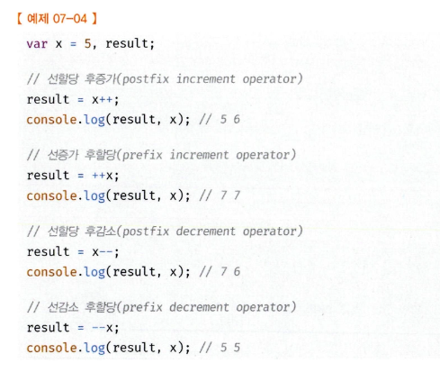
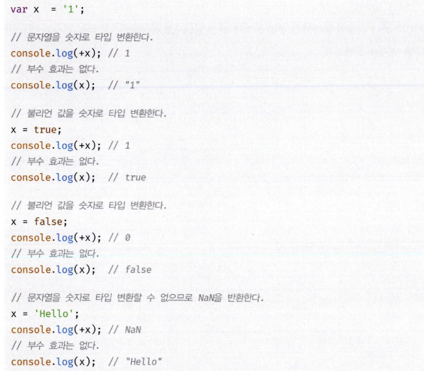
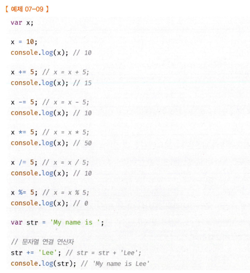
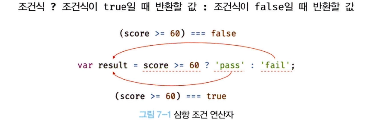
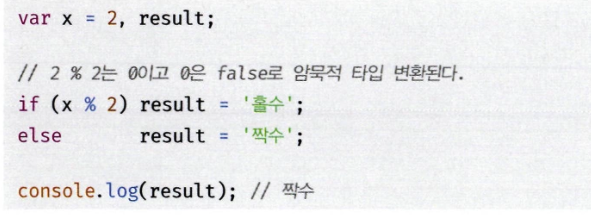

### chap7

7장 연산자

연산자는 하나 이상의 표현식을 대상으로 값을 만든다. 이때 연산의 대상을 피연사자라 한다. 피연산자는 값으로 평가될 수 있는 표현식이어야 한다. 그리고 피연산자와 연산자의 조합으로 이뤄진 연산자 표현식도 값으로 평가될 수 있는 표현식이다.
피연산자가 “값”이라는 명사의 역할을 한다면 연산자는 “피연산자를 연산하여 새로운 값을 만든다”라는 동사의 역할을 한다고 볼 수 있다.

7.1 증갑, 감소 연산자

증가/감소(++/—) 연산자는 위치에 의미가 있다.



숫자 타입이 아닌 피연산자에 + 단항 연산자를 사용하면 피연산자를 숫자 타입으로 변환하여 반환한다. 이때 피연산자를 변경하는 것은 아니고 숫자 타입으로 변환한 값을 생성해서 반환한다.



7.2 할당 연산자

할당 연산자는 우항에 있는 피연사자의 평가 결과를 좌항에 있는 변수에 할당한다. 변수 값이 변하는 부수 효과가 있다.



할당문은 값으로 표현되는 표현식인 문으로서 할당된 값으로 평가된다. 

7.3 비교 연산자

비교 연산자는 두 개의 값을 비교하여 불리언 값을 반환한다. 동등 비교 (==) 와 일치 비교 (===)가 있으나 == 연산자는 타입을 자동 변환하여 비교하기 때문에 예상치 못한 결과를 초래할 수 있으니 === 일치비교를 사용하는 것이 좋다. 일치 비교 연산자에서 주의할 것은 NaN이다. NaN은 자신과 일치하지 않는 유일한 값이다. 따라서 NaN인지 조사하려면 빌트인 함수 isNaN을 사용한다.

7.4 삼항 조건 연산자

자바스크립트의 유일한 삼항 연산자이며 부수 효과는 없다.



물음표 앞의 첫 번째 피연산자는 조건식, 즉 불리언 타입의 값으로 평가될 표현식이다. 만약 조건식의 평가 결과가 불리언 값이 아니면 불리언 값으로 암묵적 타입 변환된다.
if … else 문을 사용해도 삼항 조건 연산자 표현식과 유사하게 처리할 수 있다.



하지만 삼항 조건 연산자 표현식은 if … else 문과 중요한 차이가 있다. 삼항 조건 연산자 표현식은 값처럼 사용할 수 있지만 if … else 문은 값처럼 사용할 수 없다.

