### chap10

10장 객체 리터럴

10.1  객체란 ?

JS는 객체 기반의 프로그래밍 언어이며, JS를 구성하는 거의 모든 것이 객체다. 원시 값을 제외한 나머지 값(함수, 배열, 정규 표현식 등)은 모두 객체다.
원시 값은 변경 불가능 한 값이지만, 객체 타입의 값은 변경이 가능하다. 
객체는 0개 이상의 프로퍼티로 구성된 집합이며, 프로퍼티는 키와 값으로 구성된다.
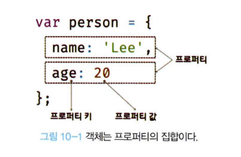

프로퍼티 값이 함수일 경우 일반 함수와 구분하기 위해 메서드라 부른다.
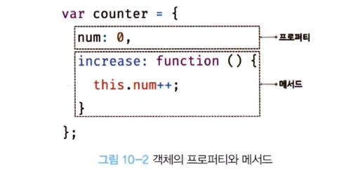

이처럼 객체는 프로퍼티와 메서드로 구성된 집합체다. 프로퍼티와 메서드의 역할은 다음과 같다.
- 프로퍼티 : 객체의 상태를 나타내는 값
- 메서드 : 프로퍼티를 참조하고 조작할 수 있는 동작

10.3 프로퍼티

객체는 프로퍼티의 집합이며, 프로퍼티는 키와 값으로 구성된다.
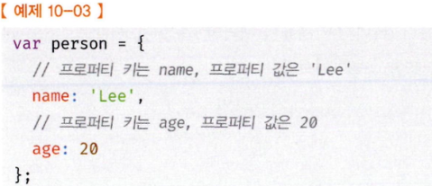

- 프로퍼티 키 : 빈 문자열을 포함하는 모든 문자열 또는 심벌 값
- 프로퍼티 값 : 자바스크립트에서 사용할 수 있는 모든 값

만약 식별자 네이밍 규칙을 따르지 않는 프로퍼키 키를 사용하면 ‘…’ 따옴표로 묶어줘야 한다.

문자열 또는 문자열로 평가할 수 있는 표현식을 사용해 프로퍼티 키를 동적으로 생성할 수도 있다. 이 경우에는 프로퍼티 키로 사용할 표현식을 대괄호로([…]) 묶어야 한다.
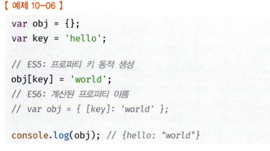

프로퍼키 키로 숫자 리터러을 사용하면 따옴표는 붙지 않지만 내부적으로는 문자열로 변환된다.
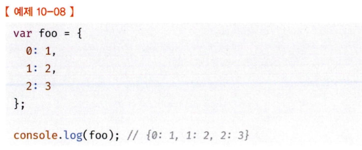

이미 존재하는 프로퍼티 키를 중복 선언하면 나중에 선언한 프로퍼티가 먼저 선언한 프로퍼티를 덮어쓴다. (이때 에러는 발생하지 않음)
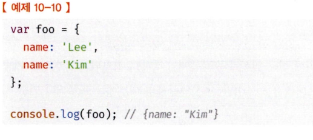

10.5 프로퍼티 접근

- 마침표 프로퍼티 접근 연산자를 사용하는 마침표 표기법
- 대괄호 프로퍼티 접근 연산자를 사용하는 대괄호 표기법
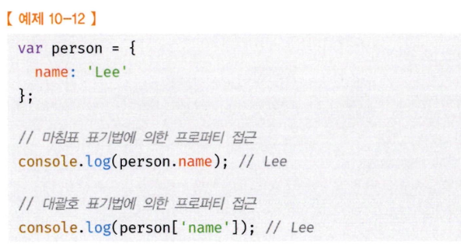

대괄호 표기법을 사용하는 경우 대괄호 프로퍼티 접근 연산자 내부에 지정하는 프로퍼티 키는 반드시 따옴표로 감싼 문자열이어야 한다. 따옴표로 감싸지 않은 키는 식별자로 해석된다.

10.7 프로퍼티 동적 생성

존재하지 않는 프로퍼티에 값을 할당하면 프로퍼티가 동적으로 생성되어 추가되고 프로퍼티 값이 할당된다.
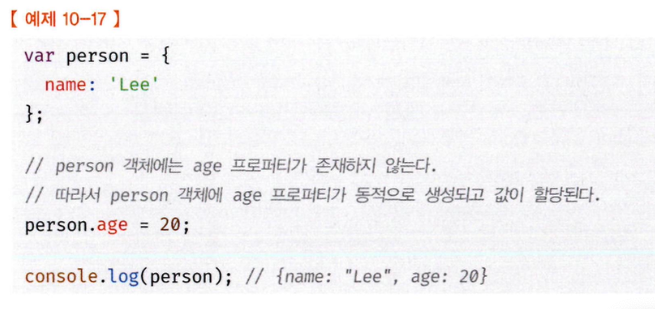

10.8 프로퍼티 삭제

delete 연산자의 피연산자는 프로퍼티 값에 접근할 수 있는 표현식이어야 한다. 만약 존재하지 않는 프로퍼티를 삭제하면 아무런 에러 없이 무시된다.
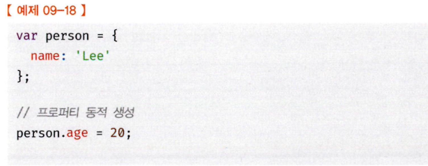
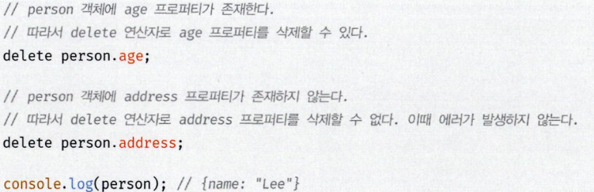


10.9 ES6에서 추가된 객체 리터럴의 확장 기능

프로퍼티 값은 변수에 할당된 값, 즉 식별자 표현식일 수도 있다.
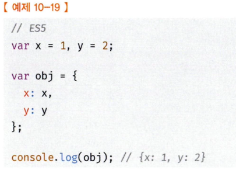


ES6에서는 프로퍼티 값으로 변수를 사용하는 경우 변수 이름과 프로퍼티 키가 동일한 이름일 때 프로퍼티 키를 생략할 수 있다. 이때 프로퍼티 키는 변수 이름으로 자동 생성된다.
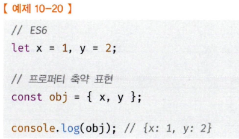


ES6에서는 객체 리터럴 내부에서도 계산된 프로퍼티 이름으로 프로퍼티 키를 동적 생성할 수 있다.
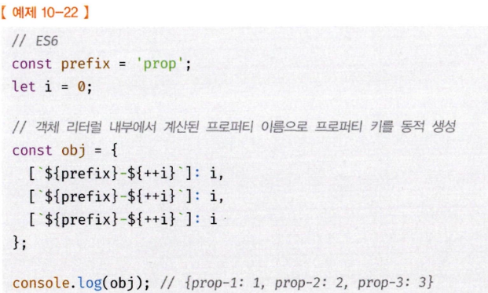