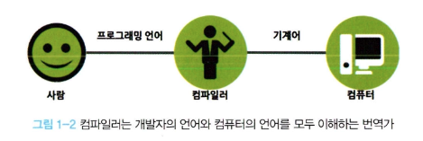

# 01 프로그래밍

## 1.1 프로그래밍이란?

- 컴퓨터에게 실행을 요구하는 일종의 **커뮤니케이션**

  - 0과 1밖에 모르는 기계가 실행할 수 있을 정도로 **정확하고 상세하게 요구사항을 설명하는 작업**

    ⇒ 그 결과물이 바로 코드다

    ⇒ 이 때 필요한 것이 **컴퓨팅 사고(Computational thinking)**

- 문제(요구사항)을 명확히 이해하는 것이 우선되어야 함

## 1.2 프로그래밍 언어

- 문제 해결 능력을 바탕으로 정의된 문제 해결 방안은 컴퓨터에게 전달되어야 함

  → 이때 명령을 수행할 주체는 컴퓨터

- 기계어(machine code)로 명령을 전달해야 함

  1. 사람이 이해할 수 있는 약속된 구문(Syntax, 문법)으로 구성된 프로그래밍 언어를 사용해 프로그램을 작성
  2. 그것을 컴퓨터가 이해할 수 있는 기계어로 변환하는데, 일종의 변역기를 이용한다.

     ⇒ 이때 이용하는 번역기를 컴파일러(compiler) 혹은 인터프리터(interpreter)라고 함

     

## 1.3 구문과 의미

- 문제 해결 능력으로 만들어낸 해결 방안은 프로그래밍 언어의 문법을 사용해 표현
- 작성된 코드는 해결 방안의 구체적 구현물

  ⇒ 요구사항이 실현(문제가 해결)되어야 의미가 있음

- 요구사항의 집합을 분석해서 적절한 자료구조와 함수의 집합으로 변환한 후, 그 흐름을 제어하는 것
