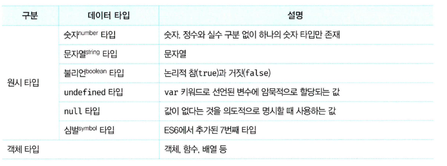
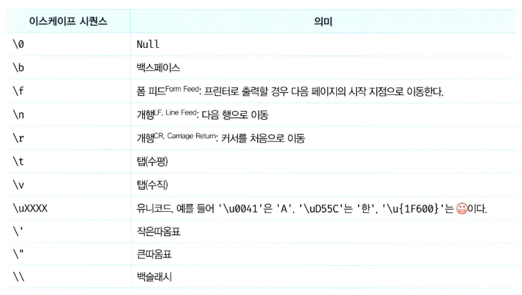

# 06 데이터 타입



## **6.1 숫자 타입(Number Type)**

- 자바스크립트는 하나의 숫자 타입만 존재
- 배정밀도 64비트 부동소수점 형식을 따름
- 정수, 실수, 2진수, 8진수, 16진수 모두 64비트 부동소수점 형식의 2진수로 저장
- 특별한 값: `Infinity`, `Infinity`, `NaN`

```jsx
let integer = 42; // 정수
let float = 3.14; // 실수
let binary = 0b1010; // 2진수
let octal = 0o52; // 8진수
let hex = 0x2a; // 16진수

console.log(Infinity); // Infinity
console.log(-Infinity); // -Infinity
console.log(NaN); // NaN
```

## **6.2 문자열 타입(String Type)**

- 16비트 유니코드 문자(UTF-16) 집합
- 작은 따옴표, 큰 따옴표, 백틱(``)으로 감싼다
- 문자열은 원시 타입이므로 변경 불가능

```jsx
let single = '작은 따옴표';
let double = '큰 따옴표';
let backtick = `백틱`;

console.log(single);
console.log(double);
console.log(backtick);
```

## **6.3 템플릿 리터럴(Template Literal)**

- 멀티라인 문자열, 표현식 삽입, 태그드 템플릿 등 제공
- 백틱(``) 사용
- `${}`를 통해 표현식 삽입 가능

```jsx
let name = 'JavaScript';
console.log(`${name}는 재미있다!`);

let multiline = `이것은
멀티라인
문자열입니다.`;

console.log(multiline);
```



## **6.4 불리언 타입(Boolean Type)**

- 논리적 참과 거짓을 나타내는 `true`와 `false`

```jsx
let isTrue = true;
let isFalse = false;

console.log(isTrue);
console.log(isFalse);
```

## **6.5 undefined 타입**

- `undefined`는 유일한 값
- 선언된 변수는 암묵적으로 `undefined`로 초기화
- 값을 할당하지 않은 변수는 `undefined` 반환

```jsx
let x;

console.log(x); // undefined
```

## **6.6 null 타입**

- `null`이 유일한 값
- 변수에 값이 없음을 의도적으로 명시
- 더 이상 참조하지 않는 메모리 공간에 가비지 컬렉션 수행

```jsx
let y = null;

console.log(y); // null
```

## **6.7 심벌 타입(Symbol Type)**

- ES6에서 추가된 변경 불가능한 원시 타입
- 유일무이한 값 생성
- 객체의 프로퍼티 키로 사용

```jsx
const symbol1 = Symbol('description');
const symbol2 = Symbol('description');

console.log(symbol1 === symbol2); // false
```

## **6.8 객체 타입(Object Type)**

- 자바스크립트의 거의 모든 것은 객체
- 원시 타입을 제외한 모든 값은 객체 타입

```jsx
let obj = {
  name: 'JavaScript',
  version: 'ES6',
};

console.log(obj);
```

## **6.9 데이터 타입의 필요성**

1. **데이터 타입에 의한 메모리 공간의 확보와 참조**
   - 메모리에 값을 저장하고 참조하기 위해 데이터 타입 필요
   - 데이터 타입에 따라 필요한 메모리 공간 크기 결정
2. **데이터 타입에 의한 값의 해석**
   - 메모리에서 읽어들인 2진수를 데이터 타입에 따라 해석
   - 예: `0100 0001` → 숫자 65, 문자열 'A'

## **6.10 동적 타이핑(Dynamic Typing)**

1. **동적 타입 언어와 정적 타입 언어**
   - 정적 타입 언어: 변수의 타입을 사전에 선언 (C, Java 등)
   - 동적 타입 언어: 자바스크립트처럼 변수에 할당된 값에 따라 타입이 결정
2. **동적 타입 언어의 단점**
   - 변수의 값이 변경되면 타입도 동적으로 변환되어 오류 발생 가능
   - 유연성은 높지만 신뢰성은 떨어짐
3. **동적 타입 언어에서 변수 관리 팁**
   - 변수는 필요한 경우에만 사용
   - 스코프를 좁게 설정
   - 전역 변수 최소화
   - 상수 사용으로 값 변경 억제
   - 목적이나 의미를 명확히 나타내는 변수명 사용

```jsx
let data = 42; // 숫자 타입

console.log(typeof data); // number

data = '문자열'; // 문자열 타입으로 변경

console.log(typeof data); // string
```
