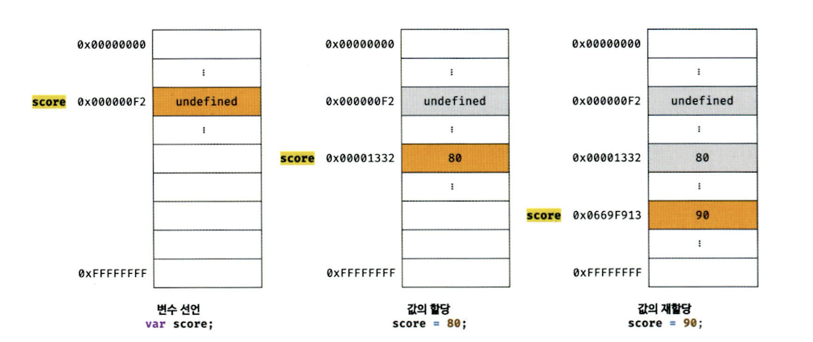
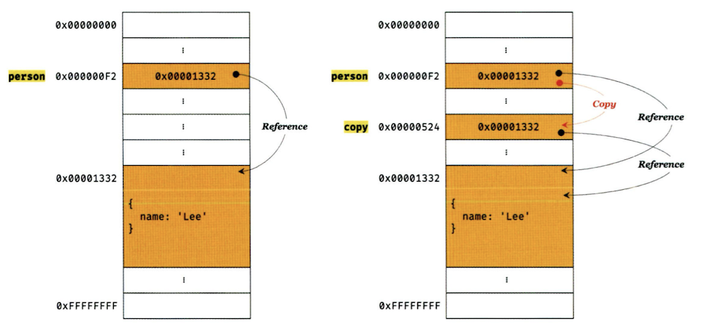

# 11 원시 값과 객체의 비교

|         | 원시 타입                                        | 객체 타입                                          |
| ------- | ------------------------------------------------ | -------------------------------------------------- |
| 값      | immutable value                                  | mutable value                                      |
| 값 할당 | 변수(확보된 메모리 공간)에는 실제 값이 저장      | 변수(확보된 메모리 공간)에는 참조 값이 저장        |
| 값 복사 | 원본의 원시 값이 복사되어 전달**값에 의한 전달** | 원본의 참조 값이 복사되어 전달**참조에 의한 전달** |

## 11.1 원시 값

### 11.1.1 변경 불가능한 값

- 원시값은 **변경 불가능한 값**(`immutable value`)으로 읽기 전용(read only) 값
- 한 번 생성된 원시 값은 읽기 전용(`read only`) 값으로서 변경 불가
- 원시 값 자체를 변경 불가능하다는 것이지, 변수 값을 변경할 수 없다는 것이 아님

```jsx
// const 키워드를 사용 해 선언한 변수는 재할당이 금지. 상수는 재할당이 금지된 변수일 뿐
const o = {};

// const 키워드를 사용해 선언한 변수에 할당한 원시 값(상수)은 변경 불가
// 하지만 const 키워드를 사용해 선언한 변수에 할당한 객체는 변경 가능
o.a = 1;
console.log(o); // {a: 1}
```



- 원시 값을 할당한 변수에 새로운 원시 값을 재할당하면
- 메모리 공간에 저장되어 있는 **재할당 이전의 원시 값을 변경하는 것이 아니라**
- **새로운 메모리 공간을 확보**하고 재할당한 원시 값을 저장한 후,

  ⇒ 변수가 참조하던 메모리 공간의 주소가 변경된 이유는, 변수에 할당된 원시 값이 변경 불가능한 값이기 때문

- 변수는 **새롭게 재할당한 원시 값을 가킴**

  ⇒ 이러한 특성을 **불변성**이라고 함

  **⇒ 불변성을 갖는 원시 값을 할당한 변수는 재할당 이외에 변수 값을 변경할 수 있는 방법이 없음**

### 11.1.2 문자열과 불변성

- 문자열은 **유사 배열 객체**로서 배열과 유사하게 각 문자에 접근할 수 있으나

  **변경 불가능한 값**이기 때문에 일부 문자를 변경해도 반영되지 않음

  ⇒ 원시 타입인 문자열은 **읽기 전용**이기 때문

- 원시 값을 저장하려면 먼저 확보해야 하는 메모리 공간의 크기를 결정해야 함

```jsx
var str = 'string';

// 문자열은 유사 배열이므로 배열과 유사하게 인덱스를 사용해 각 문자에 접근 가능
// 하지만 문자열은 원시값이므로 변경 불가, 이때 에러가 발생하지 않음
str[0] = 's';

console.log(str); // string
```

### 11.1.3 값에 의한 전달

- 변수에 원시 값을 갖는 변수를 할당하면, 할당받는 변수에는 **할당되는 변수의 원시 값이 복사되어 전달**

```jsx
var score = 90;
var copy = score;

console.log(score); // 90
console.log(copy); // 90

score = 100;

console.log(score); // 100
console.log(copy); // 100
```

→ `score` 변수와 `copy` 변수는 숫자 값 `100`을 갖는다는 점에서는 동일하지만,

`score` 변수와 `copy` 변수의 값 `100`은 **다른 메모리 공간에 저장된 별개의 값**

> 📌 참고:
> 자바스크립트에서의 값에 의한 전달은
>
> `값에 의한 전달`이라는 용어는 자바스크립트를 위한 용어가 아님
>
> 엄격하게 표현하면 변수에는 값이 전달되는 것이 아니라 **메모리 주소가 전달**
>
> 이는 변수와 같은 식별자는 값이 아니라 메모리 주소를 기억하고 있기 때문

- **값에 의한 전달**은 사실은 값을 전달하는 것이 아니라 **메모리 주소를 전달**
- 단, 전달된 메모리 주소를 통해 메모리 공간에 접근하면 값을 참조 가능

> 🔥 중요한 것은 변수에 원시 값을 갖는 변수를 할당하면
>
> **변수 할당 시점**이든, 두 변수 중 어느 하나의 변수에 값을 **재할당하는 시점**이든
>
> 두 변수의 원시 값은 **서로 다른 메모리 공간에 저장된 별개의 값**이 되어
>
> 어느 한쪽에서 재할당을 통해 값을 변경하더라도 **서로 간섭할 수 없다**는 것

## 11.2 객체

- 프로퍼티의 개수가 정해져 있지 않아 동적으로 추가되고 삭제할 수 있음
- 프로퍼티의 값에도 제약이 없음
- 원시 값과 같이 확보해야 할 메모리 공간의 크기를 사전에 정해 둘 수 없음
- 객체를 변경할 때 마다 복사해서 생성 후 변경하면 비용이 많이 듦
- 객체는 크기가 매우 클 수도 있고 원시 값처럼 크기가 일정하지도 않음
- 프로퍼티 값이 객체일 수도 있음

  ⇒ 메모리를 효율적으로 사용하며 객체를 복사해 생성하는 비용을 절약하여 성능을 향상시키기 위해 **변경 가능한 값으로 설계**

### 11.2.1 변경 가능한 값

- **원시 값은 변경 불가능한 값**이므로 원시 값을 갖는 변수의 값을 변경하려면 **재할당 외에는 방법이 없음**
- **객체는 변경 가능한 값이므로** 객체를 할당한 변수는 **재할당 없이 객체를 직접 변경 가능**

  ⇒ 재할당 없이 프로퍼티를 **동적으로 추가 가능**

  ⇒ 프로퍼티 **값을 갱신 가능**

  ⇒ 프로퍼티 **자체를 삭제 가능**

> 💡 **얕은복사와 깊은복사**
>
> 객체를 프로퍼티 값으로 갖는 객체의 경우
>
> **얕은 복사**는 한 단계까지만 복사하는 것
>
> ⇒ 참조 값을 복사
>
> **깊은 복사**는 객체에 중첩되어 있는 객체까지 복사하는 것
>
> ⇒ 객체에 중첩되어 있는 객체까지 모두 복사해서 원시 값처럼 완전한 복사본을 만드는 복사
>
> ```jsx
> const o = { x: { y: 1 } };
>
> // 얕은 복사
> const c1 = { ...o }; // 스프레드 문법
> console.log(c1 === o); // false
> console.log(c1.x === o.x); // true
>
> // lodash의 cloneDeep을 사용한 깊은 복사
> // "npm install lodash"로 lodash를 설치한 후, Node.js 환경에서 실행
> const _ = require('lodash');
> // 깊은 복사
> const c2 = _.cloneDeep(o);
> console.log(c2 === o); // false
> console.log(c2.x === o.x); // false
>
> const v = 1;
>
> // 깊은 복사
> const c1 = v;
> console.log(c1 === v); // true
>
> const o = { x: 1 };
>
> // 얕은 복사
> const c2 = o;
> console.log(c2 === o); // true
> ```
>
> 얕은 복사와 깊은 복사로 생성한 객체는 원본과는 다른 객체
>
> **⇒ 원본과 복사본은 참조 값이 다른 별개의 객체**

### 11.2.2 참조에 의한 전달

- 객체를 가리키는 변수(원본 `person`)을 다른 변수(사본 `copy`)에 할당하면 **원본의 참조 값이 복사되어 전달**되는 것

```jsx
var person = {
  name: 'Lee',
};

// 참조값을 복사(얕은 복사)
var copy = person;
```

- 위의 코드에서 `person`과 `copy` 모두 동일한 객체를 가리킴

  ⇒ 두 개의 식별자가 하나의 객체를 공유 한다는것을 의미
  
