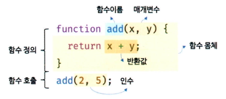
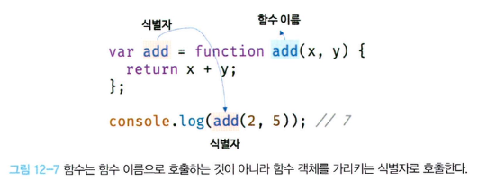
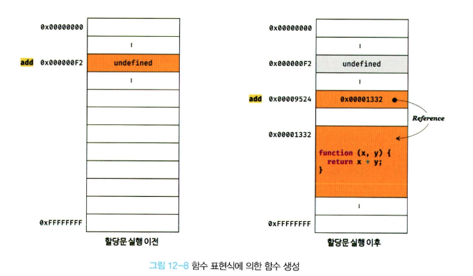
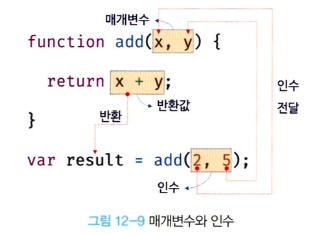
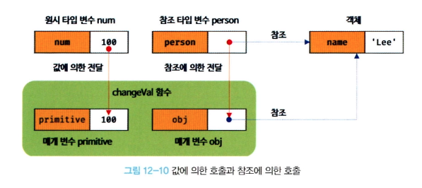
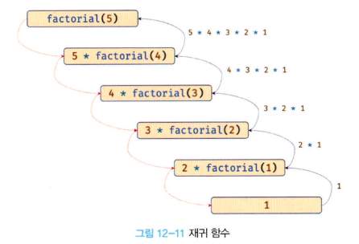

# 12 함수

## 12.1 함수란?

> 일련의 과정을 문(statement)로 구현하고 코드 블록으로 감싸서 하나의 실행 단위로 정의 한 것



- 프로그래밍 언어의 함수도 수학의 함수처럼 입력을 받아서 출력을 내보냄
  - **매개변수(parameter)**: 함수 내부로 입력을 전달받는 변수
  - **인수(`argument`)**: 입력 값
  - **반환값(`return value`)**: 출력 값
- 함수는 정의하는 것만으로 실행되는 것이 아니므로 실행을 명시적으로 지시해야함

  ⇒ 이를 함수 호출이라 함

```jsx
// 함수 선언문을 통한 함수 정의 예시
function add(x, y) {
  return x + y;
}

// 함수 호출
add(1, 5);
```

## 12.2 함수를 사용하는 이유

- 함수는 몇 번이든 호출할 수 있으므로 **코드의 재사용**이라는 측면에서 매우 유용함
- 코드의 중복을 억제하고 재사용성을 높이는 함수는 **유지보수의 편의성**을 높이고 **코드의 신뢰성**을 높임
- 함수는 객체 타입이라 이름(식별자)를 붙일 수 있는데, 함수 이름은 변수와 마찬가지로 자신의 역할을 잘 설명해야 함

  ⇒ 적절한 함수 이름은 함수의 내부 코드를 이해하지 않고도 함수의 역할을 파악할 수 있게 도움

  ⇒ 이는 **코드의 가독성**을 향상시킴

## 12.3 함수 리터럴

- 자바스크립트의 함수는 **객체 타입의 값**

  ⇒ 숫자 값을 `숫자 리터럴`, 객체를 `객체 리터럴`로 생성하는 것처럼 함수도 `함수 리터럴`로 생성 가능

- 함수 리터럴은 `function` 키워드, 함수 이름, 매개 변수 목록, 함수 몸체로 구성
- 함수 리터럴은 **평가되는 값을 생성**하며 함수는 **객체**
- 일반 객체는 호출할 수 없지만 **함수는 호출 가능**

```jsx
// 변수에 함수 리터럴을 할당
const funcAdd = function add(x, y) {
  return x + y;
};
```

## 12.4 함수 정의

> 함수를 호출하기 이전에 **인수를 전달받을 매개변수**와 **실행할 문**들, 그리고 **반환할 값을 지정**하는 것

- 함수를 정의하는 방식

  - 함수 선언문
  - 함수 표현식
  - `function` 생성자 함수
  - 화살표 함수(ES6)

### 12.4.1 함수 선언문

- 함수 리터럴과 형태가 동일
- 함수 리터럴은 함수 이름은 생략할 수 있으나 **함수 선언문은 함수 이름을 생략 불가**

```jsx
// 함수 선언문
function add(x, y) {
  return x + y;
}
```

- 함수 선언문은 표현식이 아닌 **문**이기 때문에 `undefined`가 출력
- 함수 이름이 있는 기명 함수 리터럴은 함수 선언문 또는 함수 리터럴 표현식으로 해석될 가능성이 있음
- 함수 선언문은 함수 이름을 생략할 수 없다는 점을 제외하면 함수 리터럴과 형태가 동일하지만 **표현식이 아닌 문**
- 자바스크립트 엔진은 생성된 함수를 호출하기 위해 **함수 이름과 동일한 이름의 식별자를 암묵적으로 생성하고, 함수 객체를 할당**



### 12.4.2 함수 표현식

- 함수는 일급 객체이므로 **함수 리터럴로 생성한 함수 객체를 변수에 할당 가능**
  ⇒ 이러한 함수 정의 방식을 **함수 표현식**이라 함
- 함수 표현식은 **표현식인 문**
  ```jsx
  const sum = function () {
    // 익명함수를 상수 변수에 할당 ➔ 함수 표현식 예시
    return 1 + 2;
  };
  console.log(sum());
  ```

### 12.4.3 함수 생성 시점과 함수 호이스팅

> 함수 선언문으로 정의한 함수와 함수 표현식으로 정의한 함수의 생성 시점이 다름

- **함수 선언문**으로 정의한 함수는 함수 선언문 이전에 호출 가능

  - 함수 선언문으로 정의하면 **런타임 이전**에 함수 객체가 먼저 생성
  - 자바스크립트 엔진은 함수 이름과 동일한 이름의 식별자를 암묵적으로 생성하고, 생성된 함수 객체를 할당

    ⇒ 런타임 시점에는 이미 함수 객체가 생성되어 있고, 함수 이름과 동일한 식별자에 할당까지 완료된 상태(호이스팅)

- **함수 표현식**으로 정의한 함수는 함수 표현식 이전에 호출할 수 없음

  - 함수 표현식은 변수에 할당되는 값이 함수 리터럴인 문

    ⇒ 함수 표현식은 변수 선언문과 변수 할당문을 한 번에 기술한 축약 표현과 동일하게 동작

    ⇒ 변수 선언은 런타임 이전에 실행되어 `undefined`로 초기화된다.

  - 함수 표현식 이전에 함수를 참조하면 `undefined`로 평가되는데, 이때 함수를 호출하면 `undefined`를 호출하는 것과 마찬가지이므로 타입 에러가 발생하니 주의

    ⇒ 함수 표현식으로 정의한 함수는 반드시 함수 표현식 이후에 참조 또는 호출해야 타입 에러가 발생하지 않음



### 12.4.4 `Function` 생성자 함수

- 자바스크립트가 기본 제공하는 빌트인 함수인 `Function` 생성자 함수에 **매개변수 목록**과 **함수 몸체**를 **문자열로 전달**하면서 `new` 연산자와 함께 호출하면 함수 객체를 생성해서 반환
- `Function` 생성자 함수로 함수를 생성하는 방식은 일반적이지 않으며 바람직하지도 않음

  ⇒ 클로저를 생성하지 않는 등, 함수 선언문이나 함수 표현식으로 생성한 함수와 다르게 동작

> 💡 생성자 함수
>
> 생성자 함수는 **객체를 생성하는 함수**를 말함
>
> 객체를 생성하는 방식은 객체 리터럴 이외에 다양한 방법이 있음

```jsx
var add = new Function('x', 'y', 'return x + y');

console.log(add(2, 5));
```

### 12.4.5 화살표 함수

- ES6에서 도입된 화살표 함수(`arrow function`)는 `function` 키워드 대신에 화살표(`⇒`)를 사용해 좀 더 간략한 방법으로 함수를 선언 가능
- 화살표 함수는 생성자 함수로 사용할 수 없으며, 기존 함수와 `this` 바인딩 방식이 다르고, `prototype` 프로퍼티가 없으며 `arguments 객체`를 생성하지 않음

```jsx
var add = (x, y) => x + y;
console.log(add(2, 5)); // 7
```

## 12.5 함수 호출

- 함수는 함수를 가리키는 실별자와 한 쌍의 소괄호`()`인 함수 호출 연산자로 호출

### 12.5.1 매개변수와 인수

- 함수를 실행하기 위해 **필요한 값을 함수 외부에서 내부로 전달할 필요가 있는 경우**, 매개변수를 통해 인수를 전달
- **인수** : 함수를 호출할 때 지정하며, 개수와 타입에 제한이 없음
  - 매개변수보다 인수가 더 많은 경우 초과된 인수는 무시됨
- **매개변수** : 함수를 정의할 때 선언하며, 스코프(유효범위)는 함수 내부
  - 인수가 부족해 인수가 할당되지 않은 매개변수의 값은 `undefined`

```jsx
// 함수 선언문
function add(x, y) {
  return x + y;
}

// 함수 호출
// 인수 1과 2는 매개변수 x와 y에 순서대로 할당되고 함수 몸체의 문들이 실행된다.
var result = add(1, 2);
```



### 12.5.2 인수 확인

> 아래 코드는 JS 문법 상 어떠한 문제도 없으므로 JS 엔진은 아무런 이의제기 없으면 실행됨

```jsx
function add(x, y) {
  return x + y;
}

console.log(add(2)); // NaN
console.log(add('a', 'b')); // 'ab'
```

- 자바스크립트 함수는 매개변수와 인수의 개수가 일치하는지 확인하지 않음
- 자바스크립트는 동적 타입 언어다. 따라서 자바스크립트 함수는 매개변수의 타입을 사전에 지정할 수 없음

⇒ 자바스크립트는 함수를 정의할 때 적절한 인수가 전달되었는지 확인할 필요가 있음

```jsx
function add(x, y) {
  if (typeof x !== 'number' || typeof y !== 'number') {
    // 매개변수를 통해 전달된 인수의 타입이 부적절한 경우 에러를 발생시킨다.
    throw new TypeError('인수는 모두 숫자 값이어야 합니다.');
  }

  return x + y;
}

console.log(add(2)); // TypeError: 인수는 모두 숫자 값이어야 합니다.
console.log(add('a', 'b')); // TypeError: 인수는 모두 숫자 값이어야 합니다.
```

- 인수가 전달되지 않는 경우 매개변수에 기본값을 할당하는 방법

```jsx
// ES6에서 도입된 매개변수 기본값을 사용
function add(a = 0, b = 0, c = 0) {
  return a + b + c;
}

console.log(add(1, 2, 3)); // 6
console.log(add(1, 2)); // 3
console.log(add(1)); // 1
console.log(add()); // 0
```

### 12.5.3 매개변수의 최대 개수

- ECMAScript 사양에서는 매개변수의 최대 개수에 대해 명시적으로 제한하고 있지는 않지만, 물리적 한계는 있으므로 자바스크립트 엔진마다 매개변수의 최대 개수에 대한 제한은 있음
- 매개변수는 순서에 의미가 있어 매개변수가 많아지면 함수를 호출할 때 전달해야 할 인수의 순서를 고려해야 함
- 함수의 매개변수는 코드를 이해하는데 방해되는 요소이므로 이상적인 매개변수 개수는 0개이며 **최대 3개 이상을 넘지 않는 것을 권장**

  ⇒ 그 이상이라면 객체를 인수로 전달하는 것이 유리

- 매개변수의 개수가 많다는 것은 함수가 여러가지 일을 한다는 증거이므로 바람직하지 않음
  - **이상적인 함수는 한 가지 일만 해야**하며 가급적 작게 만들어야 함

### 12.5.4 반환문

- 함수는 `return` 키워드와 표현식(반환값)으로 이뤄진 반환문을 사용해 실행 결과를 함수 외부로 반환(return)할 수 있음
- 반환문은 두 가지 역할을 수행
  1. 반환문은 함수의 실행을 중단하고 함수 몸체를 빠져나감
     - 반환문 이후에 다른 문이 존재하면 그 문은 실행되지 않고 무시
  2. 반환문은 `return` 키워드 뒤에 오는 표현식을 평가에 반환
     - `return` 키워드 뒤에 반환값으로 사용할 표현식을 명시적으로 지정하지 않으면 `undefined`가 반환

## 12.6 참조에 의한 전달과 외부 상태의 변경

- **매개변수도** 함수 몸체 내부에서 **변수와 동일하게 취급**되므로 매개변수 또한 타입에 따라 값에 의한 전달,참조에 의한 전달 방식을 그대로 따른다.

```jsx
// 매개변수 primitive는 원시값을 전달받고, 매개변수 obj는 객체를 전달받는다.
function changeVal(primitive, obj) {
  primitive += 100;
  obj.name = 'Kim';
}

// 외부 상태
var num = 100;
var person = { name: 'Lee' };

console.log(num); // 100
console.log(person); // {name: "Lee"}

// 원시값은 값 자체가 복사되어 전달되고 객체는 참조값이 복사되어 전달된다.
changeVal(num, person);

// 원시값은 원본이 훼손되지 않는다.
console.log(num); // 100

// 객체는 원본이 훼손된다.
console.log(person); // {name: "Kim"}
```



- 원시 타입 인수는 **값 자체가 복사되어 매개변수에 전달**되기 때문에 함수 몸체에서 그 값을 변경(재할당을 통한 교체)해도 원본은 훼손되지 않음

  ⇒ 외부 상태, 즉 함수 외부에서 함수 몸체 내부로 전달한 원시 값의 원본을 변경하는 어떠한 부수효과도 발생하지 않음

- 객체 타입 인수는 **참조 값이 복사되어 매개변수에 전달**되기 때문에 함수 몸체에서 참조 값을 통해 객체를 변경할 경우 원본이 훼손

  ⇒ 외부 상태, 즉 함수 외부에서 함수 몸체 내부로 전달한 참조 값에 의해 원본 객체가 변경되는 부수 효과가 발생

  ⇒ 이러한 문제의 해결 방법 중 하나는 객체를 **불변 객체**로 만들어 사용하는 것

## 12.7 다양한 함수의 형태

### 12.7.1 즉시 실행 함수(IIFE)

- **함수 정의와 동시에 즉시 호출**되는 함수
- **단 한 번만 호출**되며 다시 호출할 수 없음

```jsx
// 즉시 실행 함수는 익명 함수로 사용하는 것이 일반적
(function () {
  var a = 3;
  var b = 5;
  return a * b;
})();
```

### 12.7.2 재귀 함수

- 함수가 자기 자신을 호출하는 것을 **재귀 호출**되는 함수
- **재귀 함수**는 자기 자신을 호출하는 행위

  ⇒ 재귀 호출을 수행하는 함수

- 재귀 함수는 자신을 무한 재귀 호출하므로 탈출 조건을 만들어야 스택 오버 플로 에러가 발생하지 않음

```jsx
// 함수 표현식
var factorial = function foo(n) {
  // 탈출 조건: n이 1 이하일 때 재귀 호출을 멈춘다.
  if (n <= 1) return 1;
  // 함수를 가리키는 식별자로 자기 자신을 재귀 호출
  return n * factorial(n - 1);

  // 함수 이름으로 자기 자신을 재귀 호출할 수도 있다.
  // console.log(factorial === foo); // true
  // return n * foo(n - 1);
};

console.log(factorial(5)); // 5! = 5 * 4 * 3 * 2 * 1 = 120
```



### 12.7.3 중첩 함수

- **함수 내부에 정의된 함수**를 중첩 함수 또는 내부 함수라 함
  - 중첩 함수를 포함하는 함수는 외부 함수라 부름
- 중첩 함수는 **외부 함수 내에서만 호출 가능**
  - 일반적으로 중첩 함수는 자신을 포함하는 외부 함수를 돕는 **헬퍼 함수**의 역할 수행

```jsx
function outer() {
  var x = 1;

  // 중첩 함수
  function inner() {
    var y = 2;
    // 외부 함수의 변수를 참조할 수 있다.
    console.log(x + y); // 3
  }

  inner();
}

outer();
```

### 12.7.4 콜백 함수

- **함수의 매개변수를 통해 다른 함수의 내부로 전달되는 함수**를 콜백 함수라 함
- 매개변수를 통해 함수의 외부에서 콜백 함수를 전달받은 함수를 **고차 함수**라 함

  - 콜백 함수를 자신의 일부분으로 합성
  - 매개변수를 통해 전달받은 콜백 함수의 호출 시점을 결정해서 호출

    ⇒ 콜백 함수는 고차 함수에 의해 호출되며 이때 고차 함수는 필요에 따라 함수에 인수를 전달 가능

```jsx
// 외부에서 전달받은 f를 n만큼 반복 호출한다
function repeat(n, f) {
  for (var i = 0; i < n; i++) {
    f(i); // i를 전달하면서 f를 호출
  }
}

var logAll = function (i) {
  console.log(i);
};

// 반복 호출할 함수를 인수로 전달한다.
repeat(5, logAll); // 0 1 2 3 4

var logOdds = function (i) {
  if (i % 2) console.log(i);
};

// 반복 호출할 함수를 인수로 전달한다.
repeat(5, logOdds); // 1 3
```

### 12.7.5 순수 함수와 비순수 함수

- 순수 함수: 함수형 프로그래밍에서 어떤 외부 상태에 의존하지도 않고 변경하지도 않는 부수 효과가 없는 함수
- 비순수 함수: 외부 상태에 의존하거나 외부 상태를 변경하는 부수 효과가 있는 함수

```jsx
var count = 0;

// 순수 함수 increase는 동일한 인수가 전달되면 언제나 동일한 값을 반환
function increase(n) {
  return ++n;
}

// 순수 함수가 반환한 결과값을 변수에 재할당해서 상태를 변경
count = increase(count);
console.log(count); // 1

count = increase(count);
console.log(count); // 2

// 비순수 함수
function increase() {
  return ++count; // 외부 상태에 의존하며 외부 상태를 변경
}

// 비순수 함수는 외부 상태(count)를 변경하므로 상태 변화를 추적하기 어려워짐
increase();
console.log(count); // 1

increase();
console.log(count); // 2
```
