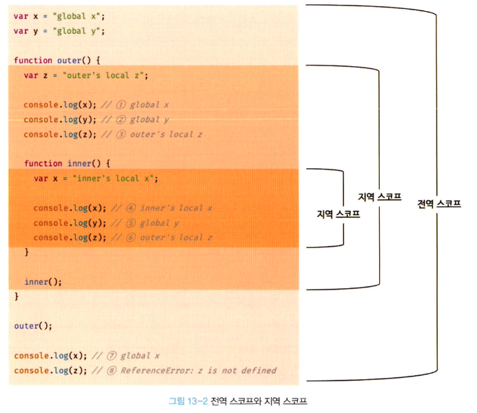

# 13 스코프

## 13.1 스코프란?

- 모든 식별자(_변수 이름, 함수 이름, 클래스 이름 등_)는 **자신이 선언된 위치에 의해 다른 코드가 식별자 자신을 참조할 수 있는 유효 범위가 결정**

  **⇒** 이를 **스코프라 함**

  **⇒** 스코프는 **식별자가 유효한 범위**

## 13.2 스코프의 종류

- 코드는 전역(global)과 지역(local)으로 구분

  | 구분 | 설명                  | 스코프      | 변수      |
  | ---- | --------------------- | ----------- | --------- |
  | 전역 | 코드의 가장 바깥 영역 | 전역 스코프 | 전역 변수 |
  | 지역 | 함수 몸체 내부        | 지역 스코프 | 지역 변수 |

### 13.2.1 전역과 전역 스코프 / 13.2.2 지역과 지역 스코프



## 13.3 스코프 체인

- 스코프는 함수의 중첩에 의해 계층적인 구조를 갖게 됨

  **⇒ 스코프가 계층적으로 연결된 것**을 **스코프 체인**이라고 함

- 변수를 참조할 때 자바스크립트 엔진은 스코프 체인을 통해 변수를 참조하는 코드의 스코프에서 시작하여 **상위 스코프 방향으로 이동하며 선언된 변수를 검색**

  ⇒ 절대 하위 스코프로 내려가면서 식별자를 검색하는 일은 없음

- 이를 통해 상위 스코프에서 선언한 변수를 하위 스코프에서도 참조 가능

### 13.3.1 스코프 체인에 의한 변수 검색

- 자바스크립트 엔진은 스코프 체인을 따라 변수를 참조하는 코드의 스코프에서 시작해서 상위 스코프 방향으로 이동하며 선언된 변수를 검색

  ⇒ 이는 **상위 스코프에서 유효한 변수는 하위 스코프에서 자유롭게 참조할 수 있지만 하위 스코프에서 유효한 변수를 상위 스코프에서 참조할 수 없다**는것을 의미

### 13.3.2 스코프 체인에 의한 함수 검색

- 함수도 식별자에 할당되기 때문에 스코프를 갖음

  → 사실 함수는 식별자에 함수 객체라 할당된 것 외에는 일반 변수와 다를 바 없음

- 따라서 스코프를 "변수를 검색할 때 사용하는 규칙"이라고 표현하기 보다는 **_"식별자를 검색하는 규칙"_**이라고 표현하는 것이 적절

## 13.4 함수 레벨 스코프

- 함수 몸체 내부를 말하고 지역 스코프를 만듦

  **⇒ 코드 블록이 아닌 함수에 의하서만 지역 스코프가 생성**된다는 의미

- C나 자바 등을 비롯한 대부분의 프로그래밍 언어는 함수 몸체만이 아니라 모든 코드 블록(`if`, `for`, `while`, `try/catch` 등)이 지역 스코프를 만듦

  **⇒ 블록 레벨 스코프**

- **`var` 키워드로 선언된 변수는 오로지 함수의 코드 블록(함수 몸체) 만을 지역 스코프로 인정**

  **⇒ 함수 레벨 스코프**

```jsx
var x = 1;

if (true) {
  // var 키워드로 선언된 변수는 함수의 코드 블록(함수 몸체)만을 지역 스코프로 인정한다.
  // 함수 밖에서 var 키워드로 선언된 변수는 코드 블록 내에서 선언되었다 할지라도 모두 전역 변수다.
  // 따라서 x는 전역 변수다. 이미 선언된 전역 변수 x가 있으므로 x 변수는 중복 선언된다.
  // 이는 의도치 않게 변수 값이 변경되는 부작용을 발생시킨다.
  var x = 10;
}

console.log(x); // 10
```

```jsx
var i = 10;

// for 문에서 선언한 i는 전역 변수다. 이미 선언된 전역 변수 i가 있으므로 중복 선언된다.
for (var i = 0; i < 5; i++) {
  console.log(i); // 0 1 2 3 4
}

// 의도치 않게 변수의 값이 변경되었다.
console.log(i); // 5
```

- `var` 키워드로 선언된 변수는 오로지 함수의 코드 블록만을 지역 스코프로 인정하지만 **ES6에서 도입된 `let`, `const` 키워드는 블록 레벨 스코프를 지원**

## 13.5 렉시컬 스코프

- **렉시컬 스코프: 함수를 어디서 정의했는지에 따라 함수의 상위 스코프를 결정하는 것**
- 자바스크립트는 렉시컬 스코프를 따르므로 함수를 어디서 호출했는지가 아니라, **함수를 어디서 정의했는지에 따라 상위 스코프를 결정**
- 함수가 호출된 위치는 상위 스코프 결정에 어떠한 영향도 주지 않음

  ⇒ 함수의 상위 스코프는 언제나 자신이 정의된 스코프

- 함수의 상위 스코프는 함수 정의가 실행될 때 정적으로 결정
- 함수 정의(함수 선언문 또는 함수 표현식)가 실행되어 함수 객체는 이렇게 결정된 상위 스코프를 기억함

  ⇒ 함수가 호출될 때마다 함수의 상위 스코프를 참조할 필요가 없기 때문
