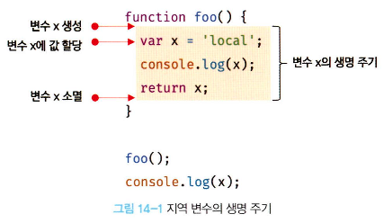
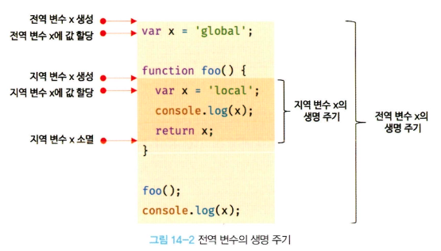

# 14 전역 변수의 문제점

## 14.1 변수의 생명 주기

### 14.1.1 지역 변수의 생명 주기

- 변수는 선언에 의해 생성되고, 할당을 통해 값을 가지며 언젠가 소멸

  ⇒ 변수는 **생명 주기(life cycle)**

- 변수에 생명 주기가 없다면 한번 선언된 변수는 프로그램을 종료하지 않는 한 영원히 메모리 공간을 점유하게 됨
- 변수는 자신이 선언된 위치에서 생성되고 소멸
- 전역 변수의 생명 주기는 애플리케이션의 생명 주기와 같지만, 함수 내부에서 선언된 지역 변수는 함수가 호출되면 생성되고 함수가 종료하면 소멸

  ⇒ 지역 변수의 생명 주기는 함수의 생명 주기와 일치

  

- 변수의 생명 주기는 메모리 공간이 **확보**(allocate)된 시점부터 메모리 공간이 **해제**(release)되어 가용 메모리 풀(memory pool)에 **반환**되는 시점까지
- **호이스팅**은 **스코프 단위**로 동작

  - 전역 변수의 호이스팅은 전역 변수의 선언이 전역 스코프의 선두로 끌어 올려진 것 처럼 동작

    **⇒ 전역 변수는 전역 전체에서 유효**

  - 지역 변수의 호이스팅은 지역 변수의 선언이 지역 스코프의 선두로 끌어 올려진 것 처럼 동작

    **⇒ 지역 변수는 함수 전체에서 유효**

⇒ 호이스팅은 변수 선언이 스코프의 선두로 끌어 올려진 것처럼 동작하는 자바스크립트 고유의 특징을 의미

### 14.1.2 전역 변수의 생명 주기

- `var` 키워드로 선언한 전역 변수의 생명 주기는 **전역 객체의 생명 주기와 일치**

  

## 14.2 전역 변수의 문제점

### **암묵적 결합**

- 전역 변수를 선언한 의도는 전역, 즉 **코드 어디서든 참조하고 할당할 수 있는 변수를 사용하겠다는 것**

  ⇒ 모든 코드가 전역 변수를 참조하고 변경할 수 있는 **암묵적 결합**을 허용하는 것

- **변수의 유효 범위가 크면 클수록 코드의 가독성은 나빠지고 의도치 않게 상태가 변경될 수 있는 위험성도 높아짐**

### **긴 생명 주기**

- 전역 변수는 생명 주기가 긺

  ⇒ 따라서 **메모리 리소스도 오랜 기간 소비**하고, **전역 변수의 상태를 변경할 수 있는 시간도 길고 기회도 많음**

- `var` 키워드는 변수의 중복 선언을 허용, 생명 주기가 긴 전역 변수는 변수 이름이 중복될 가능성이 있고, 이렇게 되면 의도치 않은 재할당이 이뤄짐

### **스코프 체인 상에서 종점에 존재**

- 변수를 검색할 때 전역 변수가 가낭 마지막에 검색된다는 것

  ⇒ 즉 **전역 변수의 검색 속도가 가장 느림**

### **네임스페이스 오염**

- 자바스크립트의 가장 큰 문제점 중 하나는 **파일이 분리되어 있다 해도 하나의 전역 스코프를 공유**한다는 것
- 따라서 다른 파일 내에서 동일한 이름으로 명명된 전역 변수나 전역 함수가 같은 스코프에 존재할 경우 예상치 못한 결과를 가져올 수 있음

## 14.3 전역 변수의 사용을 억제하는 방법

- 이러한 문제점들로 전역 변수의 무분별한 사용은 위험
- **전역 변수를 반드시 사용해야 할 이유를 찾지 못한다면 지역 변수를 사용해야 함**
- **변수의 스코프는 좁을수록 좋음**

### 14.3.1 즉시 실행 함수

- 함수 정의와 동시에 호출되는 즉시 실행 함수는 단 한번만 호출
- **모든 코드를 즉시 실행 함수로 감싸면 모든 변수는 즉시 실행 함수의 지역 변수가 됨**
- 이 방법을 사용하면 전역 변수를 생성하지 않으므로 라이브러리 등에 자주 사용된다.

```jsx
(function () {
  var foo = 10; // 즉시 실행 함수의 지역 변수
  // ...
})();

console.log(foo); // ReferenceError: foo is not defined
```

### 14.3.2 네임스페이스 객체

- 전역에 네임스페이스 역할을 담당할 객체를 생성하고 전역 변수처럼 사용하고 싶은 변수를 프로퍼티로 추가하는 방법

```jsx
var MYAPP = {}; // 전역 네임스페이스 객체

MYAPP.name = 'april';

console.log(MYAPP.name); // april
```

### 14.3.3 모듈 패턴

- 모듈 패턴은 **클래스를 모방**해서 **관련이 있는 변수와 함수를 모아 즉시 실행 함수로 감싸 하나의 모듈**을 만듦
- 이러한 모듈 패턴은 `클로저`기반으로 동작
- 모듈 패턴의 가장 큰 특징은 전역 변수의 억제는 물론 **캡술화까지 구현**할 수 있다는 것
- **캡슐화(encapsulation)**
  > 캡슐화(encapsulation)는 객체의 **상태(state)를 나타내는 프로퍼티**와 프로퍼티를 참조하고 조작할 수 있는 동작(behavior)인 **메서드**를 **하나로 묶는 것을 말함**
  - **정보 은닉(infomation hiding)**: 캡슐화는 객체의 특정 프로퍼티나 메서드를 감출 목적으로 사용

### 14.3.4 ES6 모듈

- ES6 모듈을 사용하면 더는 전역 변수를 사용할 수 없음
- **ES6 모듈은 파일 자체의 독자적인 모듈 스코프를 제공**

  ⇒ 모듈 내에서 `var` 키워드로 선언한 변수는 더는 전역 변수가 아니며 window 객체의 프로퍼티도 아님

- 모던 브라우저에서는 ES6 모듈을 사용할 수 있는데, `script` 태그에 `type='module'` 어트리뷰트를 추가하면 로드된 자바스크립트 파일은 모듈로서 동작
- 모듈의 파일 확장자는 `mjs`를 권장

```jsx
<script type='module' scr='lib.mjs'></script><script type='module' scr='app.mjs'></script>
```
