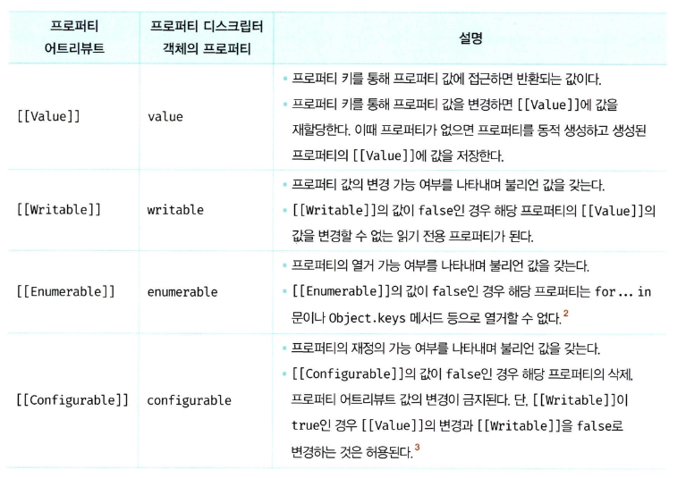
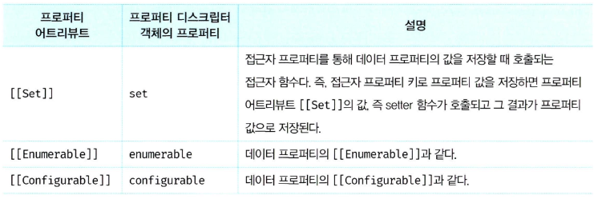

# 16 프로퍼티 어트리뷰트

## 16.1 내부 슬롯과 내부 메서드

- 자바스크립트 엔진의 구현 알고리즘을 설명하기 위해 ECMAScript 사양에서 사용하는 **의사 프로퍼티**(`pseudo property`)와 **의사 메소드**(`pseudo method`)
- ECMAScript 사양에 등장하는 이중 대괄호(`[[...]]`)로 감싼 이름들이 내부 슬롯과 내부 메서드
- 자바스크립트 엔진의 내부 로직이므로 원칙적으로 자바스크립트는 내부 슬롯과 내부 메서드에 **직접 접근하거나 호출할 수 있는 방법을 제공하지 않음**

  ⇒ 일부 내부 슬롯과 내부 메서드에 한하여 직접 접근할 수 있는 수단을 제공하기는 함

  - `[[Prototype]]`: 원칙적으로 집적 접근할 수 없지만 `__proto__`를 통해 간접적으로 접근 가능

## 16.2 프로퍼티 어트리뷰트와 프로퍼티 디스크립터 객체

- 자바스크립트 엔진은 프로퍼티를 생성할 때 **프로퍼티의 상태를 나타내는 프로퍼티 어트리뷰트를 기본값으로 자동 정의**
- 프로퍼티의 상태: 프로퍼티의 값, 값의 갱신 가능 여부, 열거 가능 여부, 재정의 가능 여부를 말함
- 프로퍼티 어트리뷰트: 자바스크립트 엔진이 관리하는 내부 상태 값(meta-property)인 내부 슬롯 `[[Value]]`, `[[Writable]]`, `[[Enumerable]]`, `[[Configurable]]`
- 프로퍼티 어트리뷰트에 직접 접근할 수 없지만 `Object.getOwnPropertyDesciptor` 메서드를 사용하여 간접적으로 확인 가능
  - `Object.getOwnPropertyDesciptor` 메서드를 호출할 때
    - 첫 번째 매개 변수에는 객체의 참조를 전달
    - 두 번째 매개변수에는 프로퍼티 키를 문자열로 전달
  - 이 때 `Object.getOwnPropertyDesciptor` 메서드는 프로퍼티 어트리뷰트 정보를 제공하는 **프로퍼티 디스크립터 객체를 반환**

## 16.3 데이터 프로퍼티와 접근자 프로퍼티

- **데이터 프로퍼티**: 키와 값으로 구성된 프로퍼티로 `get/set` 메서드를 가짐
- **접근자 프로퍼티**: 자체적으로는 값을 갖지 않고 다른 데이터 프로퍼티의 값을 읽거나 저장할 때 호출되는 접근자 함수로 구성된 프로퍼티로 `value`를 가짐

### 16.3.1 데이터 프로퍼티

- **값을 저장하기 위한 프로퍼티**
- 일반적으로 사용하는 프로퍼티는 데이터 프로퍼티



### 16.3.2 접근자 프로퍼티

- 자체적으로는 값을 갖지 않음
- 다른 데이터 프로퍼티의 값을 읽거나 저장할 때 사용하는 접근자 함수로 구성된 프로퍼티

  **⇒ 프로퍼티를 읽거나 쓸 때 호출하는 함수를 값 대신에 지정할 수 있는 프로퍼티**

- 접근자 프로퍼티의 본질은 함수
  - 값을 획득(`get`)하고 설정(`set`)하는 역할을 담당
  - 그런데 외부 코드에서는 함수가 아닌 일반적인 프로퍼티처럼 보임
- 접근자 프로퍼티는 `getter/setter` 함수라고도 부름




> 📍프로토 타입
>
> - 프로토 타입은 **어떤 객체의 상위(부모) 객체의 역할을 하는 객체**
> - 프로토타입은 하위(자식) 객체에게 자신의 프로퍼티와 메서드를 상속
> - 프로토타입 객체의 프로퍼티나 메서드를 상속받은 하위 객체는 자신의 프로퍼티 또는 메서드인 것처럼 자유롭게 사용 가능
>
>   ```jsx
>   // 일반 객체의 __proto__은 접근자 프로퍼티다
>   Object.getOwnPropertyDescriptor(Object.prototype, `__proto__`);
>
>   // 함구 객체의 prototype은 데이터 프로퍼티다
>   Object.getOwnPropertyDescriptor(function () {}, `prototype`);
>   ```

## 16.4 프로퍼티 정의

- 새로운 프로퍼티를 추가하면서 프로퍼티 어트리뷰트를 **명시적으로 정의**하거나, 기존 프로퍼티의 프로퍼티 어트리뷰트를 **재정의**하는 것
- `Object.defineProperty`메서드를 사용해 프로퍼티의 어트리뷰트를 정의 가능
  - 인수로는 객체의 참조와 데이터 프로퍼티의 키인 문자열, 프로퍼티 디스크립터 객체를 전달

## 16.5 객체 변경 방지

- 객체는 변경 가능한 값이므로 재할당 없이 직접 변경할 수 있음

  ⇒ 프로퍼티를 추가하거나 삭제할 수 있고 프로퍼티 값을 갱신할 수 있으며 프로퍼티 어트리뷰트를 재정의할 수도 있음


### 16.5.1 객체 확장 금지

- `Object.preventExtensions` 메서드는 **객체의 확장을 금지**
- 확장이 금지된 객체는 프로퍼티 추가가 금지

### 16.5.2 객체 밀봉

- `Object.seal` 메서드는 **객체를 밀봉**
- 객체 밀봉: 프로퍼티 추가 및 삭제와 프로퍼티 어트리뷰트 재정의 금지를 의미

  ⇒ 밀봉된 객체는 **읽기와 쓰기만 가능**

### 16.5.3 객체 동결

- `Object.freeze` 메서드는 **객체를 동결**
- 객체 동결: 프로퍼티 추가 밒 삭제와 프로퍼티 어트리뷰트 재정의 금지, 프로퍼티 값 갱신 금지를 의미

  ⇒ 동결된 객체는 **읽기만 가능**

### 16.5.4 불변 객체

- **위의 변경 방지 메서드들은얕은 변경 방지**
  - 직속 프로퍼티만 변경이 방지되고 중첩 객체까지는 영향을 주지는 못함
- 객체의 중첩 객체까지 동결하여 변경이 불가능한 **읽기 전용의 불변 객체를 구현하려면 객체를 값으로 갖는 모든 프로퍼티에 대해 재귀적으로 `Object.freeze` 메서드를 호출**해야 함
