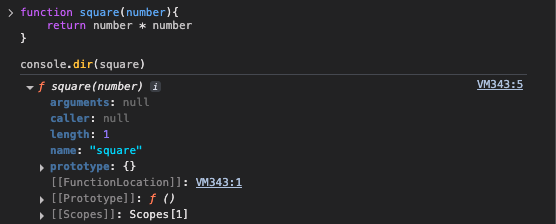
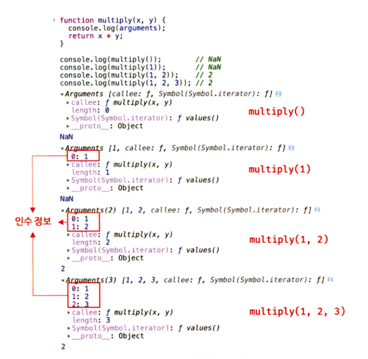

# 18 함수와 일급 객체

## 18.1 일급 객체

- 아래의 조건을 만족하는 객체를 **일급 객체** 라고 함
  1. **무명의 리터럴로 생성**할 수 있다. 즉, 런타임에 생성이 가능하다.
  2. 변수나 자료구조(객체, 배열 등)에 **저장**할 수 있다.
  3. **함수의 매개변수에 전달**할 수 있다.
  4. **함수의 반환값으로 사용**할 수 있다.➔ **함수의 매개변수에 전달**할 수 있고 **함수의 반환값으로 사용**한다는 것은,**함수형 프로그래밍**을 가능케 하는 자바스크립트의 장점 중 하나다.

⇒ 자바스크립트의 함수는 일급 객체

```jsx
// 1. 함수는 무명의 리터럴로 생성할 수 있다.
// 2. 함수는 변수에 저장할 수 있다.
// 런타임(할당 객체)에 함수 리터럴이 평가되어 함수 객체가 생성되고 변수에 할당된다.
const increase = function (num) {
  return ++num;
};

const decrease = function (num) {
  return --num;
};

// 2. 함수는 객체에 저장할 수 있다.
const auxs = { increase, decrease };
```

- 함수가 일급 객체라는 것은 함수를 객체와 동일하게 사용할 수 있다는 의미
- 객체는 값이므로 함수는 값과 동일하게 취급할 수 있음

## 18.2 함수 객체의 프로퍼티

- 함수는 객체이기 때문에 프로퍼티를 가질 수 있음

  

- 함수 객체의 프로퍼티 `arguments`, `caller`, `length`, `name`, `prototype` 프로퍼티는 모두 일반 객체에는 없는 **함수 객체 고유의 데이터 프로퍼티**

### 18.2.1 `arguments` 프로퍼티

- 함수 객체의 `arguments` 프로퍼티 값은 `arguments` 객체
- 함수 호출 시 전달된 **인수들의 정보**를 담고 있음
- 순회 가능한 **유사 배열 객체**
- 함수 **내부에서 지역 변수처럼** 사용됨

  ⇒ 즉, 함수 외부에서는 참조할 수 없음

```jsx
function multiply(x, y) {
  console.log(arguments);
  return x * y;
}

// 자바스크립트는 함수의 매개변수와 인수의 개수가 일치하는지 확인하지 않음
// 함수 호출 시 매개변수 개수만큼 인수를 전달하지 않아도 에러가 발생하지 않음
console.log(multiply()); // NaN
console.log(multiply(1)); // NaN
console.log(multiply(1, 2)); // 2
console.log(multiply(1, 2, 3)); // 2
```



- `arguments` 객체는 매개변수 개수를 확정할 수 없는 **가변 인자 함수 구현**에 유용

```jsx
function sum() {
  let res = 0;

  // arguments 객체는 length 프로퍼티가 있는 유사 배열 객체이므로 for 문으로 순회 가능
  for (let i = 0; i < arguments.length; i++) {
    res += arguments[i];
  }

  return res;
}

console.log(sum()); // 0
console.log(sum(1, 2)); // 3
console.log(sum(1, 2, 3)); // 6
```

- **ES6 Rest 파라미터의 도입**으로 모던 자바스크립트에서는 `arguments` 객체의 중요성이 이전 같지는 않음

### 18.2.2 `caller` 프로퍼티

> caller 프로퍼티는 ECMAScript 사양에 포함되지 않은 비표준 프로퍼티

⇒ 이후 표준화될 예정도 없기 때문에 참고만 하기

- 함수 객체의 `caller` 프로퍼티는 **함수 자신을 호출한 함수를 가리킴**

```jsx
function foo(func) {
  return func();
}

function bar() {
  return 'caller : ' + bar.caller;
}

// 브라우저에서의 실행한 결과
console.log(foo(bar)); // caller : function foo(func) {...}
console.log(bar()); // caller : null
```

### 18.2.3 `length` 프로퍼티

- 함수 객체의 `length` 프로퍼티는 함수를 정의할 때 선언한 **매개변수의 개수**를 가리킴
- `arguments` 객체의 `length` 프로퍼티는 인자의 개수를 가리킴
- 함수 객체의 `length`는 매개변수의 개수를 가리키므로 주의

  ⇒ 둘은 값이 다를 수 있음

```jsx
function foo() {}
console.log(foo.length); // 0

function bar(x) {
  return x;
}
console.log(bar.length); // 1

function baz(x, y) {
  return x * y;
}
console.log(baz.length); // 2
```

### 18.2.4 `name` 프로퍼티

- 함수 객체의 `name` 프로퍼티는 **함수 이름**을 나타냄
- ES6부터 정식 표준이 됨

```jsx
// 기명 함수 표현식
var namedFunc = function foo() {};
console.log(namedFunc.name); // foo

// 익명 함수 표현식
var anonymousFunc = function () {};
// ES5: name 프로퍼티는 빈 문자열을 값으로 갖는다.
// ES6: name 프로퍼티는 함수 객체를 가리키는 변수 이름을 값으로 갖는다.
console.log(anonymousFunc.name); // anonymousFunc

// 함수 선언문(Function declaration)
function bar() {}
console.log(bar.name); // bar
```

### 18.2.5 `__proto__` 접근자 프로퍼티

- 모든 객체는 `[[Prototype]]` 내부 슬롯을 갖는다.
- `[[Prototype]]` 내부 슬롯은 객체지향 프로그래밍의 **상속을 구현하는 프로토타입 객체**를 가리킴
- `__proto__`프로퍼티는 `[[Prototype]]` 내부 슬롯이 가리키는 **프로토타입 객체에 접근하기 위해** 사용하는 **접근자 프로퍼티**

### 18.2.6 `prototype` 프로퍼티

- 생성자 함수로 호출 할 수 있는 함수 객체

  ⇒  **`constructor`만이 소유하는 프로퍼티**

- 일반 객체와 생성자 함수로 호출할 수 없는 `non-constructor`에는 `prototype` 프로퍼티가 없음
- (함수가 객체를 생성하는)**생성자 함수**로 호출될 때 생성자 함수가 생성할 **인스턴스의 프로토타입 객체**를 가리킴
