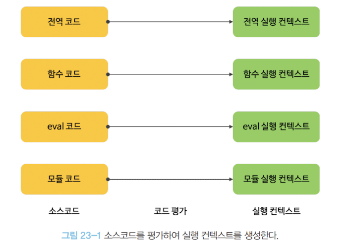
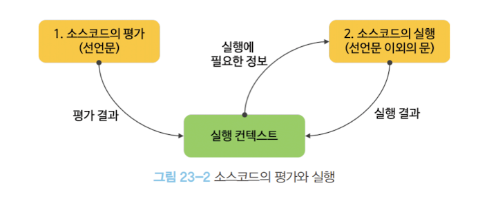
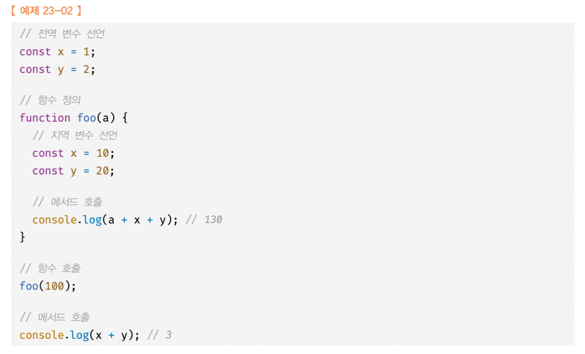
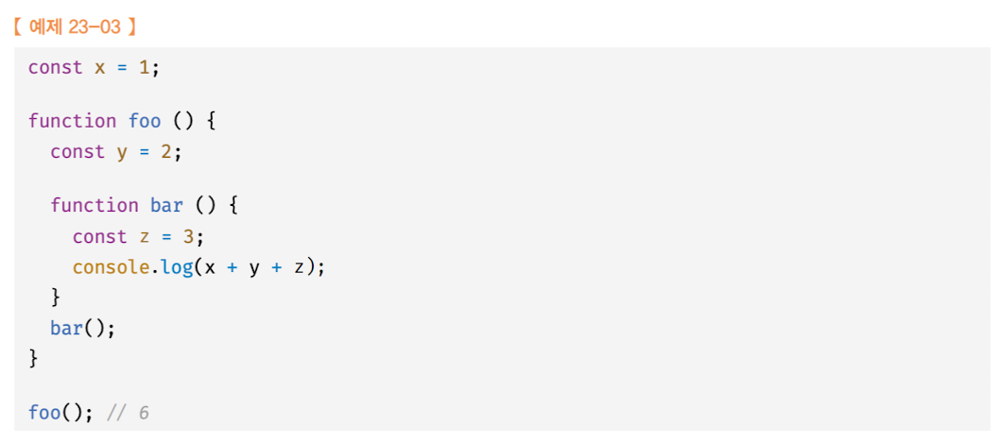
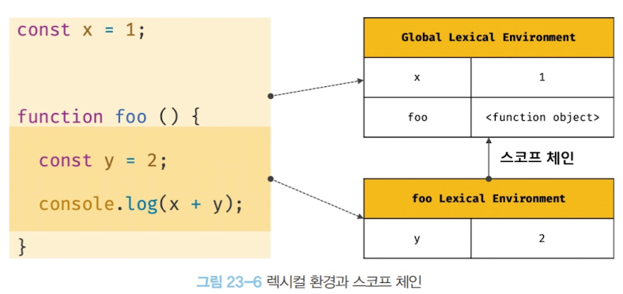
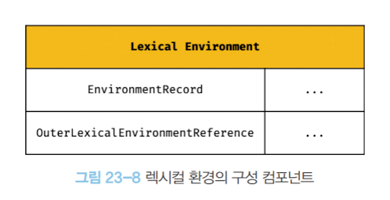
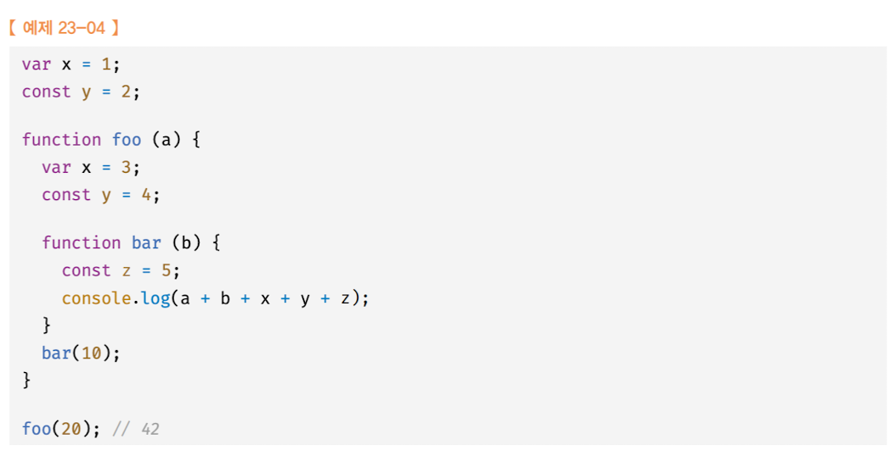
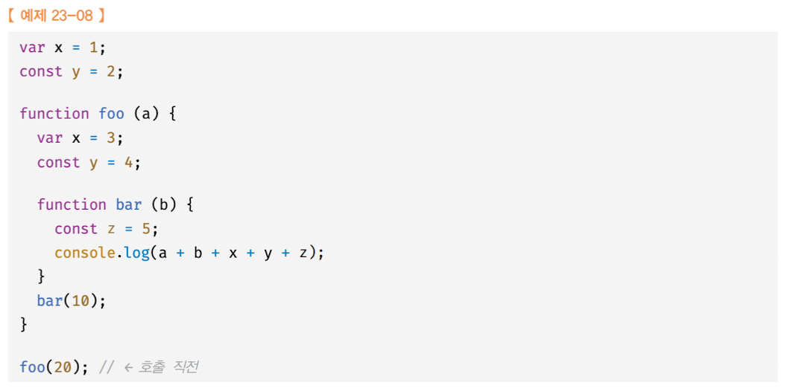
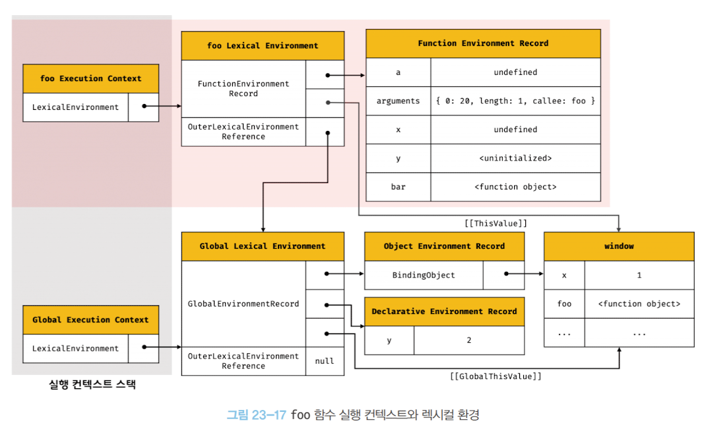
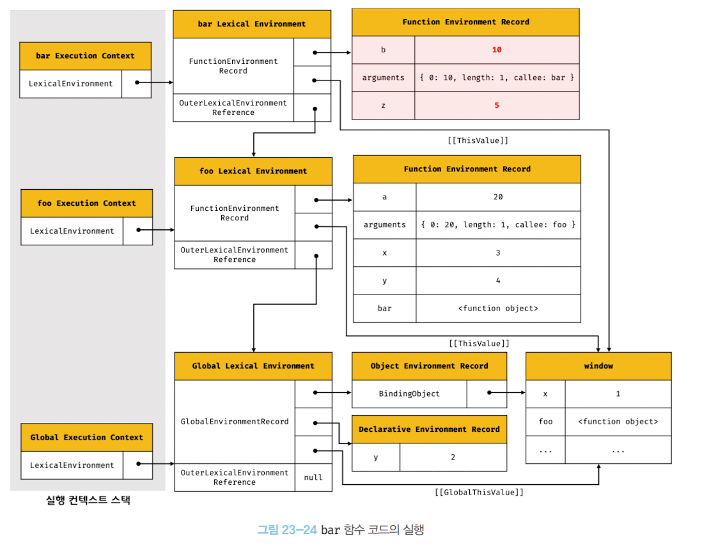

# 23 실행컨텍스트

- 실행 컨텍스트는 자바스크립트의 동작 원리를 담고 있는 핵심 개념
- 이를 이해하면 자바스크립트가 스코프를 기반으로 식별자와 식별자에 바인딩된 값(식별자 바인딩)을 관리하는 방식과 호이스팅이 발생하는 이유, 클로저의 동작 방식, 태스크 큐와 함께 동작하는 이벤트 핸들러와 비동기 처리의 동작 방식을 이해 가능

## 23.1 소스코드의 타입

- ECMAScript 사양은 소스코드(ECMAScript code)를 4가지 타입으로 구분
- 4가지 타입의 소스코드는 실행 컨텍스트를 생성

  ⇒ 소스코드(실행 가능한 코드executable code)를 4가지 타입으로 구분하는 이유는 소스코드의 타입에 따라 실행 컨텍스트를 생성하는 과정과 관리 내용이 다르기 때문

1. 전역코드

   - 전역 코드는 전역 변수를 관리하기 위해 최상위 스코프인 전역 스코프를 생성해야 함
   - var 키워드로 선언된 전역 변수와 함수 선언문으로 정의된 전역 함수를 전역 객체의 프로퍼티와 메서드로 바인딩하고 참조하기 위해 전역 객체와 연결되어야 함

   ⇒ 이를 위해 전역 코드가 평가되면 전역 실행 컨텍스트가 생성

2. 함수 코드

   - 지역 스코프를 생성하고 지역 변수, 매개변수, arguments 객체를 관리해야 함
   - 생성한 지역 스코프를 전역 스코프에서 시작하는 스코프 체인의 일원으로 연결해야 함

   ⇒ 이를 위해 함수 코드가 평가되면 함수 실행 컨텍스트가 생성

3. eval 코드

   - eval 코드는 strict mode에서 자신만의 독자적인 스코프를 생성

   ⇒ 이를 위해 eval 코드가 평가되면 eval 실행 컨텍스트가 생성

4. 모듈코드

   - 모듈 코드는 모듈별로 독립적인 모듈 스코프를 생성

   ⇒ 이를 위해 모듈 코드가 평가되면 모듈 실행 컨텍스트가 생성된다.

   

## 23.2 소스코드의 평가와 실행

- 자바스크립트 엔진은 **소스코드의 평가, 소스코드의 실행** 과정으로 나누어 처리

1. 소스코드 평가
   - 실행 컨텍스트를 생성하고 변수, 함수 등의 선언문만 먼저 실행하여 생성된 변수나 함수 식별자를 키로 실행 컨텍스트가 관리하는 스코프(렉시컬 환경의 환경 레코드)에 등록
2. 소스코드 실행

   - 소스코드 평가 과정이 끝나면 비로소 선언무을 제외한 소스코드가 순차적으로 실행되기 시작

     ⇒ 런타임이 시작

   - 이때 소스코드 실행에 필요한 정보, 즉 변수나 함수의 참조를 실행 컨텍스트가 관리하는 스코프에서 검색해서 취득

   

## 23.3 실행 컨텍스트의 역할

> 다음 예제는 전역 코드와 함수 코드로 구성되어 있음
>
> 자바스크립트 엔진이 이 예제를 어떻게 평가하고 실행할지 생각해보기

### 1. 전역코드 평가

- 전역 코드의 변수 선언문과 함수 선언문이 먼저 실행
- 그 결과 생성된 전역 변수와 전역 함수가 실행 컨텍스트가 관리하는 전역 스코프에 등록
- var 키워드로 선언된 전역 변수와 함수 선언문으로 정의된 전역 함수는 전역 객체의 프로퍼티와 메서드가 됨

### 2. 전역코드 실행

- 변수에 값이 할당되고 함수가 호출
- 함수가 호출되면 순차적으로 실행되던 전역 코드의 실행을 일시 중단하고 코드 실행 순서를 변경하여 함수 내부로 진입

### 3. 함수코드 평가

- 함수 호출에 의해 코드 실행 순서가 변경되어 함수 내부로 진입하면 함수 내부의 문들을 실행하기에 앞서 함수 코드 평가 과정을 거치며 함수 코드를 실행하기 위한 준비를 함
- 이때 매개변수와 지역 변수 선언문이 먼저 실행되고, 그 결과 생성된 매개변수와 지역 변수가 실행 컨텍스트가 관리하는 지역 스코프에 등록

### 4. 함수 코드 실행

- 이때 매개변수와 지역 변수에 값이 할당되고 console.log 메서드가 호출
- 코드가 실행되려면 다음과 같이 스코프, 식별자, 코드 실행 순서 등의 관리가 필요

  1. 선언에 의해 생성된 모든 식별자(변수, 함수, 클래스 등)를 스코프를 구분하여 등록하고 상태 변화(식별자에 바인딩된 값의 변화)를 지속적으로 관리할 수 있어야 함
  2. 스코프는 중첩 관계에 의해 스코프 체인을 형성해야 한다. 즉, 스코프 체인을 통해 상위 스코프로 이동하며 식별자를 검색할 수 있어야 한다.
  3. 현재 실행 중인 코드의 실행 순서를 변경(예를 들어, 함수 호출에 의한 실행 순서 변경)할 수 있어야 하며 다시 되돌아갈 수도 있어야 한다.

     ⇒ 이 모든 것을 관리하는 것이 바로 실행 컨텍스트

     **⇒ 실행 컨텍스트는 소스코드를 실행하는 데 필요한 환경을제공하고 코드의 실행 결과를 실제로 관리하는 영역**

## 23.4 실행 컨텍스트 스택

- 생성된 실행 컨텍스트는 스택 자료구조로 관리

  ⇒ 이를 실행 컨텍스트 스택이라고 부름

### 1. 전역 코드의 평가와실행

- 자바스크립트 엔진은 먼저 전역 코드를 평가하여 전역 실행 컨텍스트를 생성하고 실행 컨텍스트 스택에 푸시
- 이때 전역 변수 x와 전역 함수 foo는 전역 실행 컨텍스트에 등록
- 이후 전역 코드가 실행되기 시작하여 전역 변수 x에 값이 할당되고 전역 함수 foo가 호출

### 2. foo 함수 코드의 평가와 실행

- 전역 함수 foo가 호출되면 전역 코드의 실행은 일시 중단되고 코드의 제어권control이 foo 함수 내부로 이동
- 자바스크립트 엔진은 foo 함수 내부의 함수 코드를 평가하여 foo 함수 실행 컨텍스트를 생성하고 실행 컨텍스트 스택에 푸시
- 이때 foo 함수의 지역 변수 y와 중첩 함수 bar가 foo 함수 실행 컨텍스트에 등록
- 이후 foo 함수 코드가 실행되기 시작하여 지역 변수 y에 값이 할당되고 중첩 함수 bar가 호출

### 3. bar 함수 코드의 평가와 실행

- 중첩 함수 bar가 호출되면 foo 함수 코드의 실행은 일시 중단되고 코드의 제어권이 bar 함수 내부로 이동
- 자바스크립트 엔진은 bar 함수 내부의 함수 코드를 평가하여 bar 함수 실행 컨텍스트를 생성하고 실행 컨텍스트 스택에 푸시
- 이때 bar 함수의 지역 변수 z가 bar 함수 실행 컨텍스트에 등록
- 이후 bar 함수 코드가 실행되기 시작하여 지역 변수 z에 값이 할당되고 console.log 메서드를 호출 4한 이후, bar 함수는 종료

### 4. 함수 코드로 복귀

- bar 함수가 종료되면 코드의 제어권은 다시 foo 함수로 이동
- 이때 자바스크립트 엔진은 bar 함수 실행 컨텍스트를 실행 컨텍스트 스택에서 팝하여 제거
- 그리고 foo 함수는 더 이상 실행할 코드가 없으므로 종료

### 5. 전역 코드로 복귀

- foo 함수가 종료되면 코드의 제어권은 다시 전역 코드로 이동
- 이때 자바스크립트 엔진은 foo 함수 실행 컨텍스트를 실행 컨텍스트 스택에서 팝하여 제거
- 그리고 더 이상 실행할 전역 코드가 남아 있지 않으므로 전역 실행 컨텍스트도 실행 컨텍스트 스택에서 팝되어 실행 컨텍스트 스택에는 아무것도 남아있지 않게 됨

---

- **실행 컨텍스트 스택은 코드의 실행 순서를 관리**
- 소스코드가 평가되면 실행 컨텍스트가 생성되고 실행 컨텍스트 스택의 최상위에 쌓임
- **실행 컨텍스트 스택의 최상위에 존재하는 실행 컨텍스트는 언제나현재 실행 중인 코드의 실행 컨텍스트**

## 23.5 렉시컬 환경

- 식별자와 식별자에 바인딩된 값, 그리고 상위 스코프에 대한 참조를 기록하는 자료구조로 실행 컨텍스트를 구성하는 컴포넌트
- 실행 컨텍스트 스택이 코드의 실행 순서를 관리한다면 렉시컬 환경은 스코프와 식별자를 관리

- 렉시컬 환경은 키와 값을 갖는 객체 형태의 스코프(전역, 함수, 블록 스코프)를 생성하여 식별자를 키로 등록하고 식별자에 바인딩된 값을 관리

- 렉시컬 환경은 두 개의 컴포넌트로 구성

  **1. 환경 레코드 Environment Record**

  - 스코프에 포함된 식별자를 등록하고 등록된 식별자에 바인딩된 값을 관리하는 저장소
  - 환경 레코드는 소스코드의 타입에 따라 관리하는 내용에 차이가 있음

  **2. 외부 렉시컬 환경에 대한 참조 Outer Lexical Environment Reference**

  - 외부 렉시컬 환경에 대한 참조는 상위 스코프를 가리킴
  - 이때 상위 스코프란 외부 렉시컬 환경, 즉 해당 실행 컨텍스트를 생성한 소스코드를 포함하는 상위 코드의 렉시컬 환경을 말함
  - 외부 렉시컬 환경에 대한 참조를 통해 단방향 링크드 리스트인 스코프 체인을 구현

## 23.6 실행 컨텍스트의 생성과 식별자 검색 과정

> 다음 예제를 통해 어떻게 실행 컨텍스트가 생성되고 코드 실행 결과가 관리되는지,
>
> 그리고 어떻게 실행 컨텍스트를 통해 식별자를 검색하는지 살펴보기

### 23.6.1 전역 객체 생성

- 전역 객체는 전역 코드가 평가되기 이전에 생성

### 23.6.2 전역 코드 평가

- 소스코드가 로드되면 자바스크립트 엔진은 전역 코드를 평가
- 전역 코드 평가는 다음과 같은 순서로 진행

  > 1. 전역 실행 컨텍스트 생성
  > 2. 전역 렉시컬 환경 생성
  >
  >    2.1 전역 환경 레코드 생성
  >
  >    2.1.1 객체 환경 레코드 생성
  >
  >    2.1.2 선언적 환경 레코드 생성
  >
  >    2.2 this 바인딩
  >
  >    2.3 외부 렉시컬 환경에 대한 참조 결정

_위 과정을 거쳐 생성된 전역 실행 컨텍스트와 렉시컬 환경_

### 23.6.3 전역 코드 실행

- 전역 코드가 순차적으로 실행되기 시작
- 변수 할당문이 실행되어 전역 변수 x, y에 값이 할당
- foo 함수가 호출

- 동일한 이름의 식별자가 있을 수 있기 때문에 어느 스코프의 식별자를 참조하면 되는지 결정할 필요가 있음

  **⇒ 식별자 결정**

- **식별자 결정을 위해 식별자를 검색할 때는 실행 중인 실행 컨텍스트에서 식별자를 검색하기 시작**

### 23.6.4 foo 함수 코드 평가

> 현재 전역 코드 평가를 통해 전역 실행 컨텍스트가 생성되었고 전역 코드를실행하고 있음
>
> 현재 진행 상황은 foo 함수를 호출하기 직전

- foo 함수가 호출되면 전역 코드의 실행을 일시 중단하고 foo 함수 내부로 코드의 제어권이 이동
- 그리고 함수 코드를 평가하기 시작
- 함수 코드 평가는 아래 순서로 진행

  > 1. 함수 실행 컨텍스트 생성
  > 2. 함수 렉시컬 환경 생성
  >
  >    2.1 함수 환경 레코드 생성
  >
  >    2.2 this 바인딩
  >
  >    2.3 외부 렉시컬 환경에 대한 참조 결정

_위 과정을 거쳐 생성된 foo 함수 실행 컨텍스트와 렉시컬 환경_

### 23.6.5 foo 함수 코드 실행

- 런타임이 시작되어 foo 함수의 소스코드가 순차적으로 실행되기 시작
- 매개변수에 인수가 할당되고 변수 할당문이 실행되어 지역 변수 x, y에 값이 할당
- 그리고 함수 bar가 호출
- **식별자 결정을 위해 실행 중인 실행 컨텍스트의 렉시컬 환경에서 식별자를 검색하기 시작**
  - 현재 실행 중인 실행 컨텍스트는 foo 함수 실행 컨텍스트이므로 foo 함수 렉시컬 환경에서 식별자 x, y를 검색하기 시작
  - 만약 실행 중인 실행 컨텍스트의 렉시컬 환경에서 식별자를 검색할 수 없으면 외부 렉시컬 환경에 대한 참조가 가리키는 렉시컬 환경으로 이동하여 식별자를 검색

### 23.6.6 bar 함수 코드 평가

> foo 함수 코드 평가를 통해 foo 함수 실행 컨텍스트가 생성되었고 foo 함수 코드를 실행하고 있음
>
> 현재 진행 상황은 bar 함수를 호출하기 직전

- bar 함수가 호출되면 bar 함수 내부로 코드의 제어권이 이동
- 그리고 bar 함수 코드를 평가하기 시작
- 실행 컨텍스트와 렉시컬 환경의 생성 과정은 foo 함수 코드 평가와 동일

_생성된 bar 함수 실행 컨텍스트와 렉시컬 환경_

### 23.6.7 bar 함수 코드 실행

- 런타임이 시작되어 bar 함수의 소스코드가 순차적으로 실행되기 시작
- 매개변수에 인수가 할당되고, 변수 할당문이 실행되어 지역 변수 z에 값이 할당
- 그리고 `console.log(a + b + x + y + z);`가 실행

### 23.6.8 bar 함수 코드 실행 종료

- `console.log` 메서드가 호출되고 종료하면 더는 실행할 코드가 없으므로 bar 함수 코드의 실행이 종료
- 실행 컨텍스트 스택에서 bar 함수 실행 컨텍스트가 팝되어 제거되고 foo 실행 컨텍스트가 실행 중인 실행 컨텍스트가 됨
- bar 함수 실행 컨텍스트가 소멸되었다 하더라도 만약 bar 함수 렉시컬 환경을 누군가 참조하고 있다면 bar함수 렉시컬 환경은 소멸하지 않음

### 23.6.8 foo 함수 코드 실행 종료

- bar 함수가 종료하면 더 이상 실행할 코드가 없으므로 foo 함수 코드의 실행이 종료
- 이때 실행 컨텍스트 스택에서 foo 함수 실행 컨텍스트가 팝되어 제거되고 전역 실행 컨텍스트가 실행 중인 실행 컨텍스트가 됨

### 23.6.10 전역 코드 실행 종료

- foo 함수가 종료되면 더는 실행할 전역 코드가 없으므로 전역 코드의 실행이 종료되고 전역 실행 컨텍스트도 실행 컨텍스트 스택에서 팝되어 실행 컨텍스트 스택에는 아무것도 남아있지 않게 됨

## 23.7 실행 컨텍스트와 블록 레벨 스코프

- var 키워드로 선언한 변수는 오로지 함수의 코드 블록만 지역 스코프로 인정하는 함수 레벨 스코프를 따름
- 하지만 let, const 키워드로 선언한 변수는 모든 코드 블록(함수, if 문, for 문, while 문, try/catch 문 등)을 지역 스코프로 인정하는 블록 레벨 스코프를 따름

1. if 문의 코드 블록 내에서 let 키워드로 변수가 선언

   ⇒ 따라서 if 문의 코드 블록이 실행되면 if 문의 코드 블록을 위한 블록 레벨 스코프를 생성해야 함

2. 이를 위해 선언적 환경 레코드를 갖는 렉시컬 환경을 새롭게 생성하여 기존의 전역 렉시컬 환경을 교체
3. 이때 새롭게 생성된 if 문의 코드 블록을 위한 렉시컬 환경의 외부 렉시컬 환경에 대한 참조는 if 문이 실행되기 이전의 전역 렉시컬 환경을 가리킴
